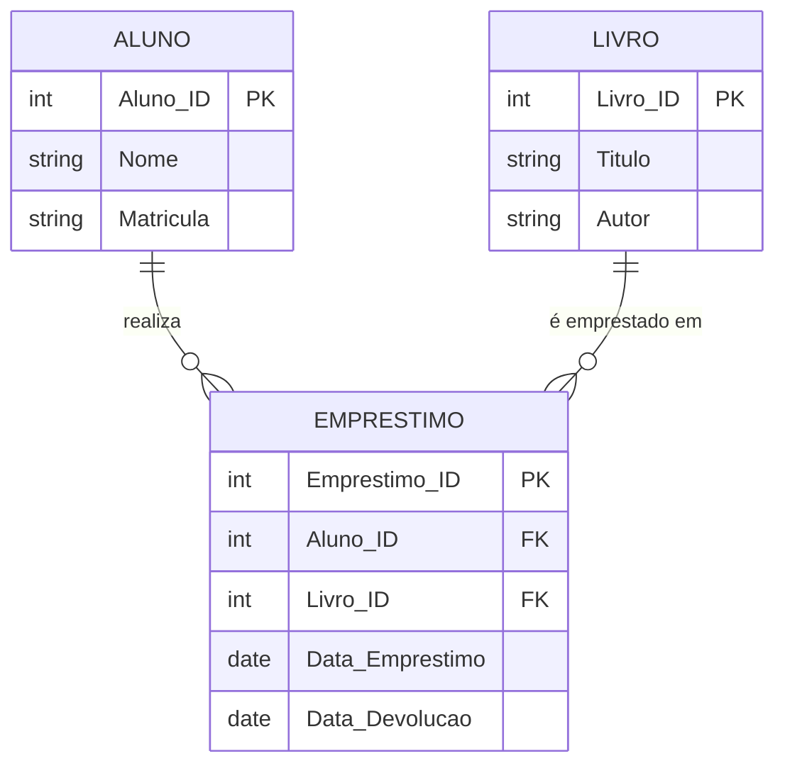

  # Exercício 02 - Biblioteca Universitária

## Descrição do Cenário

Este exercício apresenta um sistema de banco de dados para uma biblioteca universitária. O objetivo é demonstrar como consultar o histórico de empréstimos de um aluno específico, utilizando relacionamentos entre tabelas e operações de JOIN.

### Contexto do Negócio

A biblioteca universitária precisa manter um controle rigoroso dos empréstimos de livros realizados pelos alunos. O sistema deve permitir consultar todo o histórico de empréstimos de qualquer aluno, incluindo livros já devolvidos e aqueles que ainda estão em posse do estudante.

### Estrutura dos Dados

O sistema é composto por três entidades principais com os seguintes relacionamentos:




## Implementação em PostgreSQL

### Definição da Estrutura (DDL)

O código abaixo cria o esquema e as tabelas necessárias para o sistema:

```sql
-- Criação do esquema para organizar as tabelas
CREATE SCHEMA Biblioteca;
SET search_path TO Biblioteca;

-- Tabela para armazenar dados dos alunos
CREATE TABLE Aluno (
    Aluno_ID SERIAL PRIMARY KEY,
    Nome VARCHAR(100) NOT NULL,
    Matricula VARCHAR(20) UNIQUE NOT NULL
);

-- Tabela para armazenar dados dos livros
CREATE TABLE Livro (
    Livro_ID SERIAL PRIMARY KEY,
    Titulo VARCHAR(150) NOT NULL,
    Autor VARCHAR(100)
);

-- Tabela para armazenar dados dos empréstimos
CREATE TABLE Emprestimo (
    Emprestimo_ID SERIAL PRIMARY KEY,
    Aluno_ID INT REFERENCES Aluno(Aluno_ID),
    Livro_ID INT REFERENCES Livro(Livro_ID),
    Data_Emprestimo DATE NOT NULL,
    Data_Devolucao DATE
);
```

### Inserção de Dados de Exemplo

Para demonstrar o funcionamento do sistema, inserimos alguns registros de exemplo:

```sql
-- Inserção de alunos
INSERT INTO Aluno (Nome, Matricula) VALUES
('Carlos Pereira', '2021001'),
('Fernanda Lima', '2021002');

-- Inserção de livros
INSERT INTO Livro (Titulo, Autor) VALUES
('Introdução à Programação', 'José Silva'),
('Banco de Dados', 'Maria Souza'),
('Estruturas de Dados', 'Ana Costa');

-- Inserção de empréstimos
INSERT INTO Emprestimo (Aluno_ID, Livro_ID, Data_Emprestimo, Data_Devolucao) VALUES
(1, 1, '2024-03-10', '2024-03-20'),  -- Livro já devolvido
(1, 2, '2024-04-15', NULL),          -- Livro ainda em posse do aluno
(2, 3, '2024-05-01', NULL);          -- Empréstimo de outro aluno
```

### Consulta Principal: Histórico de Empréstimos

O objetivo principal deste exercício é consultar o histórico completo de empréstimos de um aluno específico:

#### Consulta Genérica (Template)

```sql
SELECT L.Titulo AS Livro,
       E.Data_Emprestimo,
       E.Data_Devolucao
FROM Emprestimo E
JOIN Livro L ON E.Livro_ID = L.Livro_ID
WHERE E.Aluno_ID = [ID_DO_ALUNO];
```

#### Exemplo Prático: Histórico do Aluno com ID 1

```sql
SELECT L.Titulo AS Livro,
       E.Data_Emprestimo,
       E.Data_Devolucao
FROM Emprestimo E
JOIN Livro L ON E.Livro_ID = L.Livro_ID
WHERE E.Aluno_ID = 1;
```

**Resultado esperado:**
```
Livro                      | Data_Emprestimo | Data_Devolucao
---------------------------|-----------------|----------------
Introdução à Programação   | 2024-03-10      | 2024-03-20
Banco de Dados             | 2024-04-15      | NULL
```

## Explicação Técnica

### Operações Utilizadas

1. **JOIN (INNER JOIN)**:
   - Combina registros de duas tabelas baseado em uma condição de relacionamento
   - No nosso caso, conecta `Emprestimo` com `Livro` através do `Livro_ID`
   - Permite acessar informações do livro (título) junto com dados do empréstimo

2. **WHERE com Filtro**:
   - Filtra os resultados para mostrar apenas empréstimos de um aluno específico
   - Utiliza o `Aluno_ID` como critério de filtro

3. **Alias de Colunas (AS)**:
   - Renomeia colunas no resultado para melhor legibilidade
   - `L.Titulo AS Livro` torna o resultado mais claro

### Interpretação dos Resultados

- **Data_Devolucao = NULL**: Indica que o livro ainda está em posse do aluno
- **Data_Devolucao com valor**: Indica que o livro já foi devolvido na data especificada
- **Histórico completo**: A consulta mostra tanto empréstimos ativos quanto finalizados

### Consultas Adicionais Úteis

#### Consultar apenas livros não devolvidos:

```sql
SELECT L.Titulo AS Livro,
       E.Data_Emprestimo
FROM Emprestimo E
JOIN Livro L ON E.Livro_ID = L.Livro_ID
WHERE E.Aluno_ID = 1 
  AND E.Data_Devolucao IS NULL;
```

#### Consultar histórico com nome do aluno:

```sql
SELECT A.Nome AS Aluno,
       L.Titulo AS Livro,
       E.Data_Emprestimo,
       E.Data_Devolucao
FROM Emprestimo E
JOIN Livro L ON E.Livro_ID = L.Livro_ID
JOIN Aluno A ON E.Aluno_ID = A.Aluno_ID
WHERE E.Aluno_ID = 1;
```
