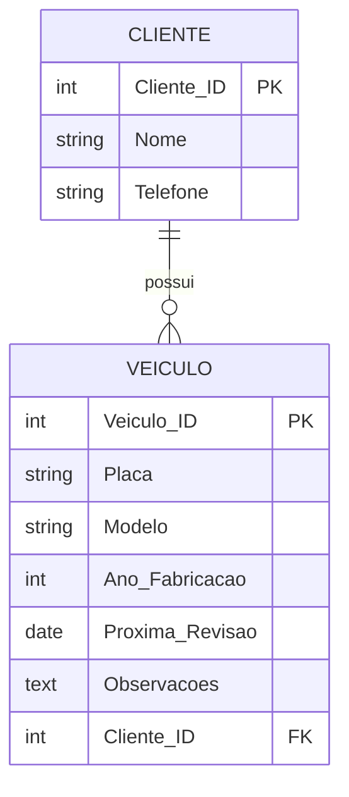

# Exercício 03 - Oficina Mecânica

## Descrição do Cenário

Este exercício apresenta um sistema de banco de dados para uma oficina mecânica. O objetivo é demonstrar como consultar informações detalhadas dos veículos, incluindo cálculos de idade baseados no ano de fabricação e dados sobre manutenção preventiva.

### Contexto do Negócio

A oficina mecânica precisa manter um controle organizado dos veículos de seus clientes, incluindo informações sobre o histórico de manutenção e agendamento de revisões futuras. O sistema deve permitir consultar dados específicos de cada veículo, como modelo, idade atual e próximas manutenções programadas.

### Estrutura dos Dados

O sistema é composto por duas entidades principais com o seguinte relacionamento:



## Implementação em PostgreSQL

### Definição da Estrutura (DDL)

O código abaixo cria o esquema e as tabelas necessárias para o sistema:

```sql
-- Criação do esquema para organizar as tabelas
CREATE SCHEMA Oficina_Mecanica;
SET search_path TO Oficina_Mecanica;

-- Tabela para armazenar dados dos clientes
CREATE TABLE Cliente (
    Cliente_ID SERIAL PRIMARY KEY,
    Nome VARCHAR(100) NOT NULL,
    Telefone VARCHAR(15)
);

-- Tabela para armazenar dados dos veículos
CREATE TABLE Veiculo (
    Veiculo_ID SERIAL PRIMARY KEY,
    Placa VARCHAR(10) UNIQUE NOT NULL,
    Modelo VARCHAR(100) NOT NULL,
    Ano_Fabricacao INT NOT NULL,
    Proxima_Revisao DATE,
    Observacoes TEXT,
    Cliente_ID INT REFERENCES Cliente(Cliente_ID)
);
```

### Inserção de Dados de Exemplo

Para demonstrar o funcionamento do sistema, inserimos alguns registros de exemplo:

```sql
-- Inserção de clientes
INSERT INTO Cliente (Nome, Telefone) VALUES
('Paulo Henrique', '11999990000'),
('Mariana Costa', '11988880000');

-- Inserção de veículos com diferentes características
INSERT INTO Veiculo (Placa, Modelo, Ano_Fabricacao, Proxima_Revisao, Observacoes, Cliente_ID) VALUES
('ABC1234', 'Fiat Uno', 2010, '2024-12-10', 'Troca de óleo necessária', 1),
('XYZ5678', 'Honda Civic', 2018, '2025-06-20', 'Revisão completa programada', 2);
```

### Consulta Principal: Dados dos Veículos

O objetivo principal deste exercício é consultar informações detalhadas dos veículos, incluindo a idade calculada:

```sql
SELECT V.Modelo,
       (EXTRACT(YEAR FROM CURRENT_DATE) - V.Ano_Fabricacao) AS Idade,
       V.Proxima_Revisao,
       V.Observacoes
FROM Veiculo V;
```

**Resultado esperado:**
```
Modelo      | Idade | Proxima_Revisao | Observacoes
------------|-------|-----------------|---------------------------
Fiat Uno    | 14    | 2024-12-10      | Troca de óleo necessária
Honda Civic | 6     | 2025-06-20      | Revisão completa programada
```

## Explicação Técnica

### Funções e Operações Utilizadas

1. **EXTRACT(YEAR FROM CURRENT_DATE)**:
   - Extrai o ano atual da data do sistema
   - `CURRENT_DATE` retorna a data atual
   - `EXTRACT(YEAR FROM ...)` pega apenas o componente do ano

2. **Cálculo de Idade**:
   - Subtrai o ano de fabricação do ano atual
   - Fórmula: `Ano Atual - Ano de Fabricação = Idade em Anos`
   - Resultado é um número inteiro representando a idade do veículo

3. **Alias de Coluna (AS)**:
   - `AS Idade` torna o resultado da expressão mais legível
   - Facilita a interpretação dos dados no resultado

### Interpretação dos Resultados

- **Modelo**: Identifica o tipo de veículo para facilitar o reconhecimento
- **Idade**: Mostra quantos anos o veículo tem, útil para determinar necessidades de manutenção
- **Proxima_Revisao**: Data agendada para manutenção preventiva
- **Observacoes**: Informações importantes sobre o estado atual ou necessidades específicas

### Consultas Adicionais Úteis

#### Consultar veículos de um cliente específico:

```sql
SELECT C.Nome AS Cliente,
       V.Placa,
       V.Modelo,
       (EXTRACT(YEAR FROM CURRENT_DATE) - V.Ano_Fabricacao) AS Idade,
       V.Proxima_Revisao,
       V.Observacoes
FROM Veiculo V
JOIN Cliente C ON V.Cliente_ID = C.Cliente_ID
WHERE V.Cliente_ID = 1;
```

#### Consultar veículos com revisão atrasada:

```sql
SELECT V.Placa,
       V.Modelo,
       V.Proxima_Revisao,
       (CURRENT_DATE - V.Proxima_Revisao) AS Dias_Atraso
FROM Veiculo V
WHERE V.Proxima_Revisao < CURRENT_DATE;
```

#### Consultar veículos por faixa de idade:

```sql
SELECT V.Modelo,
       V.Placa,
       (EXTRACT(YEAR FROM CURRENT_DATE) - V.Ano_Fabricacao) AS Idade
FROM Veiculo V
WHERE (EXTRACT(YEAR FROM CURRENT_DATE) - V.Ano_Fabricacao) > 10
ORDER BY Idade DESC;
```

#### Consultar próximas revisões (próximos 30 dias):

```sql
SELECT C.Nome AS Cliente,
       C.Telefone,
       V.Placa,
       V.Modelo,
       V.Proxima_Revisao
FROM Veiculo V
JOIN Cliente C ON V.Cliente_ID = C.Cliente_ID
WHERE V.Proxima_Revisao BETWEEN CURRENT_DATE AND (CURRENT_DATE + INTERVAL '30 days')
ORDER BY V.Proxima_Revisao;
```
