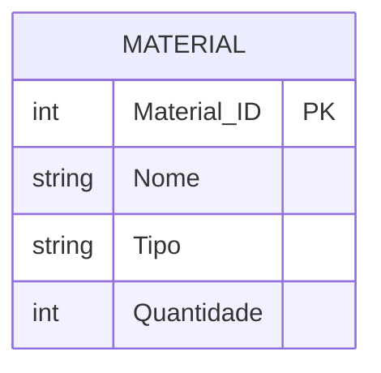

# Exercício 04 - Loja de Materiais de Construção

## Descrição do Cenário

Este exercício apresenta um sistema de banco de dados para uma loja de materiais de construção. O objetivo é demonstrar como calcular a quantidade total em estoque de dois materiais específicos, utilizando funções de agregação e filtros condicionais.

### Contexto do Negócio

A loja de materiais de construção precisa manter um controle preciso do estoque de seus produtos. É comum que os clientes solicitem informações sobre a disponibilidade de múltiplos materiais para seus projetos, sendo necessário calcular rapidamente a quantidade total disponível de materiais específicos.

### Estrutura dos Dados

O sistema é composto por uma entidade principal que armazena informações dos materiais:



## Implementação em PostgreSQL

### Definição da Estrutura (DDL)

O código abaixo cria o esquema e a tabela necessária para o sistema:

```sql
-- Criação do esquema para organizar as tabelas
CREATE SCHEMA Loja_Construcao;
SET search_path TO Loja_Construcao;

-- Tabela para armazenar dados dos materiais
CREATE TABLE Material (
    Material_ID SERIAL PRIMARY KEY,
    Nome VARCHAR(100) NOT NULL,
    Tipo VARCHAR(50),
    Quantidade INT NOT NULL
);
```

### Inserção de Dados de Exemplo

Para demonstrar o funcionamento do sistema, inserimos alguns registros de exemplo:

```sql
-- Inserção de materiais com diferentes tipos e quantidades
INSERT INTO Material (Nome, Tipo, Quantidade) VALUES
('Cimento', 'Pó', 100),
('Areia', 'Granulado', 200),
('Tijolo', 'Cerâmico', 500),
('Cal', 'Pó', 50);
```

### Consulta Principal: Quantidade Total de Dois Materiais

O objetivo principal deste exercício é calcular a quantidade total em estoque de dois materiais específicos:

#### Exemplo: Cimento e Areia (IDs 1 e 2)

```sql
SELECT SUM(Quantidade) AS Quantidade_Total
FROM Material
WHERE Material_ID IN (1, 2);
```

**Resultado esperado:**
```
Quantidade_Total
----------------
300
```

## Explicação Técnica

### Funções e Operações Utilizadas

1. **SUM(coluna)**:
   - Função de agregação que calcula a soma de todos os valores de uma coluna
   - Ignora valores NULL automaticamente
   - Retorna NULL se não houver registros válidos

2. **WHERE com IN**:
   - Operador IN permite filtrar registros que correspondem a uma lista de valores
   - `WHERE Material_ID IN (1, 2)` é equivalente a `WHERE Material_ID = 1 OR Material_ID = 2`
   - Mais eficiente e legível para múltiplos valores

3. **Alias de Resultado (AS)**:
   - `AS Quantidade_Total` torna o resultado mais descritivo
   - Facilita a interpretação do valor retornado

### Processo de Cálculo

1. O filtro WHERE seleciona apenas os materiais com IDs 1 e 2
2. A função SUM soma as quantidades desses materiais selecionados
3. O resultado é a quantidade total disponível dos dois materiais

### Consultas Adicionais Úteis

#### Consultar por nome dos materiais:

```sql
SELECT SUM(Quantidade) AS Quantidade_Total
FROM Material
WHERE Nome IN ('Cimento', 'Areia');
```

#### Consultar total por tipo de material:

```sql
SELECT Tipo,
       SUM(Quantidade) AS Quantidade_Total
FROM Material
WHERE Tipo = 'Pó'
GROUP BY Tipo;
```

#### Consultar detalhes dos materiais e total:

```sql
SELECT Nome,
       Tipo,
       Quantidade,
       SUM(Quantidade) OVER (PARTITION BY Tipo) AS Total_Por_Tipo
FROM Material
WHERE Material_ID IN (1, 2);
```

#### Consultar materiais com estoque baixo:

```sql
SELECT Nome,
       Tipo,
       Quantidade
FROM Material
WHERE Quantidade < 100
ORDER BY Quantidade ASC;
```

#### Consultar total geral do estoque:

```sql
SELECT SUM(Quantidade) AS Estoque_Total,
       COUNT(*) AS Total_Materiais,
       AVG(Quantidade) AS Media_Por_Material
FROM Material;
```

#### Consultar materiais por faixa de quantidade:

```sql
SELECT Nome,
       Tipo,
       Quantidade,
       CASE 
           WHEN Quantidade < 50 THEN 'Estoque Baixo'
           WHEN Quantidade BETWEEN 50 AND 200 THEN 'Estoque Normal'
           ELSE 'Estoque Alto'
       END AS Status_Estoque
FROM Material
ORDER BY Quantidade DESC;
```

### Variações da Consulta Principal

#### Usando lista de IDs variável:

```sql
-- Para consultar materiais com IDs 1, 3 e 4
SELECT SUM(Quantidade) AS Quantidade_Total
FROM Material
WHERE Material_ID IN (1, 3, 4);
```

#### Incluindo detalhes dos materiais somados:

```sql
SELECT STRING_AGG(Nome, ', ') AS Materiais,
       SUM(Quantidade) AS Quantidade_Total
FROM Material
WHERE Material_ID IN (1, 2);
```

#### Com validação de existência:

```sql
SELECT CASE 
           WHEN COUNT(*) = 2 THEN SUM(Quantidade)
           ELSE NULL
       END AS Quantidade_Total,
       COUNT(*) AS Materiais_Encontrados
FROM Material
WHERE Material_ID IN (1, 2);
```