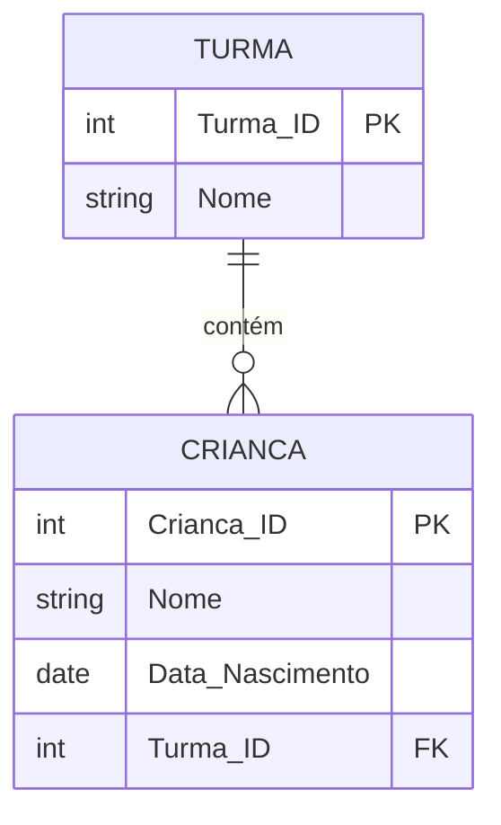

# Exercício 05 - Creche Infantil

## Descrição do Cenário

Este exercício apresenta um sistema de banco de dados para uma creche infantil. O objetivo é demonstrar como calcular a idade mínima e máxima das crianças matriculadas, utilizando funções de agregação combinadas com cálculos de idade baseados na data de nascimento.

### Contexto do Negócio

A creche infantil precisa manter informações organizadas sobre as crianças matriculadas, incluindo dados pessoais e a turma em que estão alocadas. Para fins de planejamento pedagógico e administrativo, é importante conhecer a faixa etária das crianças, identificando a criança mais nova e a mais velha da instituição.

### Estrutura dos Dados

O sistema é composto por duas entidades principais com o seguinte relacionamento:



## Implementação em PostgreSQL

### Definição da Estrutura (DDL)

O código abaixo cria o esquema e as tabelas necessárias para o sistema:

```sql
-- Criação do esquema para organizar as tabelas
CREATE SCHEMA Creche;
SET search_path TO Creche;

-- Tabela para armazenar dados das turmas
CREATE TABLE Turma (
    Turma_ID SERIAL PRIMARY KEY,
    Nome VARCHAR(50) NOT NULL
);

-- Tabela para armazenar dados das crianças
CREATE TABLE Crianca (
    Crianca_ID SERIAL PRIMARY KEY,
    Nome VARCHAR(100) NOT NULL,
    Data_Nascimento DATE NOT NULL,
    Turma_ID INT REFERENCES Turma(Turma_ID)
);
```

### Inserção de Dados de Exemplo

Para demonstrar o funcionamento do sistema, inserimos alguns registros de exemplo:

```sql
-- Inserção de turmas
INSERT INTO Turma (Nome) VALUES
('Maternal'),
('Jardim I'),
('Jardim II');

-- Inserção de crianças com diferentes idades
INSERT INTO Crianca (Nome, Data_Nascimento, Turma_ID) VALUES
('Ana', '2020-05-10', 1),      -- Aproximadamente 4 anos
('Lucas', '2019-11-20', 2),    -- Aproximadamente 5 anos
('Beatriz', '2018-03-15', 3),  -- Aproximadamente 6 anos
('João', '2021-09-05', 1);     -- Aproximadamente 3 anos
```

### Consulta Principal: Idade Mínima e Máxima

O objetivo principal deste exercício é calcular a idade mínima e máxima das crianças matriculadas:

```sql
SELECT MIN(EXTRACT(YEAR FROM AGE(CURRENT_DATE, Data_Nascimento))) AS Idade_Minima,
       MAX(EXTRACT(YEAR FROM AGE(CURRENT_DATE, Data_Nascimento))) AS Idade_Maxima
FROM Crianca;
```

**Resultado esperado:**
```
Idade_Minima | Idade_Maxima
-------------|-------------
3            | 6
```

## Explicação Técnica

### Funções e Operações Utilizadas

1. **AGE(data_final, data_inicial)**:
   - Calcula a diferença entre duas datas
   - Retorna um intervalo que inclui anos, meses e dias
   - `AGE(CURRENT_DATE, Data_Nascimento)` calcula a idade exata da criança

2. **EXTRACT(YEAR FROM intervalo)**:
   - Extrai apenas a parte dos anos do intervalo calculado
   - Converte o resultado para um número inteiro
   - Ignora meses e dias para obter apenas a idade em anos completos

3. **MIN() e MAX()**:
   - Funções de agregação que encontram o menor e maior valor respectivamente
   - MIN retorna a idade da criança mais nova
   - MAX retorna a idade da criança mais velha

### Processo de Cálculo

1. Para cada criança, AGE calcula quantos anos, meses e dias se passaram desde o nascimento
2. EXTRACT pega apenas os anos, resultando na idade em anos completos
3. MIN encontra a menor idade entre todas as crianças
4. MAX encontra a maior idade entre todas as crianças
5. Ambos os valores são retornados em uma única linha

### Consultas Adicionais Úteis

#### Consultar idades com detalhes das crianças:

```sql
SELECT Nome,
       Data_Nascimento,
       EXTRACT(YEAR FROM AGE(CURRENT_DATE, Data_Nascimento)) AS Idade
FROM Crianca
ORDER BY Idade;
```

#### Consultar criança mais nova e mais velha:

```sql
-- Criança mais nova
SELECT Nome,
       Data_Nascimento,
       EXTRACT(YEAR FROM AGE(CURRENT_DATE, Data_Nascimento)) AS Idade
FROM Crianca
WHERE EXTRACT(YEAR FROM AGE(CURRENT_DATE, Data_Nascimento)) = (
    SELECT MIN(EXTRACT(YEAR FROM AGE(CURRENT_DATE, Data_Nascimento)))
    FROM Crianca
);

-- Criança mais velha
SELECT Nome,
       Data_Nascimento,
       EXTRACT(YEAR FROM AGE(CURRENT_DATE, Data_Nascimento)) AS Idade
FROM Crianca
WHERE EXTRACT(YEAR FROM AGE(CURRENT_DATE, Data_Nascimento)) = (
    SELECT MAX(EXTRACT(YEAR FROM AGE(CURRENT_DATE, Data_Nascimento)))
    FROM Crianca
);
```

#### Consultar estatísticas de idade por turma:

```sql
SELECT T.Nome AS Turma,
       MIN(EXTRACT(YEAR FROM AGE(CURRENT_DATE, C.Data_Nascimento))) AS Idade_Minima,
       MAX(EXTRACT(YEAR FROM AGE(CURRENT_DATE, C.Data_Nascimento))) AS Idade_Maxima,
       AVG(EXTRACT(YEAR FROM AGE(CURRENT_DATE, C.Data_Nascimento))) AS Idade_Media
FROM Crianca C
JOIN Turma T ON C.Turma_ID = T.Turma_ID
GROUP BY T.Turma_ID, T.Nome
ORDER BY T.Nome;
```

#### Consultar distribuição de idades:

```sql
SELECT EXTRACT(YEAR FROM AGE(CURRENT_DATE, Data_Nascimento)) AS Idade,
       COUNT(*) AS Quantidade_Criancas
FROM Crianca
GROUP BY Idade
ORDER BY Idade;
```

#### Consultar crianças por faixa etária:

```sql
SELECT Nome,
       EXTRACT(YEAR FROM AGE(CURRENT_DATE, Data_Nascimento)) AS Idade,
       CASE 
           WHEN EXTRACT(YEAR FROM AGE(CURRENT_DATE, Data_Nascimento)) <= 2 THEN 'Berçário'
           WHEN EXTRACT(YEAR FROM AGE(CURRENT_DATE, Data_Nascimento)) <= 3 THEN 'Maternal'
           WHEN EXTRACT(YEAR FROM AGE(CURRENT_DATE, Data_Nascimento)) <= 4 THEN 'Jardim I'
           ELSE 'Jardim II'
       END AS Faixa_Etaria_Sugerida
FROM Crianca
ORDER BY Idade;
```

#### Consultar idade em anos e meses:

```sql
SELECT Nome,
       Data_Nascimento,
       EXTRACT(YEAR FROM AGE(CURRENT_DATE, Data_Nascimento)) AS Anos,
       EXTRACT(MONTH FROM AGE(CURRENT_DATE, Data_Nascimento)) AS Meses,
       AGE(CURRENT_DATE, Data_Nascimento) AS Idade_Completa
FROM Crianca
ORDER BY Data_Nascimento DESC;
```

### Variações da Consulta Principal

#### Incluindo idade média:

```sql
SELECT MIN(EXTRACT(YEAR FROM AGE(CURRENT_DATE, Data_Nascimento))) AS Idade_Minima,
       MAX(EXTRACT(YEAR FROM AGE(CURRENT_DATE, Data_Nascimento))) AS Idade_Maxima,
       AVG(EXTRACT(YEAR FROM AGE(CURRENT_DATE, Data_Nascimento))) AS Idade_Media,
       COUNT(*) AS Total_Criancas
FROM Crianca;
```

#### Com informações das crianças correspondentes:

```sql
WITH idades AS (
    SELECT Nome,
           EXTRACT(YEAR FROM AGE(CURRENT_DATE, Data_Nascimento)) AS Idade
    FROM Crianca
)
SELECT 
    (SELECT MIN(Idade) FROM idades) AS Idade_Minima,
    (SELECT MAX(Idade) FROM idades) AS Idade_Maxima,
    (SELECT Nome FROM idades WHERE Idade = (SELECT MIN(Idade) FROM idades) LIMIT 1) AS Crianca_Mais_Nova,
    (SELECT Nome FROM idades WHERE Idade = (SELECT MAX(Idade) FROM idades) LIMIT 1) AS Crianca_Mais_Velha;
```