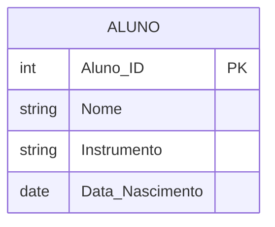

# Exercício 06 - Escola de Música

## Descrição do Cenário

Este exercício apresenta um sistema de banco de dados para uma escola de música. O objetivo é demonstrar como filtrar registros baseados em intervalos de anos específicos, utilizando a função EXTRACT para trabalhar com componentes de data e o operador BETWEEN para definir faixas de valores.

### Contexto do Negócio

A escola de música oferece aulas de diversos instrumentos para alunos de diferentes faixas etárias. Para fins de organização de turmas e planejamento pedagógico, é comum a necessidade de filtrar alunos nascidos em períodos específicos, permitindo agrupar estudantes com idades similares ou que pertencem a uma determinada geração.

### Estrutura dos Dados

O sistema é composto por uma entidade principal que armazena informações dos alunos:



## Implementação em PostgreSQL

### Definição da Estrutura (DDL)

O código abaixo cria o esquema e a tabela necessária para o sistema:

```sql
-- Criação do esquema para organizar as tabelas
CREATE SCHEMA Escola_Musica;
SET search_path TO Escola_Musica;

-- Tabela para armazenar dados dos alunos
CREATE TABLE Aluno (
    Aluno_ID SERIAL PRIMARY KEY,
    Nome VARCHAR(100) NOT NULL,
    Instrumento VARCHAR(50),
    Data_Nascimento DATE NOT NULL
);
```

### Inserção de Dados de Exemplo

Para demonstrar o funcionamento do sistema, inserimos alguns registros de exemplo:

```sql
-- Inserção de alunos com diferentes anos de nascimento
INSERT INTO Aluno (Nome, Instrumento, Data_Nascimento) VALUES
('Carlos', 'Violão', '2001-06-15'),     -- Nascido em 2001
('Fernanda', 'Piano', '2005-10-22'),    -- Nascida em 2005
('João', 'Bateria', '1999-12-30'),      -- Nascido em 1999 (fora do intervalo)
('Marina', 'Violino', '2003-04-05');    -- Nascida em 2003
```

### Consulta Principal: Alunos Nascidos entre 2000 e 2005

O objetivo principal deste exercício é filtrar alunos que nasceram em um intervalo específico de anos:

```sql
SELECT Nome, 
       Instrumento, 
       Data_Nascimento
FROM Aluno
WHERE EXTRACT(YEAR FROM Data_Nascimento) BETWEEN 2000 AND 2005;
```

**Resultado esperado:**
```
Nome     | Instrumento | Data_Nascimento
---------|-------------|----------------
Carlos   | Violão      | 2001-06-15
Fernanda | Piano       | 2005-10-22
Marina   | Violino     | 2003-04-05
```

## Explicação Técnica

### Funções e Operações Utilizadas

1. **EXTRACT(YEAR FROM data)**:
   - Extrai o componente do ano de uma data
   - Retorna um número inteiro representando o ano
   - Permite comparações numéricas com anos específicos

2. **BETWEEN operador**:
   - Define um intervalo inclusivo entre dois valores
   - `BETWEEN 2000 AND 2005` inclui os anos 2000, 2001, 2002, 2003, 2004 e 2005
   - Equivale a `>= 2000 AND <= 2005`

3. **Filtro WHERE**:
   - Aplica a condição de filtro aos registros
   - Retorna apenas os registros que atendem ao critério especificado

### Processo de Filtro

1. Para cada registro, EXTRACT pega o ano da data de nascimento
2. O operador BETWEEN verifica se o ano está no intervalo de 2000 a 2005
3. Apenas os registros que atendem à condição são incluídos no resultado
4. Os dados são retornados com as colunas especificadas no SELECT

### Consultas Adicionais Úteis

#### Consultar alunos com idade calculada:

```sql
SELECT Nome,
       Instrumento,
       Data_Nascimento,
       EXTRACT(YEAR FROM Data_Nascimento) AS Ano_Nascimento,
       EXTRACT(YEAR FROM AGE(CURRENT_DATE, Data_Nascimento)) AS Idade
FROM Aluno
WHERE EXTRACT(YEAR FROM Data_Nascimento) BETWEEN 2000 AND 2005
ORDER BY Data_Nascimento;
```

#### Consultar por instrumento específico no período:

```sql
SELECT Nome,
       Data_Nascimento,
       EXTRACT(YEAR FROM Data_Nascimento) AS Ano_Nascimento
FROM Aluno
WHERE EXTRACT(YEAR FROM Data_Nascimento) BETWEEN 2000 AND 2005
  AND Instrumento = 'Piano';
```

#### Contar alunos por ano de nascimento:

```sql
SELECT EXTRACT(YEAR FROM Data_Nascimento) AS Ano_Nascimento,
       COUNT(*) AS Quantidade_Alunos
FROM Aluno
WHERE EXTRACT(YEAR FROM Data_Nascimento) BETWEEN 2000 AND 2005
GROUP BY EXTRACT(YEAR FROM Data_Nascimento)
ORDER BY Ano_Nascimento;
```

#### Consultar alunos por década:

```sql
SELECT Nome,
       Instrumento,
       Data_Nascimento,
       CASE 
           WHEN EXTRACT(YEAR FROM Data_Nascimento) BETWEEN 1990 AND 1999 THEN 'Anos 90'
           WHEN EXTRACT(YEAR FROM Data_Nascimento) BETWEEN 2000 AND 2009 THEN 'Anos 2000'
           WHEN EXTRACT(YEAR FROM Data_Nascimento) BETWEEN 2010 AND 2019 THEN 'Anos 2010'
           ELSE 'Outra década'
       END AS Decada
FROM Aluno
ORDER BY Data_Nascimento;
```

#### Estatísticas por instrumento no período:

```sql
SELECT Instrumento,
       COUNT(*) AS Total_Alunos,
       MIN(Data_Nascimento) AS Mais_Velho,
       MAX(Data_Nascimento) AS Mais_Novo
FROM Aluno
WHERE EXTRACT(YEAR FROM Data_Nascimento) BETWEEN 2000 AND 2005
GROUP BY Instrumento
ORDER BY Total_Alunos DESC;
```

#### Consultar alunos nascidos em anos específicos:

```sql
-- Apenas anos 2000 e 2005 (exatamente como no exercício original)
SELECT Nome,
       Instrumento,
       Data_Nascimento
FROM Aluno
WHERE EXTRACT(YEAR FROM Data_Nascimento) IN (2000, 2005);
```

#### Consultar com formatação de data:

```sql
SELECT Nome,
       Instrumento,
       TO_CHAR(Data_Nascimento, 'DD/MM/YYYY') AS Data_Formatada,
       EXTRACT(YEAR FROM Data_Nascimento) AS Ano
FROM Aluno
WHERE EXTRACT(YEAR FROM Data_Nascimento) BETWEEN 2000 AND 2005
ORDER BY Data_Nascimento;
```

### Variações da Consulta Principal

#### Usando comparação direta de datas:

```sql
SELECT Nome,
       Instrumento,
       Data_Nascimento
FROM Aluno
WHERE Data_Nascimento >= '2000-01-01' 
  AND Data_Nascimento <= '2005-12-31';
```

#### Incluindo contagem total:

```sql
SELECT Nome,
       Instrumento,
       Data_Nascimento,
       COUNT(*) OVER() AS Total_Alunos_Periodo
FROM Aluno
WHERE EXTRACT(YEAR FROM Data_Nascimento) BETWEEN 2000 AND 2005
ORDER BY Data_Nascimento;
```

#### Com validação de dados:

```sql
SELECT Nome,
       Instrumento,
       Data_Nascimento,
       CASE 
           WHEN Data_Nascimento IS NULL THEN 'Data não informada'
           ELSE 'Data válida'
       END AS Status_Data
FROM Aluno
WHERE EXTRACT(YEAR FROM Data_Nascimento) BETWEEN 2000 AND 2005
   OR Data_Nascimento IS NULL;
```