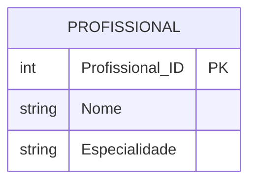

# Exercício 07 - Centro de Estética

## Descrição do Cenário

Este exercício apresenta um sistema de banco de dados para um centro de estética. O objetivo é demonstrar como filtrar registros baseados em múltiplos valores específicos, utilizando o operador IN para selecionar profissionais que possuem especialidades determinadas.

### Contexto do Negócio

O centro de estética conta com diversos profissionais especializados em diferentes tipos de tratamentos. Para otimizar o atendimento e organizar a agenda, é necessário identificar rapidamente quais profissionais podem realizar determinados serviços, permitindo ao centro oferecer aos clientes informações precisas sobre disponibilidade e especialidades.

### Estrutura dos Dados

O sistema é composto por uma entidade principal que armazena informações dos profissionais:



## Implementação em PostgreSQL

### Definição da Estrutura (DDL)

O código abaixo cria o esquema e a tabela necessária para o sistema:

```sql
-- Criação do esquema para organizar as tabelas
CREATE SCHEMA Centro_Estetica;
SET search_path TO Centro_Estetica;

-- Tabela para armazenar dados dos profissionais
CREATE TABLE Profissional (
    Profissional_ID SERIAL PRIMARY KEY,
    Nome VARCHAR(100) NOT NULL,
    Especialidade VARCHAR(50) NOT NULL
);
```

### Inserção de Dados de Exemplo

Para demonstrar o funcionamento do sistema, inserimos alguns registros de exemplo:

```sql
-- Inserção de profissionais com diferentes especialidades
INSERT INTO Profissional (Nome, Especialidade) VALUES
('Ana Silva', 'Massagem'),           -- Especialidade desejada
('Carlos Oliveira', 'Depilação'),    -- Especialidade desejada
('Fernanda Costa', 'Manicure'),      -- Especialidade não desejada
('Paulo Souza', 'Massagem'),         -- Especialidade desejada
('Mariana Lima', 'Cabeleireiro');    -- Especialidade não desejada
```

### Consulta Principal: Profissionais de Massagem e Depilação

O objetivo principal deste exercício é filtrar profissionais que possuem especialidades específicas:

```sql
SELECT Nome, 
        Especialidade
FROM Profissional
WHERE Especialidade IN ('Massagem', 'Depilação');
```

**Resultado esperado:**
```
Nome            | Especialidade
----------------|---------------
Ana Silva       | Massagem
Carlos Oliveira | Depilação
Paulo Souza     | Massagem
```

## Explicação Técnica

### Funções e Operações Utilizadas

1. **Operador IN**:
    - Permite filtrar registros que correspondem a qualquer valor de uma lista
    - `IN ('Massagem', 'Depilação')` é equivalente a `= 'Massagem' OR = 'Depilação'`
    - Mais eficiente e legível quando há múltiplos valores para comparação

2. **Filtro WHERE**:
    - Aplica a condição de seleção aos registros
    - Retorna apenas os profissionais com as especialidades especificadas

3. **SELECT com colunas específicas**:
    - Retorna apenas as colunas Nome e Especialidade
    - Fornece informações essenciais para identificar os profissionais

### Processo de Filtro

1. O operador IN verifica se o valor da coluna Especialidade corresponde a qualquer um dos valores na lista
2. Registros com especialidades 'Massagem' ou 'Depilação' são selecionados
3. Outros registros são excluídos do resultado
4. As informações dos profissionais selecionados são retornadas

### Consultas Adicionais Úteis

#### Consultar todos os profissionais com contagem por especialidade:

```sql
SELECT Especialidade,
        COUNT(*) AS Quantidade_Profissionais
FROM Profissional
GROUP BY Especialidade
ORDER BY Quantidade_Profissionais DESC;
```

#### Consultar profissionais excluindo especialidades específicas:

```sql
SELECT Nome,
        Especialidade
FROM Profissional
WHERE Especialidade NOT IN ('Manicure', 'Cabeleireiro')
ORDER BY Especialidade, Nome;
```

#### Consultar com informações adicionais:

```sql
SELECT Profissional_ID,
        Nome,
        Especialidade,
        CASE 
            WHEN Especialidade = 'Massagem' THEN 'Relaxamento e Bem-estar'
            WHEN Especialidade = 'Depilação' THEN 'Estética Corporal'
            ELSE 'Outros Serviços'
        END AS Categoria_Servico
FROM Profissional
WHERE Especialidade IN ('Massagem', 'Depilação')
ORDER BY Especialidade, Nome;
```

#### Verificar disponibilidade de especialidades:

```sql
SELECT 
    CASE 
        WHEN EXISTS (SELECT 1 FROM Profissional WHERE Especialidade = 'Massagem') 
        THEN 'Disponível' 
        ELSE 'Indisponível' 
    END AS Massagem_Disponivel,
    CASE 
        WHEN EXISTS (SELECT 1 FROM Profissional WHERE Especialidade = 'Depilação') 
        THEN 'Disponível' 
        ELSE 'Indisponível' 
    END AS Depilacao_Disponivel;
```

#### Consultar profissionais com múltiplas especialidades (se aplicável):

```sql
-- Esta consulta seria útil se um profissional pudesse ter múltiplas especialidades
SELECT Nome,
        STRING_AGG(Especialidade, ', ') AS Especialidades
FROM Profissional
WHERE Especialidade IN ('Massagem', 'Depilação')
GROUP BY Nome
HAVING COUNT(DISTINCT Especialidade) > 1;
```

#### Estatísticas das especialidades solicitadas:

```sql
SELECT 
    COUNT(*) AS Total_Profissionais_Especializados,
    COUNT(CASE WHEN Especialidade = 'Massagem' THEN 1 END) AS Profissionais_Massagem,
    COUNT(CASE WHEN Especialidade = 'Depilação' THEN 1 END) AS Profissionais_Depilacao
FROM Profissional
WHERE Especialidade IN ('Massagem', 'Depilação');
```

#### Consultar com ordenação por especialidade:

```sql
SELECT Nome,
        Especialidade
FROM Profissional
WHERE Especialidade IN ('Massagem', 'Depilação')
ORDER BY 
    CASE Especialidade
        WHEN 'Massagem' THEN 1
        WHEN 'Depilação' THEN 2
    END,
    Nome;
```

### Variações da Consulta Principal

#### Usando OR ao invés de IN:

```sql
SELECT Nome,
        Especialidade
FROM Profissional
WHERE Especialidade = 'Massagem' 
    OR Especialidade = 'Depilação';
```

#### Incluindo contagem total:

```sql
SELECT Nome,
        Especialidade,
        COUNT(*) OVER() AS Total_Profissionais_Encontrados
FROM Profissional
WHERE Especialidade IN ('Massagem', 'Depilação')
ORDER BY Especialidade, Nome;
```

#### Com busca case-insensitive:

```sql
SELECT Nome,
        Especialidade
FROM Profissional
WHERE UPPER(Especialidade) IN ('MASSAGEM', 'DEPILAÇÃO')
ORDER BY Nome;
```

#### Adicionando filtro por nome:

```sql
SELECT Nome,
        Especialidade
FROM Profissional
WHERE Especialidade IN ('Massagem', 'Depilação')
  AND Nome LIKE '%Silva%'
ORDER BY Nome;
```