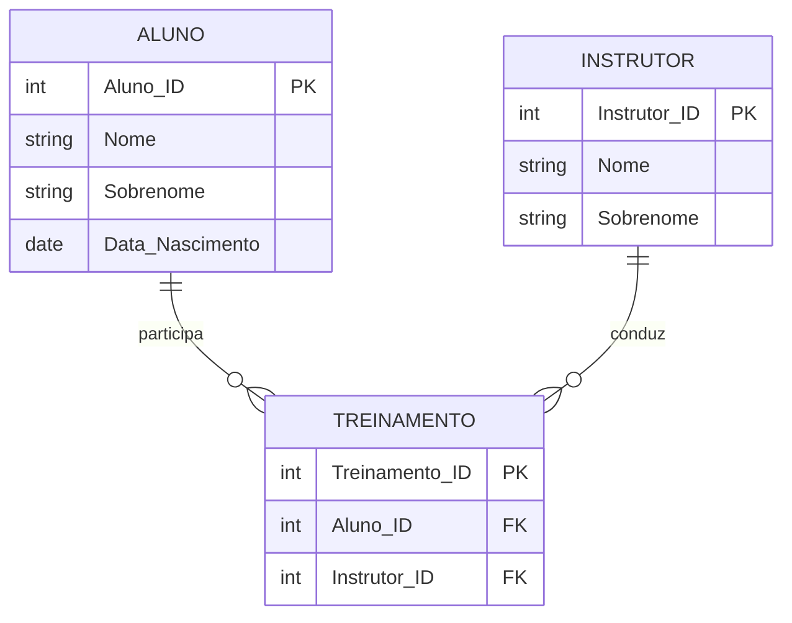

# Exercício 09 - Academia de Ginástica

## Descrição do Cenário

Este exercício apresenta um sistema de banco de dados para uma academia de ginástica. O objetivo é demonstrar como
utilizar múltiplos JOINs combinados com filtros de idade para identificar instrutores que trabalham com alunos de faixas
etárias específicas, utilizando cálculos de idade e a cláusula DISTINCT.

### Contexto do Negócio

A academia de ginástica precisa identificar quais instrutores estão trabalhando com alunos de determinadas faixas
etárias. Esta informação é crucial para planejamento de programas de treinamento específicos, adequação de exercícios
por idade e organização de turmas homogêneas. Conhecer quais instrutores têm experiência com alunos mais maduros (acima
de 40 anos) ajuda na alocação adequada de recursos humanos.

### Estrutura dos Dados

O sistema é composto por três entidades principais com os seguintes relacionamentos:



## Implementação em PostgreSQL

### Definição da Estrutura (DDL)

O código abaixo cria o esquema e as tabelas necessárias para o sistema:

```sql
-- Criação do esquema para organizar as tabelas
CREATE SCHEMA Academia;
SET search_path TO Academia;

-- Tabela para armazenar dados dos alunos
CREATE TABLE Aluno
(
    Aluno_ID        SERIAL PRIMARY KEY,
    Nome            VARCHAR(100) NOT NULL,
    Sobrenome       VARCHAR(100) NOT NULL,
    Data_Nascimento DATE         NOT NULL
);

-- Tabela para armazenar dados dos instrutores
CREATE TABLE Instrutor
(
    Instrutor_ID SERIAL PRIMARY KEY,
    Nome         VARCHAR(100) NOT NULL,
    Sobrenome    VARCHAR(100) NOT NULL
);

-- Tabela para armazenar relacionamento entre alunos e instrutores
CREATE TABLE Treinamento
(
    Treinamento_ID SERIAL PRIMARY KEY,
    Aluno_ID       INT REFERENCES Aluno (Aluno_ID),
    Instrutor_ID   INT REFERENCES Instrutor (Instrutor_ID)
);
```

### Inserção de Dados de Exemplo

Para demonstrar o funcionamento do sistema, inserimos alguns registros de exemplo:

```sql
-- Inserção de alunos com diferentes idades
INSERT INTO Aluno (Nome, Sobrenome, Data_Nascimento)
VALUES ('Carlos', 'Silva', '1980-05-10'),   -- Aproximadamente 44 anos (acima de 40)
       ('Fernanda', 'Costa', '1995-03-20'), -- Aproximadamente 29 anos (abaixo de 40)
       ('João', 'Oliveira', '1975-09-30');
-- Aproximadamente 49 anos (acima de 40)

-- Inserção de instrutores
INSERT INTO Instrutor (Nome, Sobrenome)
VALUES ('Paulo', 'Souza'),
       ('Mariana', 'Lima');

-- Inserção de relacionamentos de treinamento
INSERT INTO Treinamento (Aluno_ID, Instrutor_ID)
VALUES (1, 1), -- Carlos (44 anos) treina com Paulo
       (2, 1), -- Fernanda (29 anos) treina com Paulo
       (3, 2); -- João (49 anos) treina com Mariana
```

### Consulta Principal: Instrutores com Alunos Acima de 40 Anos

O objetivo principal deste exercício é identificar instrutores que trabalham com alunos acima de 40 anos:

```sql
SELECT DISTINCT I.Nome, I.Sobrenome
FROM Treinamento T
         JOIN Instrutor I ON T.Instrutor_ID = I.Instrutor_ID
         JOIN Aluno A ON T.Aluno_ID = A.Aluno_ID
WHERE EXTRACT(YEAR FROM AGE(CURRENT_DATE, A.Data_Nascimento)) > 40;
```

**Resultado esperado:**

```
Nome    | Sobrenome
--------|----------
Paulo   | Souza
Mariana | Lima
```

## Explicação Técnica

### Operações Utilizadas

1. **Múltiplos JOINs**:
    - `JOIN Instrutor I ON T.Instrutor_ID = I.Instrutor_ID` conecta treinamentos com instrutores
    - `JOIN Aluno A ON T.Aluno_ID = A.Aluno_ID` conecta treinamentos com alunos
    - Permite acessar informações de ambas as entidades através da tabela de relacionamento

2. **Cálculo de Idade**:
    - `AGE(CURRENT_DATE, A.Data_Nascimento)` calcula a idade exata do aluno
    - `EXTRACT(YEAR FROM ...)` extrai apenas os anos da idade calculada
    - `> 40` filtra apenas alunos com mais de 40 anos

3. **DISTINCT**:
    - Evita duplicação de instrutores no resultado
    - Essencial quando um instrutor treina múltiplos alunos acima de 40 anos
    - Garante que cada instrutor apareça apenas uma vez

4. **Filtro WHERE**:
    - Aplica a condição de idade aos registros
    - Seleciona apenas relacionamentos onde o aluno tem mais de 40 anos

### Processo de Filtro

1. A tabela Treinamento conecta alunos e instrutores
2. JOINs trazem informações completas de ambas as entidades
3. Cálculo de idade é aplicado para cada aluno
4. Filtro WHERE seleciona apenas alunos acima de 40 anos
5. DISTINCT remove instrutores duplicados do resultado

### Consultas Adicionais Úteis

#### Consultar com detalhes dos alunos acima de 40 anos:

```sql
SELECT DISTINCT I.Nome                                                  AS Instrutor_Nome,
                I.Sobrenome                                             AS Instrutor_Sobrenome,
                A.Nome                                                  AS Aluno_Nome,
                A.Sobrenome                                             AS Aluno_Sobrenome,
                EXTRACT(YEAR FROM AGE(CURRENT_DATE, A.Data_Nascimento)) AS Idade_Aluno
FROM Treinamento T
         JOIN Instrutor I ON T.Instrutor_ID = I.Instrutor_ID
         JOIN Aluno A ON T.Aluno_ID = A.Aluno_ID
WHERE EXTRACT(YEAR FROM AGE(CURRENT_DATE, A.Data_Nascimento)) > 40
ORDER BY I.Nome, A.Nome;
```

#### Contar quantos alunos acima de 40 anos cada instrutor tem:

```sql
SELECT I.Nome      AS Instrutor_Nome,
       I.Sobrenome AS Instrutor_Sobrenome,
       COUNT(*)    AS Alunos_Acima_40
FROM Treinamento T
         JOIN Instrutor I ON T.Instrutor_ID = I.Instrutor_ID
         JOIN Aluno A ON T.Aluno_ID = A.Aluno_ID
WHERE EXTRACT(YEAR FROM AGE(CURRENT_DATE, A.Data_Nascimento)) > 40
GROUP BY I.Instrutor_ID, I.Nome, I.Sobrenome
ORDER BY Alunos_Acima_40 DESC;
```

#### Consultar instrutores por faixa etária dos alunos:

```sql
SELECT I.Nome      AS Instrutor_Nome,
       I.Sobrenome AS Instrutor_Sobrenome,
       CASE
           WHEN EXTRACT(YEAR FROM AGE(CURRENT_DATE, A.Data_Nascimento)) < 30 THEN 'Jovens (< 30)'
           WHEN EXTRACT(YEAR FROM AGE(CURRENT_DATE, A.Data_Nascimento)) BETWEEN 30 AND 40 THEN 'Adultos (30-40)'
           ELSE 'Maduros (> 40)'
           END     AS Faixa_Etaria,
       COUNT(*)    AS Quantidade_Alunos
FROM Treinamento T
         JOIN Instrutor I ON T.Instrutor_ID = I.Instrutor_ID
         JOIN Aluno A ON T.Aluno_ID = A.Aluno_ID
GROUP BY I.Instrutor_ID, I.Nome, I.Sobrenome,
         CASE
             WHEN EXTRACT(YEAR FROM AGE(CURRENT_DATE, A.Data_Nascimento)) < 30 THEN 'Jovens (< 30)'
             WHEN EXTRACT(YEAR FROM AGE(CURRENT_DATE, A.Data_Nascimento)) BETWEEN 30 AND 40 THEN 'Adultos (30-40)'
             ELSE 'Maduros (> 40)'
             END
ORDER BY I.Nome, Faixa_Etaria;
```

#### Instrutores que NÃO têm alunos acima de 40 anos:

```sql
SELECT I.Nome, I.Sobrenome
FROM Instrutor I
WHERE I.Instrutor_ID NOT IN (SELECT DISTINCT T.Instrutor_ID
                             FROM Treinamento T
                                      JOIN Aluno A ON T.Aluno_ID = A.Aluno_ID
                             WHERE EXTRACT(YEAR FROM AGE(CURRENT_DATE, A.Data_Nascimento)) > 40);
```

#### Estatísticas gerais por instrutor:

```sql
SELECT I.Nome                                                                                   AS Instrutor_Nome,
       I.Sobrenome                                                                              AS Instrutor_Sobrenome,
       COUNT(*)                                                                                 AS Total_Alunos,
       COUNT(CASE WHEN EXTRACT(YEAR FROM AGE(CURRENT_DATE, A.Data_Nascimento)) > 40 THEN 1 END) AS Alunos_Acima_40,
       AVG(EXTRACT(YEAR FROM AGE(CURRENT_DATE, A.Data_Nascimento)))                             AS Idade_Media_Alunos,
       MIN(EXTRACT(YEAR FROM AGE(CURRENT_DATE, A.Data_Nascimento)))                             AS Aluno_Mais_Novo,
       MAX(EXTRACT(YEAR FROM AGE(CURRENT_DATE, A.Data_Nascimento)))                             AS Aluno_Mais_Velho
FROM Treinamento T
         JOIN Instrutor I ON T.Instrutor_ID = I.Instrutor_ID
         JOIN Aluno A ON T.Aluno_ID = A.Aluno_ID
GROUP BY I.Instrutor_ID, I.Nome, I.Sobrenome
ORDER BY Total_Alunos DESC;
```

#### Consultar com nome completo concatenado:

```sql
SELECT DISTINCT CONCAT(I.Nome, ' ', I.Sobrenome) AS Instrutor_Completo
FROM Treinamento T
         JOIN Instrutor I ON T.Instrutor_ID = I.Instrutor_ID
         JOIN Aluno A ON T.Aluno_ID = A.Aluno_ID
WHERE EXTRACT(YEAR FROM AGE(CURRENT_DATE, A.Data_Nascimento)) > 40
ORDER BY Instrutor_Completo;
```

### Variações da Consulta Principal

#### Incluindo contagem de alunos qualificados:

```sql
SELECT I.Nome,
       I.Sobrenome,
       COUNT(*) AS Alunos_Acima_40
FROM Treinamento T
         JOIN Instrutor I ON T.Instrutor_ID = I.Instrutor_ID
         JOIN Aluno A ON T.Aluno_ID = A.Aluno_ID
WHERE EXTRACT(YEAR FROM AGE(CURRENT_DATE, A.Data_Nascimento)) > 40
GROUP BY I.Instrutor_ID, I.Nome, I.Sobrenome;
```

#### Com diferentes faixas etárias:

```sql
-- Instrutores com alunos acima de 35 anos
SELECT DISTINCT I.Nome, I.Sobrenome
FROM Treinamento T
         JOIN Instrutor I ON T.Instrutor_ID = I.Instrutor_ID
         JOIN Aluno A ON T.Aluno_ID = A.Aluno_ID
WHERE EXTRACT(YEAR FROM AGE(CURRENT_DATE, A.Data_Nascimento)) > 35;
```

#### Usando subconsulta:

```sql
SELECT Nome, Sobrenome
FROM Instrutor
WHERE Instrutor_ID IN (SELECT DISTINCT T.Instrutor_ID
                       FROM Treinamento T
                                JOIN Aluno A ON T.Aluno_ID = A.Aluno_ID
                       WHERE EXTRACT(YEAR FROM AGE(CURRENT_DATE, A.Data_Nascimento)) > 40);
```