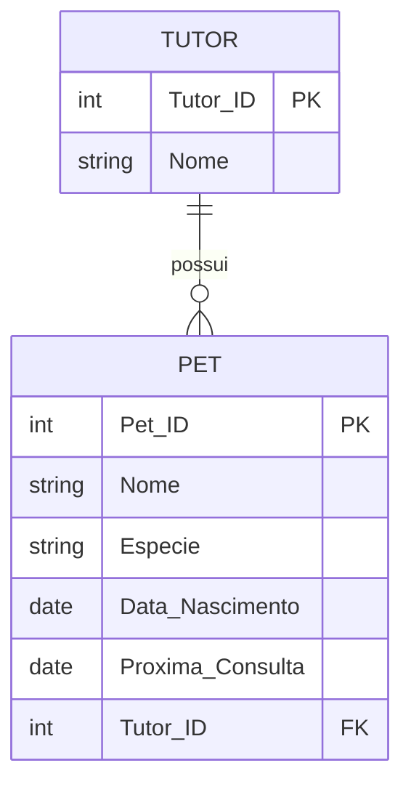

# Exercício 10 - Pet Shop

## Descrição do Cenário

Este exercício apresenta um sistema de banco de dados para um pet shop. O objetivo é demonstrar como identificar
registros que possuem valores NULL em campos específicos, utilizando a condição IS NULL para filtrar pets que não
possuem consultas agendadas.

### Contexto do Negócio

O pet shop oferece serviços veterinários para os pets de seus clientes, incluindo consultas de check-up regulares. É
importante para a gestão do negócio identificar quais pets não têm consultas agendadas, permitindo que a equipe entre em
contato com os tutores para agendar os cuidados preventivos necessários. Esta consulta também ajuda a identificar pets
que podem estar precisando de atenção médica.

### Estrutura dos Dados

O sistema é composto por duas entidades principais com o seguinte relacionamento:



## Implementação em PostgreSQL

### Definição da Estrutura (DDL)

O código abaixo cria o esquema e as tabelas necessárias para o sistema:

```sql
-- Criação do esquema para organizar as tabelas
CREATE SCHEMA Pet_Shop;
SET search_path TO Pet_Shop;

-- Tabela para armazenar dados dos tutores
CREATE TABLE Tutor
(
    Tutor_ID SERIAL PRIMARY KEY,
    Nome     VARCHAR(100) NOT NULL
);

-- Tabela para armazenar dados dos pets
CREATE TABLE Pet
(
    Pet_ID           SERIAL PRIMARY KEY,
    Nome             VARCHAR(100) NOT NULL,
    Especie          VARCHAR(50),
    Data_Nascimento  DATE         NOT NULL,
    Proxima_Consulta DATE,
    Tutor_ID         INT REFERENCES Tutor (Tutor_ID)
);
```

### Inserção de Dados de Exemplo

Para demonstrar o funcionamento do sistema, inserimos alguns registros de exemplo:

```sql
-- Inserção de tutores
INSERT INTO Tutor (Nome)
VALUES ('João Silva'),
       ('Maria Oliveira');

-- Inserção de pets com diferentes situações de consulta
INSERT INTO Pet (Nome, Especie, Data_Nascimento, Proxima_Consulta, Tutor_ID)
VALUES ('Rex', 'Cachorro', '2015-06-15', '2024-12-10', 1), -- Tem consulta agendada
       ('Miau', 'Gato', '2018-11-05', NULL, 2),            -- SEM consulta agendada
       ('Pingo', 'Cachorro', '2020-01-20', NULL, 1),       -- SEM consulta agendada
       ('Luna', 'Coelho', '2017-09-30', '2024-11-30', 2); -- Tem consulta agendada
```

### Consulta Principal: Pets sem Consulta Agendada

O objetivo principal deste exercício é identificar pets que não possuem próxima consulta agendada:

```sql
SELECT P.Nome                                                  AS Pet_Nome,
       P.Especie,
       EXTRACT(YEAR FROM AGE(CURRENT_DATE, P.Data_Nascimento)) AS Idade
FROM Pet P
WHERE P.Proxima_Consulta IS NULL;
```

**Resultado esperado:**

```
Pet_Nome | Especie  | Idade
---------|----------|-------
Miau     | Gato     | 6
Pingo    | Cachorro | 4
```

## Explicação Técnica

### Operações Utilizadas

1. **IS NULL**:
    - Verifica se um campo contém valor NULL (ausência de dados)
    - Diferente de comparações com valores vazios ou zero
    - `WHERE P.Proxima_Consulta IS NULL` seleciona apenas pets sem consulta agendada

2. **Cálculo de Idade**:
    - `AGE(CURRENT_DATE, P.Data_Nascimento)` calcula a idade exata do pet
    - `EXTRACT(YEAR FROM ...)` extrai apenas os anos da idade calculada
    - Fornece informação útil sobre a idade do pet que precisa de consulta

3. **Alias de Colunas**:
    - `AS Pet_Nome` torna claro que se refere ao nome do pet
    - Melhora a legibilidade do resultado
    - Facilita a interpretação dos dados

### Processo de Filtro

1. A consulta examina todos os registros da tabela Pet
2. A condição WHERE filtra apenas registros onde Proxima_Consulta é NULL
3. Para cada pet selecionado, calcula-se a idade atual
4. Retorna nome, espécie e idade dos pets sem consulta agendada

### Consultas Adicionais Úteis

#### Consultar pets sem consulta incluindo informações do tutor:

```sql
SELECT T.Nome                                                  AS Tutor_Nome,
       P.Nome                                                  AS Pet_Nome,
       P.Especie,
       EXTRACT(YEAR FROM AGE(CURRENT_DATE, P.Data_Nascimento)) AS Idade
FROM Pet P
         JOIN Tutor T ON P.Tutor_ID = T.Tutor_ID
WHERE P.Proxima_Consulta IS NULL
ORDER BY T.Nome, P.Nome;
```

#### Contar pets sem consulta por tutor:

```sql
SELECT T.Nome   AS Tutor_Nome,
       COUNT(*) AS Pets_Sem_Consulta
FROM Pet P
         JOIN Tutor T ON P.Tutor_ID = T.Tutor_ID
WHERE P.Proxima_Consulta IS NULL
GROUP BY T.Tutor_ID, T.Nome
ORDER BY Pets_Sem_Consulta DESC;
```

#### Consultar pets sem consulta por espécie:

```sql
SELECT P.Especie,
       COUNT(*)                                                     AS Quantidade_Sem_Consulta,
       AVG(EXTRACT(YEAR FROM AGE(CURRENT_DATE, P.Data_Nascimento))) AS Idade_Media
FROM Pet P
WHERE P.Proxima_Consulta IS NULL
GROUP BY P.Especie
ORDER BY Quantidade_Sem_Consulta DESC;
```

#### Comparar pets com e sem consulta:

```sql
SELECT CASE
           WHEN P.Proxima_Consulta IS NULL THEN 'Sem Consulta'
           ELSE 'Com Consulta'
           END                                                      AS Status_Consulta,
       COUNT(*)                                                     AS Quantidade_Pets,
       AVG(EXTRACT(YEAR FROM AGE(CURRENT_DATE, P.Data_Nascimento))) AS Idade_Media
FROM Pet P
GROUP BY CASE
             WHEN P.Proxima_Consulta IS NULL THEN 'Sem Consulta'
             ELSE 'Com Consulta'
             END;
```

#### Pets sem consulta há mais tempo (mais velhos):

```sql
SELECT P.Nome                                                  AS Pet_Nome,
       P.Especie,
       EXTRACT(YEAR FROM AGE(CURRENT_DATE, P.Data_Nascimento)) AS Idade,
       AGE(CURRENT_DATE, P.Data_Nascimento)                    AS Idade_Completa
FROM Pet P
WHERE P.Proxima_Consulta IS NULL
ORDER BY P.Data_Nascimento ASC; -- Mais velhos primeiro
```

#### Pets que precisam de consulta urgente (acima de certa idade):

```sql
SELECT P.Nome                                                  AS Pet_Nome,
       P.Especie,
       EXTRACT(YEAR FROM AGE(CURRENT_DATE, P.Data_Nascimento)) AS Idade,
       T.Nome                                                  AS Tutor_Nome
FROM Pet P
         JOIN Tutor T ON P.Tutor_ID = T.Tutor_ID
WHERE P.Proxima_Consulta IS NULL
  AND EXTRACT(YEAR FROM AGE(CURRENT_DATE, P.Data_Nascimento)) >= 5
ORDER BY Idade DESC;
```

#### Relatório completo de status de consultas:

```sql
SELECT T.Nome                                                  AS Tutor_Nome,
       P.Nome                                                  AS Pet_Nome,
       P.Especie,
       EXTRACT(YEAR FROM AGE(CURRENT_DATE, P.Data_Nascimento)) AS Idade,
       CASE
           WHEN P.Proxima_Consulta IS NULL THEN 'PRECISA AGENDAR'
           WHEN P.Proxima_Consulta < CURRENT_DATE THEN 'CONSULTA ATRASADA'
           WHEN P.Proxima_Consulta <= CURRENT_DATE + INTERVAL '7 days' THEN 'CONSULTA PRÓXIMA'
           ELSE 'CONSULTA AGENDADA'
           END                                                 AS Status_Consulta,
       P.Proxima_Consulta
FROM Pet P
         JOIN Tutor T ON P.Tutor_ID = T.Tutor_ID
ORDER BY CASE
             WHEN P.Proxima_Consulta IS NULL THEN 1
             WHEN P.Proxima_Consulta < CURRENT_DATE THEN 2
             WHEN P.Proxima_Consulta <= CURRENT_DATE + INTERVAL '7 days' THEN 3
             ELSE 4
             END,
         P.Proxima_Consulta;
```

### Variações da Consulta Principal

#### Incluindo data de nascimento:

```sql
SELECT P.Nome                                                  AS Pet_Nome,
       P.Especie,
       P.Data_Nascimento,
       EXTRACT(YEAR FROM AGE(CURRENT_DATE, P.Data_Nascimento)) AS Idade
FROM Pet P
WHERE P.Proxima_Consulta IS NULL
ORDER BY P.Data_Nascimento;
```

#### Com idade em anos e meses:

```sql
SELECT P.Nome                                                   AS Pet_Nome,
       P.Especie,
       EXTRACT(YEAR FROM AGE(CURRENT_DATE, P.Data_Nascimento))  AS Anos,
       EXTRACT(MONTH FROM AGE(CURRENT_DATE, P.Data_Nascimento)) AS Meses
FROM Pet P
WHERE P.Proxima_Consulta IS NULL
ORDER BY Anos DESC, Meses DESC;
```

#### Usando NOT EXISTS:

```sql
SELECT P.Nome                                                  AS Pet_Nome,
       P.Especie,
       EXTRACT(YEAR FROM AGE(CURRENT_DATE, P.Data_Nascimento)) AS Idade
FROM Pet P
WHERE NOT EXISTS (SELECT 1
                  FROM Pet P2
                  WHERE P2.Pet_ID = P.Pet_ID
                    AND P2.Proxima_Consulta IS NOT NULL);
```

#### Com contagem total:

```sql
SELECT P.Nome                                                  AS Pet_Nome,
       P.Especie,
       EXTRACT(YEAR FROM AGE(CURRENT_DATE, P.Data_Nascimento)) AS Idade,
       COUNT(*) OVER ()                                        AS Total_Pets_Sem_Consulta
FROM Pet P
WHERE P.Proxima_Consulta IS NULL
ORDER BY Idade DESC;
```