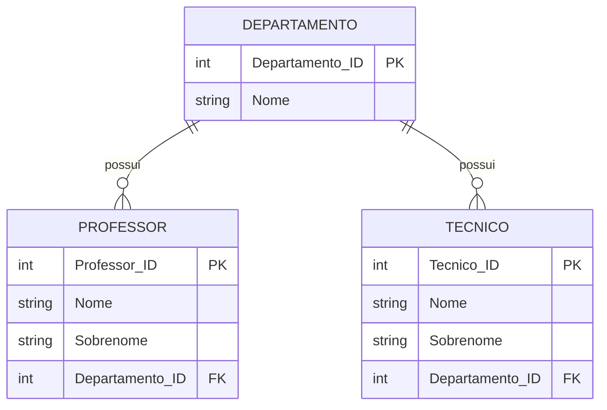

# Exercício 12 - Universidade

## Descrição do Cenário

Este exercício apresenta um sistema de banco de dados para uma universidade. O objetivo é demonstrar como utilizar
subconsultas (subqueries) para filtrar registros baseados em relacionamentos indiretos, identificando técnicos
administrativos que trabalham no mesmo departamento que um professor específico.

### Contexto do Negócio

A universidade possui diversos funcionários distribuídos em diferentes departamentos, incluindo professores e técnicos
administrativos. Para fins de organização administrativa, comunicação interna ou projetos interdepartamentais, é comum a
necessidade de identificar técnicos que trabalham no mesmo departamento que determinados professores, facilitando a
colaboração e coordenação de atividades.

### Estrutura dos Dados

O sistema é composto por três entidades principais com os seguintes relacionamentos:



## Implementação em PostgreSQL

### Definição da Estrutura (DDL)

O código abaixo cria o esquema e as tabelas necessárias para o sistema:

```sql
-- Criação do esquema para organizar as tabelas
CREATE SCHEMA Universidade;
SET search_path TO Universidade;

-- Tabela para armazenar dados dos departamentos
CREATE TABLE Departamento
(
    Departamento_ID SERIAL PRIMARY KEY,
    Nome            VARCHAR(100) NOT NULL
);

-- Tabela para armazenar dados dos professores
CREATE TABLE Professor
(
    Professor_ID    SERIAL PRIMARY KEY,
    Nome            VARCHAR(100) NOT NULL,
    Sobrenome       VARCHAR(100) NOT NULL,
    Departamento_ID INT REFERENCES Departamento (Departamento_ID)
);

-- Tabela para armazenar dados dos técnicos administrativos
CREATE TABLE Tecnico
(
    Tecnico_ID      SERIAL PRIMARY KEY,
    Nome            VARCHAR(100) NOT NULL,
    Sobrenome       VARCHAR(100) NOT NULL,
    Departamento_ID INT REFERENCES Departamento (Departamento_ID)
);
```

### Inserção de Dados de Exemplo

Para demonstrar o funcionamento do sistema, inserimos alguns registros de exemplo:

```sql
-- Inserção de departamentos
INSERT INTO Departamento (Nome)
VALUES ('Engenharia'),
       ('Administração');

-- Inserção de professores
INSERT INTO Professor (Nome, Sobrenome, Departamento_ID)
VALUES ('Carlos', 'Silva', 1), -- Professor Carlos no departamento de Engenharia
       ('Ana', 'Souza', 2);
-- Professora Ana no departamento de Administração

-- Inserção de técnicos administrativos
INSERT INTO Tecnico (Nome, Sobrenome, Departamento_ID)
VALUES ('Fernanda', 'Oliveira', 1), -- Técnica no departamento de Engenharia (mesmo que Carlos)
       ('João', 'Costa', 1),        -- Técnico no departamento de Engenharia (mesmo que Carlos)
       ('Mariana', 'Pereira', 2); -- Técnica no departamento de Administração (mesmo que Ana)
```

### Consulta Principal: Técnicos no Mesmo Departamento que 'Carlos'

O objetivo principal deste exercício é encontrar técnicos que trabalham no mesmo departamento que o professor 'Carlos':

```sql
SELECT T.Nome,
       T.Sobrenome,
       D.Nome AS Departamento
FROM Tecnico T
         JOIN Departamento D ON T.Departamento_ID = D.Departamento_ID
WHERE T.Departamento_ID = (SELECT P.Departamento_ID
                           FROM Professor P
                           WHERE P.Nome ILIKE 'Carlos'
                           LIMIT 1);
```

**Resultado esperado:**

```
Nome     | Sobrenome | Departamento
---------|-----------|-------------
Fernanda | Oliveira  | Engenharia
João     | Costa     | Engenharia
```

## Explicação Técnica

### Operações Utilizadas

1. **Subconsulta (Subquery)**:
    - `(SELECT P.Departamento_ID FROM Professor P WHERE P.Nome ILIKE 'Carlos' LIMIT 1)`
    - Executa primeiro para encontrar o departamento do professor Carlos
    - Retorna o ID do departamento que será usado na consulta principal

2. **ILIKE**:
    - Comparação case-insensitive (não diferencia maiúsculas de minúsculas)
    - `ILIKE 'Carlos'` encontra "Carlos", "carlos", "CARLOS", etc.
    - Mais flexível que o operador = tradicional

3. **JOIN com Departamento**:
    - Traz o nome do departamento para exibição no resultado
    - Melhora a legibilidade mostrando o nome ao invés do ID

4. **LIMIT 1**:
    - Garante que a subconsulta retorne apenas um valor
    - Previne erros caso existam múltiplos professores com o mesmo nome

### Processo de Execução

1. A subconsulta é executada primeiro, encontrando o Departamento_ID do professor 'Carlos'
2. O resultado da subconsulta é usado na condição WHERE da consulta principal
3. A consulta principal filtra técnicos que pertencem ao mesmo departamento
4. JOIN com Departamento traz o nome do departamento para o resultado

### Consultas Adicionais Úteis

#### Técnicos no mesmo departamento com informações do professor:

```sql
SELECT T.Nome      AS Tecnico_Nome,
       T.Sobrenome AS Tecnico_Sobrenome,
       P.Nome      AS Professor_Nome,
       P.Sobrenome AS Professor_Sobrenome,
       D.Nome      AS Departamento
FROM Tecnico T
         JOIN Departamento D ON T.Departamento_ID = D.Departamento_ID
         JOIN Professor P ON T.Departamento_ID = P.Departamento_ID
WHERE P.Nome ILIKE 'Carlos'
ORDER BY T.Nome;
```

#### Contar técnicos por departamento de cada professor:

```sql
SELECT P.Nome              AS Professor_Nome,
       P.Sobrenome         AS Professor_Sobrenome,
       D.Nome              AS Departamento,
       COUNT(T.Tecnico_ID) AS Quantidade_Tecnicos
FROM Professor P
         JOIN Departamento D ON P.Departamento_ID = D.Departamento_ID
         LEFT JOIN Tecnico T ON P.Departamento_ID = T.Departamento_ID
GROUP BY P.Professor_ID, P.Nome, P.Sobrenome, D.Nome
ORDER BY Quantidade_Tecnicos DESC;
```

#### Técnicos que trabalham com múltiplos professores (mesmo departamento):

```sql
SELECT T.Nome                                             AS Tecnico_Nome,
       T.Sobrenome                                        AS Tecnico_Sobrenome,
       D.Nome                                             AS Departamento,
       COUNT(P.Professor_ID)                              AS Quantidade_Professores,
       STRING_AGG(CONCAT(P.Nome, ' ', P.Sobrenome), ', ') AS Professores
FROM Tecnico T
         JOIN Departamento D ON T.Departamento_ID = D.Departamento_ID
         JOIN Professor P ON T.Departamento_ID = P.Departamento_ID
GROUP BY T.Tecnico_ID, T.Nome, T.Sobrenome, D.Nome
ORDER BY Quantidade_Professores DESC;
```

#### Departamentos sem técnicos:

```sql
SELECT D.Nome AS Departamento
FROM Departamento D
WHERE D.Departamento_ID NOT IN (SELECT DISTINCT T.Departamento_ID
                                FROM Tecnico T
                                WHERE T.Departamento_ID IS NOT NULL);
```

#### Comparação de funcionários por departamento:

```sql
SELECT D.Nome                                      AS Departamento,
       COUNT(P.Professor_ID)                       AS Total_Professores,
       COUNT(T.Tecnico_ID)                         AS Total_Tecnicos,
       COUNT(P.Professor_ID) + COUNT(T.Tecnico_ID) AS Total_Funcionarios
FROM Departamento D
         LEFT JOIN Professor P ON D.Departamento_ID = P.Departamento_ID
         LEFT JOIN Tecnico T ON D.Departamento_ID = T.Departamento_ID
GROUP BY D.Departamento_ID, D.Nome
ORDER BY Total_Funcionarios DESC;
```

#### Técnicos em departamentos com professores específicos (múltiplos nomes):

```sql
SELECT T.Nome      AS Tecnico_Nome,
       T.Sobrenome AS Tecnico_Sobrenome,
       D.Nome      AS Departamento
FROM Tecnico T
         JOIN Departamento D ON T.Departamento_ID = D.Departamento_ID
WHERE T.Departamento_ID IN (SELECT P.Departamento_ID
                            FROM Professor P
                            WHERE P.Nome ILIKE ANY (ARRAY ['Carlos', 'Ana']));
```

#### Relatório completo de colaboração por departamento:

```sql
SELECT D.Nome                                    AS Departamento,
       COALESCE(prof_info.Professores, 'Nenhum') AS Professores,
       COALESCE(tec_info.Tecnicos, 'Nenhum')     AS Tecnicos
FROM Departamento D
         LEFT JOIN (SELECT Departamento_ID,
                           STRING_AGG(CONCAT(Nome, ' ', Sobrenome), ', ') AS Professores
                    FROM Professor
                    GROUP BY Departamento_ID) prof_info ON D.Departamento_ID = prof_info.Departamento_ID
         LEFT JOIN (SELECT Departamento_ID,
                           STRING_AGG(CONCAT(Nome, ' ', Sobrenome), ', ') AS Tecnicos
                    FROM Tecnico
                    GROUP BY Departamento_ID) tec_info ON D.Departamento_ID = tec_info.Departamento_ID
ORDER BY D.Nome;
```

### Variações da Consulta Principal

#### Usando JOIN ao invés de subconsulta:

```sql
SELECT DISTINCT T.Nome,
                T.Sobrenome,
                D.Nome AS Departamento
FROM Tecnico T
         JOIN Departamento D ON T.Departamento_ID = D.Departamento_ID
         JOIN Professor P ON T.Departamento_ID = P.Departamento_ID
WHERE P.Nome ILIKE 'Carlos';
```

#### Incluindo informações do professor encontrado:

```sql
SELECT T.Nome      AS Tecnico_Nome,
       T.Sobrenome AS Tecnico_Sobrenome,
       D.Nome      AS Departamento,
       (SELECT CONCAT(P.Nome, ' ', P.Sobrenome)
        FROM Professor P
        WHERE P.Nome ILIKE 'Carlos'
          AND P.Departamento_ID = T.Departamento_ID
        LIMIT 1)   AS Professor_Referencia
FROM Tecnico T
         JOIN Departamento D ON T.Departamento_ID = D.Departamento_ID
WHERE T.Departamento_ID = (SELECT P.Departamento_ID
                           FROM Professor P
                           WHERE P.Nome ILIKE 'Carlos'
                           LIMIT 1);
```

#### Com validação de existência do professor:

```sql
SELECT T.Nome,
       T.Sobrenome,
       D.Nome AS Departamento
FROM Tecnico T
         JOIN Departamento D ON T.Departamento_ID = D.Departamento_ID
WHERE EXISTS (SELECT 1
              FROM Professor P
              WHERE P.Nome ILIKE 'Carlos'
                AND P.Departamento_ID = T.Departamento_ID);
```

#### Busca por nome completo do professor:

```sql
SELECT T.Nome,
       T.Sobrenome,
       D.Nome AS Departamento
FROM Tecnico T
         JOIN Departamento D ON T.Departamento_ID = D.Departamento_ID
WHERE T.Departamento_ID = (SELECT P.Departamento_ID
                           FROM Professor P
                           WHERE CONCAT(P.Nome, ' ', P.Sobrenome) ILIKE '%Carlos Silva%'
                           LIMIT 1);
```
