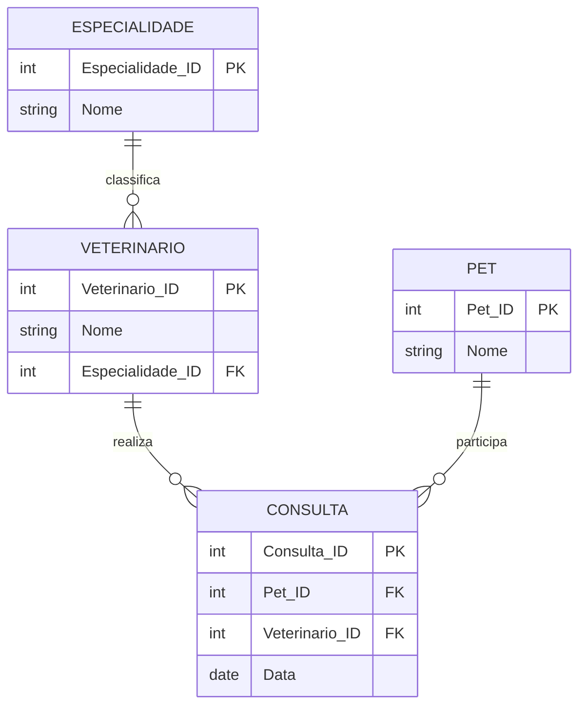

# Exercício 13 - Clínica Veterinária

## Descrição do Cenário

Este exercício apresenta um sistema de banco de dados para uma clínica veterinária. O objetivo é demonstrar como
utilizar múltiplos JOINs para navegar através de relacionamentos entre tabelas e filtrar registros baseados em critérios
específicos de especialidade, identificando pets que realizaram consultas com veterinários de uma especialidade
particular.

### Contexto do Negócio

A clínica veterinária atende diversos pets e possui veterinários especializados em diferentes áreas da medicina
veterinária. Para fins de acompanhamento médico especializado, relatórios de saúde ou estudos epidemiológicos, é
importante identificar quais pets já passaram por consultas com veterinários de especialidades específicas, como
cardiologia veterinária, permitindo um melhor controle do histórico de cuidados especializados.

### Estrutura dos Dados

O sistema é composto por quatro entidades principais com os seguintes relacionamentos:



## Implementação em PostgreSQL

### Definição da Estrutura (DDL)

O código abaixo cria o esquema e as tabelas necessárias para o sistema:

```sql
-- Criação do esquema para organizar as tabelas
CREATE SCHEMA Clinica_Vet;
SET search_path TO Clinica_Vet;

-- Tabela para armazenar especialidades veterinárias
CREATE TABLE Especialidade
(
    Especialidade_ID SERIAL PRIMARY KEY,
    Nome             VARCHAR(100) NOT NULL
);

-- Tabela para armazenar dados dos veterinários
CREATE TABLE Veterinario
(
    Veterinario_ID   SERIAL PRIMARY KEY,
    Nome             VARCHAR(100) NOT NULL,
    Especialidade_ID INT REFERENCES Especialidade (Especialidade_ID)
);

-- Tabela para armazenar dados dos pets
CREATE TABLE Pet
(
    Pet_ID SERIAL PRIMARY KEY,
    Nome   VARCHAR(100) NOT NULL
);

-- Tabela para armazenar dados das consultas
CREATE TABLE Consulta
(
    Consulta_ID    SERIAL PRIMARY KEY,
    Pet_ID         INT REFERENCES Pet (Pet_ID),
    Veterinario_ID INT REFERENCES Veterinario (Veterinario_ID),
    Data           DATE NOT NULL
);
```

### Inserção de Dados de Exemplo

Para demonstrar o funcionamento do sistema, inserimos alguns registros de exemplo:

```sql
-- Inserção de especialidades
INSERT INTO Especialidade (Nome)
VALUES ('Cardiologia Veterinária'),
       ('Dermatologia Veterinária');

-- Inserção de veterinários
INSERT INTO Veterinario (Nome, Especialidade_ID)
VALUES ('Dra. Ana', 1), -- Cardiologista
       ('Dr. Paulo', 2);
-- Dermatologista

-- Inserção de pets
INSERT INTO Pet (Nome)
VALUES ('Rex'),
       ('Luna'),
       ('Miau');

-- Inserção de consultas
INSERT INTO Consulta (Pet_ID, Veterinario_ID, Data)
VALUES (1, 1, '2024-06-01'), -- Rex com cardiologista
       (2, 2, '2024-06-05'), -- Luna com dermatologista
       (3, 1, '2024-06-10'); -- Miau com cardiologista
```

### Consulta Principal: Pets que Fizeram Consulta com Cardiologia

O objetivo principal deste exercício é identificar pets que realizaram pelo menos uma consulta com veterinários
especializados em cardiologia:

```sql
SELECT DISTINCT P.Nome AS Pet
FROM Consulta C
         JOIN Pet P ON C.Pet_ID = P.Pet_ID
         JOIN Veterinario V ON C.Veterinario_ID = V.Veterinario_ID
         JOIN Especialidade E ON V.Especialidade_ID = E.Especialidade_ID
WHERE E.Nome = 'Cardiologia Veterinária';
```

**Resultado esperado:**

```
Pet
-----
Rex
Miau
```

## Explicação Técnica

### Operações Utilizadas

1. **Múltiplos JOINs**:
    - `JOIN Pet P ON C.Pet_ID = P.Pet_ID` conecta consultas com pets
    - `JOIN Veterinario V ON C.Veterinario_ID = V.Veterinario_ID` conecta consultas com veterinários
    - `JOIN Especialidade E ON V.Especialidade_ID = E.Especialidade_ID` conecta veterinários com especialidades

2. **Navegação através de Relacionamentos**:
    - A consulta navega de Consulta → Pet para obter nomes dos pets
    - Navega de Consulta → Veterinario → Especialidade para filtrar por especialidade
    - Permite filtrar baseado em critérios de tabelas relacionadas indiretamente

3. **DISTINCT**:
    - Evita duplicação de pets no resultado
    - Essencial quando um pet teve múltiplas consultas com a mesma especialidade
    - Garante que cada pet apareça apenas uma vez

4. **Filtro WHERE**:
    - `WHERE E.Nome = 'Cardiologia Veterinária'` filtra pela especialidade específica
    - Aplica o critério de seleção na tabela final da cadeia de relacionamentos

### Processo de Junção e Filtro

1. A tabela Consulta serve como ponto central conectando pets e veterinários
2. JOINs sucessivos trazem informações de todas as tabelas relacionadas
3. Filtro WHERE seleciona apenas consultas com veterinários cardiologistas
4. DISTINCT elimina duplicatas de pets que tiveram múltiplas consultas cardiológicas

### Consultas Adicionais Úteis

#### Pets com detalhes das consultas cardiológicas:

```sql
SELECT P.Nome AS Pet,
       V.Nome AS Veterinario,
       E.Nome AS Especialidade,
       C.Data AS Data_Consulta
FROM Consulta C
         JOIN Pet P ON C.Pet_ID = P.Pet_ID
         JOIN Veterinario V ON C.Veterinario_ID = V.Veterinario_ID
         JOIN Especialidade E ON V.Especialidade_ID = E.Especialidade_ID
WHERE E.Nome = 'Cardiologia Veterinária'
ORDER BY C.Data;
```

#### Contar consultas cardiológicas por pet:

```sql
SELECT P.Nome   AS Pet,
       COUNT(*) AS Total_Consultas_Cardiologia
FROM Consulta C
         JOIN Pet P ON C.Pet_ID = P.Pet_ID
         JOIN Veterinario V ON C.Veterinario_ID = V.Veterinario_ID
         JOIN Especialidade E ON V.Especialidade_ID = E.Especialidade_ID
WHERE E.Nome = 'Cardiologia Veterinária'
GROUP BY P.Pet_ID, P.Nome
ORDER BY Total_Consultas_Cardiologia DESC;
```

#### Pets por especialidade (todas as especialidades):

```sql
SELECT E.Nome                            AS Especialidade,
       COUNT(DISTINCT P.Pet_ID)          AS Pets_Atendidos,
       STRING_AGG(DISTINCT P.Nome, ', ') AS Lista_Pets
FROM Consulta C
         JOIN Pet P ON C.Pet_ID = P.Pet_ID
         JOIN Veterinario V ON C.Veterinario_ID = V.Veterinario_ID
         JOIN Especialidade E ON V.Especialidade_ID = E.Especialidade_ID
GROUP BY E.Especialidade_ID, E.Nome
ORDER BY Pets_Atendidos DESC;
```

#### Pets que nunca fizeram consulta cardiológica:

```sql
SELECT P.Nome AS Pet
FROM Pet P
WHERE P.Pet_ID NOT IN (SELECT DISTINCT C.Pet_ID
                       FROM Consulta C
                                JOIN Veterinario V ON C.Veterinario_ID = V.Veterinario_ID
                                JOIN Especialidade E ON V.Especialidade_ID = E.Especialidade_ID
                       WHERE E.Nome = 'Cardiologia Veterinária');
```

#### Histórico completo de consultas por pet:

```sql
SELECT P.Nome                                                    AS Pet,
       V.Nome                                                    AS Veterinario,
       E.Nome                                                    AS Especialidade,
       C.Data                                                    AS Data_Consulta,
       ROW_NUMBER() OVER (PARTITION BY P.Pet_ID ORDER BY C.Data) AS Numero_Consulta
FROM Consulta C
         JOIN Pet P ON C.Pet_ID = P.Pet_ID
         JOIN Veterinario V ON C.Veterinario_ID = V.Veterinario_ID
         JOIN Especialidade E ON V.Especialidade_ID = E.Especialidade_ID
ORDER BY P.Nome, C.Data;
```

#### Veterinários cardiologistas e seus pacientes:

```sql
SELECT V.Nome                            AS Veterinario,
       COUNT(DISTINCT C.Pet_ID)          AS Total_Pets_Atendidos,
       COUNT(*)                          AS Total_Consultas,
       STRING_AGG(DISTINCT P.Nome, ', ') AS Pets_Atendidos
FROM Veterinario V
         JOIN Especialidade E ON V.Especialidade_ID = E.Especialidade_ID
         LEFT JOIN Consulta C ON V.Veterinario_ID = C.Veterinario_ID
         LEFT JOIN Pet P ON C.Pet_ID = P.Pet_ID
WHERE E.Nome = 'Cardiologia Veterinária'
GROUP BY V.Veterinario_ID, V.Nome
ORDER BY Total_Pets_Atendidos DESC;
```

#### Relatório de consultas por período e especialidade:

```sql
SELECT E.Nome                     AS Especialidade,
       EXTRACT(YEAR FROM C.Data)  AS Ano,
       EXTRACT(MONTH FROM C.Data) AS Mes,
       COUNT(*)                   AS Total_Consultas,
       COUNT(DISTINCT P.Pet_ID)   AS Pets_Unicos
FROM Consulta C
         JOIN Veterinario V ON C.Veterinario_ID = V.Veterinario_ID
         JOIN Especialidade E ON V.Especialidade_ID = E.Especialidade_ID
         JOIN Pet P ON C.Pet_ID = P.Pet_ID
GROUP BY E.Especialidade_ID, E.Nome, EXTRACT(YEAR FROM C.Data), EXTRACT(MONTH FROM C.Data)
ORDER BY Ano, Mes, E.Nome;
```

### Variações da Consulta Principal

#### Incluindo múltiplas especialidades:

```sql
SELECT DISTINCT P.Nome AS Pet
FROM Consulta C
         JOIN Pet P ON C.Pet_ID = P.Pet_ID
         JOIN Veterinario V ON C.Veterinario_ID = V.Veterinario_ID
         JOIN Especialidade E ON V.Especialidade_ID = E.Especialidade_ID
WHERE E.Nome IN ('Cardiologia Veterinária', 'Dermatologia Veterinária');
```

#### Com informações adicionais do pet:

```sql
SELECT DISTINCT P.Pet_ID,
                P.Nome                                AS Pet,
                COUNT(*) OVER (PARTITION BY P.Pet_ID) AS Total_Consultas_Cardiologia
FROM Consulta C
         JOIN Pet P ON C.Pet_ID = P.Pet_ID
         JOIN Veterinario V ON C.Veterinario_ID = V.Veterinario_ID
         JOIN Especialidade E ON V.Especialidade_ID = E.Especialidade_ID
WHERE E.Nome = 'Cardiologia Veterinária';
```

#### Usando EXISTS:

```sql
SELECT P.Nome AS Pet
FROM Pet P
WHERE EXISTS (SELECT 1
              FROM Consulta C
                       JOIN Veterinario V ON C.Veterinario_ID = V.Veterinario_ID
                       JOIN Especialidade E ON V.Especialidade_ID = E.Especialidade_ID
              WHERE C.Pet_ID = P.Pet_ID
                AND E.Nome = 'Cardiologia Veterinária');
```

#### Com data da primeira consulta cardiológica:

```sql
SELECT P.Nome      AS Pet,
       MIN(C.Data) AS Primeira_Consulta_Cardiologia
FROM Consulta C
         JOIN Pet P ON C.Pet_ID = P.Pet_ID
         JOIN Veterinario V ON C.Veterinario_ID = V.Veterinario_ID
         JOIN Especialidade E ON V.Especialidade_ID = E.Especialidade_ID
WHERE E.Nome = 'Cardiologia Veterinária'
GROUP BY P.Pet_ID, P.Nome
ORDER BY Primeira_Consulta_Cardiologia;
```