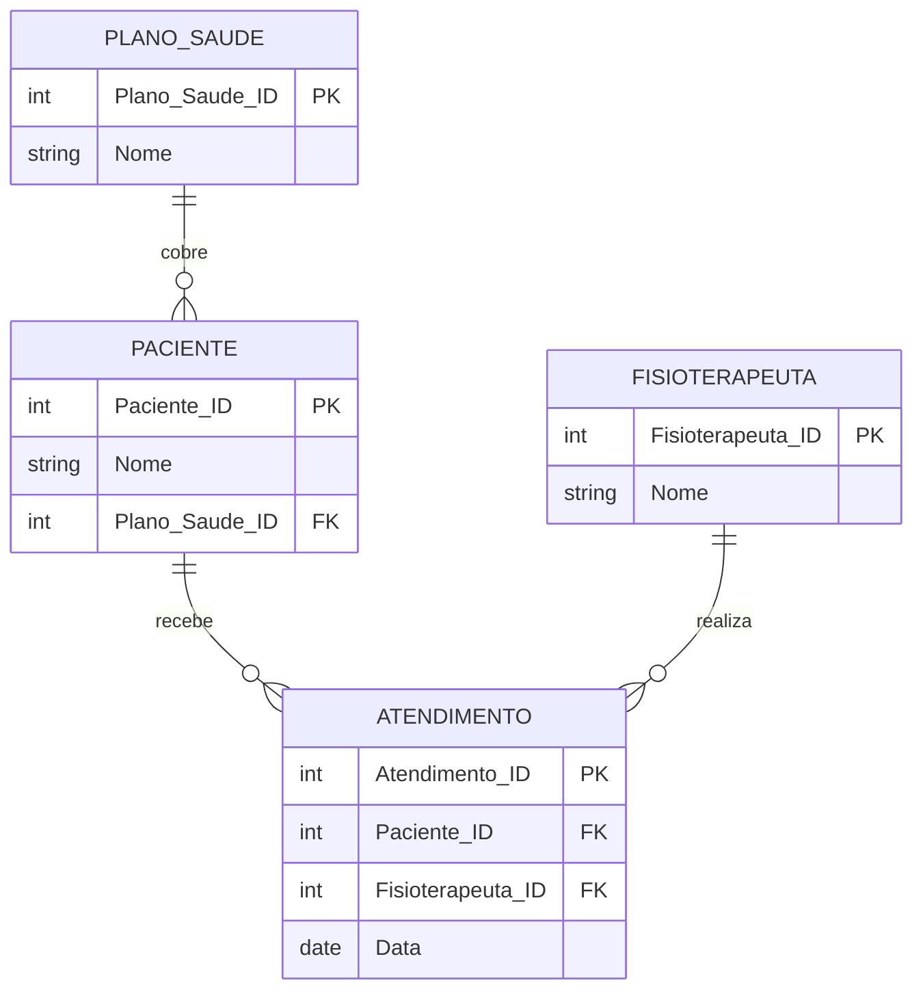

# Exercício 14 - Clínica de Fisioterapia

## Descrição do Cenário

Este exercício apresenta um sistema de banco de dados para uma clínica de fisioterapia. O objetivo é demonstrar como
utilizar múltiplos JOINs para navegar através de relacionamentos entre tabelas e filtrar registros baseados em critérios
específicos de planos de saúde, identificando fisioterapeutas que atendem pacientes com um plano de saúde específico.

### Contexto do Negócio

A clínica de fisioterapia atende pacientes com diferentes planos de saúde, e cada paciente é atendido por
fisioterapeutas especializados. Para fins administrativos, faturamento ou relatórios de convênios, é importante
identificar quais fisioterapeutas estão atendendo pacientes de planos específicos, como o "FisioPlus", permitindo melhor
gestão de recursos e relacionamento com convênios.

### Estrutura dos Dados

O sistema é composto por quatro entidades principais com os seguintes relacionamentos:



## Implementação em PostgreSQL

### Definição da Estrutura (DDL)

O código abaixo cria o esquema e as tabelas necessárias para o sistema:

```sql
-- Criação do esquema para organizar as tabelas
CREATE SCHEMA Clinica_Fisio;
SET search_path TO Clinica_Fisio;

-- Tabela para armazenar planos de saúde
CREATE TABLE Plano_Saude
(
    Plano_Saude_ID SERIAL PRIMARY KEY,
    Nome           VARCHAR(100) NOT NULL
);

-- Tabela para armazenar dados dos pacientes
CREATE TABLE Paciente
(
    Paciente_ID    SERIAL PRIMARY KEY,
    Nome           VARCHAR(100) NOT NULL,
    Plano_Saude_ID INT REFERENCES Plano_Saude (Plano_Saude_ID)
);

-- Tabela para armazenar dados dos fisioterapeutas
CREATE TABLE Fisioterapeuta
(
    Fisioterapeuta_ID SERIAL PRIMARY KEY,
    Nome              VARCHAR(100) NOT NULL
);

-- Tabela para armazenar dados dos atendimentos
CREATE TABLE Atendimento
(
    Atendimento_ID    SERIAL PRIMARY KEY,
    Paciente_ID       INT REFERENCES Paciente (Paciente_ID),
    Fisioterapeuta_ID INT REFERENCES Fisioterapeuta (Fisioterapeuta_ID),
    Data              DATE NOT NULL
);
```

### Inserção de Dados de Exemplo

Para demonstrar o funcionamento do sistema, inserimos alguns registros de exemplo:

```sql
-- Inserção de planos de saúde
INSERT INTO Plano_Saude (Nome)
VALUES ('FisioPlus'),
       ('SaudeTop');

-- Inserção de pacientes
INSERT INTO Paciente (Nome, Plano_Saude_ID)
VALUES ('Carlos Silva', 1), -- Paciente com FisioPlus
       ('Fernanda Costa', 2);
-- Paciente com SaudeTop

-- Inserção de fisioterapeutas
INSERT INTO Fisioterapeuta (Nome)
VALUES ('Ana Souza'),
       ('João Pereira');

-- Inserção de atendimentos
INSERT INTO Atendimento (Paciente_ID, Fisioterapeuta_ID, Data)
VALUES (1, 1, '2024-06-10'), -- Carlos (FisioPlus) com Ana
       (2, 2, '2024-06-15'); -- Fernanda (SaudeTop) com João
```

### Consulta Principal: Fisioterapeutas com Pacientes FisioPlus

O objetivo principal deste exercício é identificar fisioterapeutas que atendem pacientes do plano "FisioPlus":

```sql
SELECT F.Nome  AS Fisioterapeuta,
       P.Nome  AS Paciente,
       PS.Nome AS Plano_Saude
FROM Atendimento A
         JOIN Fisioterapeuta F ON A.Fisioterapeuta_ID = F.Fisioterapeuta_ID
         JOIN Paciente P ON A.Paciente_ID = P.Paciente_ID
         JOIN Plano_Saude PS ON P.Plano_Saude_ID = PS.Plano_Saude_ID
WHERE PS.Nome = 'FisioPlus';
```

**Resultado esperado:**

```
Fisioterapeuta | Paciente     | Plano_Saude
---------------|--------------|------------
Ana Souza      | Carlos Silva | FisioPlus
```

## Explicação Técnica

### Operações Utilizadas

1. **Múltiplos JOINs**:
    - `JOIN Fisioterapeuta F ON A.Fisioterapeuta_ID = F.Fisioterapeuta_ID` conecta atendimentos com fisioterapeutas
    - `JOIN Paciente P ON A.Paciente_ID = P.Paciente_ID` conecta atendimentos com pacientes
    - `JOIN Plano_Saude PS ON P.Plano_Saude_ID = PS.Plano_Saude_ID` conecta pacientes com planos de saúde

2. **Navegação através de Relacionamentos**:
    - A consulta navega de Atendimento → Fisioterapeuta para obter nomes dos profissionais
    - Navega de Atendimento → Paciente → Plano_Saude para filtrar por convênio específico
    - Permite correlacionar informações de diferentes entidades através da tabela de relacionamento

3. **Filtro WHERE**:
    - `WHERE PS.Nome = 'FisioPlus'` filtra apenas atendimentos de pacientes com este plano
    - Aplica o critério de seleção baseado no nome do plano de saúde

4. **Alias de Tabelas**:
    - Facilita a leitura e escrita da consulta
    - Evita ambiguidade quando múltiplas tabelas têm colunas com nomes similares

### Processo de Junção e Filtro

1. A tabela Atendimento serve como ponto central conectando fisioterapeutas e pacientes
2. JOINs sucessivos trazem informações de todas as tabelas relacionadas
3. Filtro WHERE seleciona apenas atendimentos de pacientes com plano "FisioPlus"
4. Resultado mostra a relação entre fisioterapeuta, paciente e plano de saúde

### Consultas Adicionais Úteis

#### Fisioterapeutas únicos que atendem FisioPlus:

```sql
SELECT DISTINCT F.Nome AS Fisioterapeuta
FROM Atendimento A
         JOIN Fisioterapeuta F ON A.Fisioterapeuta_ID = F.Fisioterapeuta_ID
         JOIN Paciente P ON A.Paciente_ID = P.Paciente_ID
         JOIN Plano_Saude PS ON P.Plano_Saude_ID = PS.Plano_Saude_ID
WHERE PS.Nome = 'FisioPlus';
```

#### Contar atendimentos por fisioterapeuta e plano:

```sql
SELECT F.Nome                        AS Fisioterapeuta,
       PS.Nome                       AS Plano_Saude,
       COUNT(*)                      AS Total_Atendimentos,
       COUNT(DISTINCT P.Paciente_ID) AS Pacientes_Unicos
FROM Atendimento A
         JOIN Fisioterapeuta F ON A.Fisioterapeuta_ID = F.Fisioterapeuta_ID
         JOIN Paciente P ON A.Paciente_ID = P.Paciente_ID
         JOIN Plano_Saude PS ON P.Plano_Saude_ID = PS.Plano_Saude_ID
GROUP BY F.Fisioterapeuta_ID, F.Nome, PS.Plano_Saude_ID, PS.Nome
ORDER BY Total_Atendimentos DESC;
```

#### Relatório de atendimentos por plano de saúde:

```sql
SELECT PS.Nome                             AS Plano_Saude,
       COUNT(*)                            AS Total_Atendimentos,
       COUNT(DISTINCT P.Paciente_ID)       AS Pacientes_Atendidos,
       COUNT(DISTINCT F.Fisioterapeuta_ID) AS Fisioterapeutas_Envolvidos
FROM Atendimento A
         JOIN Paciente P ON A.Paciente_ID = P.Paciente_ID
         JOIN Plano_Saude PS ON P.Plano_Saude_ID = PS.Plano_Saude_ID
         JOIN Fisioterapeuta F ON A.Fisioterapeuta_ID = F.Fisioterapeuta_ID
GROUP BY PS.Plano_Saude_ID, PS.Nome
ORDER BY Total_Atendimentos DESC;
```

#### Fisioterapeutas que não atendem FisioPlus:

```sql
SELECT F.Nome AS Fisioterapeuta
FROM Fisioterapeuta F
WHERE F.Fisioterapeuta_ID NOT IN (SELECT DISTINCT A.Fisioterapeuta_ID
                                  FROM Atendimento A
                                           JOIN Paciente P ON A.Paciente_ID = P.Paciente_ID
                                           JOIN Plano_Saude PS ON P.Plano_Saude_ID = PS.Plano_Saude_ID
                                  WHERE PS.Nome = 'FisioPlus');
```

#### Histórico detalhado de atendimentos com datas:

```sql
SELECT F.Nome                                                               AS Fisioterapeuta,
       P.Nome                                                               AS Paciente,
       PS.Nome                                                              AS Plano_Saude,
       A.Data                                                               AS Data_Atendimento,
       ROW_NUMBER() OVER (PARTITION BY F.Fisioterapeuta_ID ORDER BY A.Data) AS Sequencia_Atendimento
FROM Atendimento A
         JOIN Fisioterapeuta F ON A.Fisioterapeuta_ID = F.Fisioterapeuta_ID
         JOIN Paciente P ON A.Paciente_ID = P.Paciente_ID
         JOIN Plano_Saude PS ON P.Plano_Saude_ID = PS.Plano_Saude_ID
WHERE PS.Nome = 'FisioPlus'
ORDER BY F.Nome, A.Data;
```

#### Pacientes FisioPlus sem atendimento:

```sql
SELECT P.Nome  AS Paciente,
       PS.Nome AS Plano_Saude
FROM Paciente P
         JOIN Plano_Saude PS ON P.Plano_Saude_ID = PS.Plano_Saude_ID
WHERE PS.Nome = 'FisioPlus'
  AND P.Paciente_ID NOT IN (SELECT DISTINCT A.Paciente_ID
                            FROM Atendimento A
                            WHERE A.Paciente_ID IS NOT NULL);
```

#### Estatísticas por fisioterapeuta:

```sql
SELECT F.Nome                                                                     AS Fisioterapeuta,
       COUNT(DISTINCT CASE WHEN PS.Nome = 'FisioPlus' THEN A.Atendimento_ID END)  AS Atendimentos_FisioPlus,
       COUNT(DISTINCT CASE WHEN PS.Nome != 'FisioPlus' THEN A.Atendimento_ID END) AS Atendimentos_Outros_Planos,
       COUNT(DISTINCT A.Atendimento_ID)                                           AS Total_Atendimentos,
       ROUND(
               COUNT(DISTINCT CASE WHEN PS.Nome = 'FisioPlus' THEN A.Atendimento_ID END) * 100.0 /
               NULLIF(COUNT(DISTINCT A.Atendimento_ID), 0), 2
       )                                                                          AS Percentual_FisioPlus
FROM Fisioterapeuta F
         LEFT JOIN Atendimento A ON F.Fisioterapeuta_ID = A.Fisioterapeuta_ID
         LEFT JOIN Paciente P ON A.Paciente_ID = P.Paciente_ID
         LEFT JOIN Plano_Saude PS ON P.Plano_Saude_ID = PS.Plano_Saude_ID
GROUP BY F.Fisioterapeuta_ID, F.Nome
ORDER BY Atendimentos_FisioPlus DESC;
```

### Variações da Consulta Principal

#### Incluindo múltiplos planos de saúde:

```sql
SELECT F.Nome  AS Fisioterapeuta,
       P.Nome  AS Paciente,
       PS.Nome AS Plano_Saude
FROM Atendimento A
         JOIN Fisioterapeuta F ON A.Fisioterapeuta_ID = F.Fisioterapeuta_ID
         JOIN Paciente P ON A.Paciente_ID = P.Paciente_ID
         JOIN Plano_Saude PS ON P.Plano_Saude_ID = PS.Plano_Saude_ID
WHERE PS.Nome IN ('FisioPlus', 'SaudeTop');
```

#### Com informações de data do atendimento:

```sql
SELECT F.Nome  AS Fisioterapeuta,
       P.Nome  AS Paciente,
       PS.Nome AS Plano_Saude,
       A.Data  AS Data_Atendimento
FROM Atendimento A
         JOIN Fisioterapeuta F ON A.Fisioterapeuta_ID = F.Fisioterapeuta_ID
         JOIN Paciente P ON A.Paciente_ID = P.Paciente_ID
         JOIN Plano_Saude PS ON P.Plano_Saude_ID = PS.Plano_Saude_ID
WHERE PS.Nome = 'FisioPlus'
ORDER BY A.Data DESC;
```

#### Usando subconsulta:

```sql
SELECT F.Nome                                                                          AS Fisioterapeuta,
       P.Nome                                                                          AS Paciente,
       (SELECT PS.Nome FROM Plano_Saude PS WHERE PS.Plano_Saude_ID = P.Plano_Saude_ID) AS Plano_Saude
FROM Atendimento A
         JOIN Fisioterapeuta F ON A.Fisioterapeuta_ID = F.Fisioterapeuta_ID
         JOIN Paciente P ON A.Paciente_ID = P.Paciente_ID
WHERE P.Plano_Saude_ID = (SELECT PS.Plano_Saude_ID
                          FROM Plano_Saude PS
                          WHERE PS.Nome = 'FisioPlus');
```

#### Com contagem de atendimentos:

```sql
SELECT F.Nome   AS Fisioterapeuta,
       P.Nome   AS Paciente,
       PS.Nome  AS Plano_Saude,
       COUNT(*) AS Total_Atendimentos_Paciente
FROM Atendimento A
         JOIN Fisioterapeuta F ON A.Fisioterapeuta_ID = F.Fisioterapeuta_ID
         JOIN Paciente P ON A.Paciente_ID = P.Paciente_ID
         JOIN Plano_Saude PS ON P.Plano_Saude_ID = PS.Plano_Saude_ID
WHERE PS.Nome = 'FisioPlus'
GROUP BY F.Fisioterapeuta_ID, F.Nome, P.Paciente_ID, P.Nome, PS.Plano_Saude_ID, PS.Nome
ORDER BY Total_Atendimentos_Paciente DESC;
```

#### Relatório mensal de atendimentos FisioPlus:

```sql
SELECT F.Nome                        AS Fisioterapeuta,
       EXTRACT(YEAR FROM A.Data)     AS Ano,
       EXTRACT(MONTH FROM A.Data)    AS Mes,
       COUNT(*)                      AS Atendimentos_Mes,
       COUNT(DISTINCT P.Paciente_ID) AS Pacientes_Unicos_Mes
FROM Atendimento A
         JOIN Fisioterapeuta F ON A.Fisioterapeuta_ID = F.Fisioterapeuta_ID
         JOIN Paciente P ON A.Paciente_ID = P.Paciente_ID
         JOIN Plano_Saude PS ON P.Plano_Saude_ID = PS.Plano_Saude_ID
WHERE PS.Nome = 'FisioPlus'
GROUP BY F.Fisioterapeuta_ID, F.Nome, EXTRACT(YEAR FROM A.Data), EXTRACT(MONTH FROM A.Data)
ORDER BY Ano, Mes, F.Nome;
```

#### Comparação entre planos por fisioterapeuta:

```sql
SELECT F.Nome                                                                AS Fisioterapeuta,
       PS.Nome                                                               AS Plano_Saude,
       COUNT(*)                                                              AS Total_Atendimentos,
       RANK() OVER (PARTITION BY F.Fisioterapeuta_ID ORDER BY COUNT(*) DESC) AS Ranking_Plano
FROM Atendimento A
         JOIN Fisioterapeuta F ON A.Fisioterapeuta_ID = F.Fisioterapeuta_ID
         JOIN Paciente P ON A.Paciente_ID = P.Paciente_ID
         JOIN Plano_Saude PS ON P.Plano_Saude_ID = PS.Plano_Saude_ID
GROUP BY F.Fisioterapeuta_ID, F.Nome, PS.Plano_Saude_ID, PS.Nome
ORDER BY F.Nome, Ranking_Plano;
```

