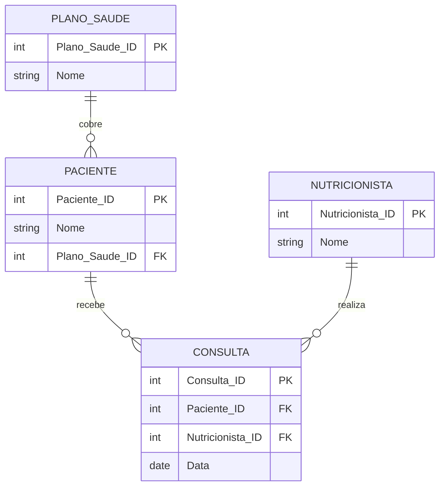

# Exercício 15 - Clínica de Nutrição

## Descrição do Cenário

Este exercício apresenta um sistema de banco de dados para uma clínica de nutrição. O objetivo é demonstrar como
utilizar operadores de negação (NOT, <>) para filtrar registros que NÃO atendem a critérios específicos, identificando
nutricionistas que atendem pacientes que não utilizam um plano de saúde específico.

### Contexto do Negócio

A clínica de nutrição atende pacientes com diferentes planos de saúde, e cada paciente é atendido por nutricionistas
especializados. Para fins de análise de mercado, diversificação de atendimento ou identificação de oportunidades
comerciais, é importante identificar quais nutricionistas estão atendendo pacientes que não utilizam determinados
planos, como o "NutriGold", permitindo estratégias direcionadas para outros segmentos de mercado.

### Estrutura dos Dados

O sistema é composto por quatro entidades principais com os seguintes relacionamentos:



## Implementação em PostgreSQL

### Definição da Estrutura (DDL)

O código abaixo cria o esquema e as tabelas necessárias para o sistema:

```sql
-- Criação do esquema para organizar as tabelas
CREATE SCHEMA Clinica_Nutricao;
SET search_path TO Clinica_Nutricao;

-- Tabela para armazenar planos de saúde
CREATE TABLE Plano_Saude
(
    Plano_Saude_ID SERIAL PRIMARY KEY,
    Nome           VARCHAR(100) NOT NULL
);

-- Tabela para armazenar dados dos pacientes
CREATE TABLE Paciente
(
    Paciente_ID    SERIAL PRIMARY KEY,
    Nome           VARCHAR(100) NOT NULL,
    Plano_Saude_ID INT REFERENCES Plano_Saude (Plano_Saude_ID)
);

-- Tabela para armazenar dados dos nutricionistas
CREATE TABLE Nutricionista
(
    Nutricionista_ID SERIAL PRIMARY KEY,
    Nome             VARCHAR(100) NOT NULL
);

-- Tabela para armazenar dados das consultas
CREATE TABLE Consulta
(
    Consulta_ID      SERIAL PRIMARY KEY,
    Paciente_ID      INT REFERENCES Paciente (Paciente_ID),
    Nutricionista_ID INT REFERENCES Nutricionista (Nutricionista_ID),
    Data             DATE NOT NULL
);
```

### Inserção de Dados de Exemplo

Para demonstrar o funcionamento do sistema, inserimos alguns registros de exemplo:

```sql
-- Inserção de planos de saúde
INSERT INTO Plano_Saude (Nome)
VALUES ('NutriGold'),
       ('VidaSaudavel');

-- Inserção de pacientes
INSERT INTO Paciente (Nome, Plano_Saude_ID)
VALUES ('Marcos Souza', 1), -- Paciente com NutriGold
       ('Ana Lima', 2);
-- Paciente com VidaSaudavel

-- Inserção de nutricionistas
INSERT INTO Nutricionista (Nome)
VALUES ('Dra. Paula'),
       ('Dr. Carlos');

-- Inserção de consultas
INSERT INTO Consulta (Paciente_ID, Nutricionista_ID, Data)
VALUES (1, 1, '2024-06-12'), -- Marcos (NutriGold) com Dra. Paula
       (2, 2, '2024-06-14'); -- Ana (VidaSaudavel) com Dr. Carlos
```

### Consulta Principal: Nutricionistas que NÃO Atendem Pacientes NutriGold

O objetivo principal deste exercício é identificar nutricionistas que atendem pacientes que não utilizam o plano "
NutriGold":

```sql
SELECT N.Nome  AS Nutricionista,
       P.Nome  AS Paciente,
       PS.Nome AS Plano_Saude
FROM Consulta C
         JOIN Nutricionista N ON C.Nutricionista_ID = N.Nutricionista_ID
         JOIN Paciente P ON C.Paciente_ID = P.Paciente_ID
         JOIN Plano_Saude PS ON P.Plano_Saude_ID = PS.Plano_Saude_ID
WHERE PS.Nome <> 'NutriGold';
```

**Resultado esperado:**

```
Nutricionista | Paciente | Plano_Saude
--------------|----------|-------------
Dr. Carlos    | Ana Lima | VidaSaudavel
```

## Explicação Técnica

### Operações Utilizadas

1. **Operador de Negação (<>)**:
    - `WHERE PS.Nome <> 'NutriGold'` exclui registros onde o plano é "NutriGold"
    - Equivalente a `WHERE PS.Nome != 'NutriGold'`
    - Retorna apenas consultas de pacientes com outros planos

2. **Múltiplos JOINs**:
    - Conecta todas as tabelas necessárias para obter informações completas
    - Permite filtrar baseado em critérios de tabelas relacionadas indiretamente

3. **Filtro de Exclusão**:
    - Ao invés de incluir registros específicos, exclui os indesejados
    - Útil para análises de "tudo exceto" determinado critério

4. **Navegação de Relacionamentos**:
    - Consulta → Nutricionista (para nome do profissional)
    - Consulta → Paciente → Plano_Saude (para filtro e informações do plano)

### Processo de Filtro por Negação

1. JOINs conectam todas as tabelas relacionadas
2. Filtro WHERE exclui especificamente o plano "NutriGold"
3. Resultado mostra apenas nutricionistas atendendo outros planos
4. Informações completas são exibidas para contexto

### Consultas Adicionais Úteis

#### Nutricionistas únicos que NÃO atendem NutriGold:

```sql
SELECT DISTINCT N.Nome AS Nutricionista
FROM Consulta C
         JOIN Nutricionista N ON C.Nutricionista_ID = N.Nutricionista_ID
         JOIN Paciente P ON C.Paciente_ID = P.Paciente_ID
         JOIN Plano_Saude PS ON P.Plano_Saude_ID = PS.Plano_Saude_ID
WHERE PS.Nome <> 'NutriGold';
```

#### Nutricionistas que NUNCA atenderam NutriGold:

```sql
SELECT N.Nome AS Nutricionista
FROM Nutricionista N
WHERE N.Nutricionista_ID NOT IN (SELECT DISTINCT C.Nutricionista_ID
                                 FROM Consulta C
                                          JOIN Paciente P ON C.Paciente_ID = P.Paciente_ID
                                          JOIN Plano_Saude PS ON P.Plano_Saude_ID = PS.Plano_Saude_ID
                                 WHERE PS.Nome = 'NutriGold');
```

#### Comparação: nutricionistas por tipo de plano:

```sql
SELECT N.Nome                                             AS Nutricionista,
       COUNT(CASE WHEN PS.Nome = 'NutriGold' THEN 1 END)  AS Atendimentos_NutriGold,
       COUNT(CASE WHEN PS.Nome <> 'NutriGold' THEN 1 END) AS Atendimentos_Outros_Planos,
       COUNT(*)                                           AS Total_Atendimentos
FROM Consulta C
         JOIN Nutricionista N ON C.Nutricionista_ID = N.Nutricionista_ID
         JOIN Paciente P ON C.Paciente_ID = P.Paciente_ID
         JOIN Plano_Saude PS ON P.Plano_Saude_ID = PS.Plano_Saude_ID
GROUP BY N.Nutricionista_ID, N.Nome
ORDER BY Atendimentos_Outros_Planos DESC;
```

#### Planos alternativos mais atendidos (excluindo NutriGold):

```sql
SELECT PS.Nome                            AS Plano_Saude,
       COUNT(*)                           AS Total_Consultas,
       COUNT(DISTINCT P.Paciente_ID)      AS Pacientes_Unicos,
       COUNT(DISTINCT N.Nutricionista_ID) AS Nutricionistas_Envolvidos
FROM Consulta C
         JOIN Paciente P ON C.Paciente_ID = P.Paciente_ID
         JOIN Plano_Saude PS ON P.Plano_Saude_ID = PS.Plano_Saude_ID
         JOIN Nutricionista N ON C.Nutricionista_ID = N.Nutricionista_ID
WHERE PS.Nome <> 'NutriGold'
GROUP BY PS.Plano_Saude_ID, PS.Nome
ORDER BY Total_Consultas DESC;
```

#### Pacientes sem NutriGold e seus nutricionistas:

```sql
SELECT P.Nome                            AS Paciente,
       PS.Nome                           AS Plano_Saude,
       STRING_AGG(DISTINCT N.Nome, ', ') AS Nutricionistas_Atendentes,
       COUNT(C.Consulta_ID)              AS Total_Consultas
FROM Paciente P
         JOIN Plano_Saude PS ON P.Plano_Saude_ID = PS.Plano_Saude_ID
         LEFT JOIN Consulta C ON P.Paciente_ID = C.Paciente_ID
         LEFT JOIN Nutricionista N ON C.Nutricionista_ID = N.Nutricionista_ID
WHERE PS.Nome <> 'NutriGold'
GROUP BY P.Paciente_ID, P.Nome, PS.Nome
ORDER BY Total_Consultas DESC;
```

#### Análise temporal de atendimentos não-NutriGold:

```sql
SELECT EXTRACT(YEAR FROM C.Data)  AS Ano,
       EXTRACT(MONTH FROM C.Data) AS Mes,
       PS.Nome                    AS Plano_Saude,
       COUNT(*)                   AS Consultas_Mes
FROM Consulta C
         JOIN Paciente P ON C.Paciente_ID = P.Paciente_ID
         JOIN Plano_Saude PS ON P.Plano_Saude_ID = PS.Plano_Saude_ID
WHERE PS.Nome <> 'NutriGold'
GROUP BY EXTRACT(YEAR FROM C.Data), EXTRACT(MONTH FROM C.Data), PS.Plano_Saude_ID, PS.Nome
ORDER BY Ano, Mes, Consultas_Mes DESC;
```

#### Nutricionistas especializados em planos alternativos:

```sql
SELECT N.Nome                                                                            AS Nutricionista,
       PS.Nome                                                                           AS Plano_Preferencial,
       COUNT(*)                                                                          AS Atendimentos_Plano,
       ROUND(COUNT(*) * 100.0 / SUM(COUNT(*)) OVER (PARTITION BY N.Nutricionista_ID), 2) AS Percentual_Especializacao
FROM Consulta C
         JOIN Nutricionista N ON C.Nutricionista_ID = N.Nutricionista_ID
         JOIN Paciente P ON C.Paciente_ID = P.Paciente_ID
         JOIN Plano_Saude PS ON P.Plano_Saude_ID = PS.Plano_Saude_ID
WHERE PS.Nome <> 'NutriGold'
GROUP BY N.Nutricionista_ID, N.Nome, PS.Plano_Saude_ID, PS.Nome
HAVING COUNT(*) >= 1
ORDER BY N.Nome, Atendimentos_Plano DESC;
```

### Variações da Consulta Principal

#### Excluindo múltiplos planos:

```sql
SELECT N.Nome  AS Nutricionista,
       P.Nome  AS Paciente,
       PS.Nome AS Plano_Saude
FROM Consulta C
         JOIN Nutricionista N ON C.Nutricionista_ID = N.Nutricionista_ID
         JOIN Paciente P ON C.Paciente_ID = P.Paciente_ID
         JOIN Plano_Saude PS ON P.Plano_Saude_ID = PS.Plano_Saude_ID
WHERE PS.Nome NOT IN ('NutriGold', 'PlanoExcluido2');
```

#### Usando NOT LIKE para padrões:

```sql
SELECT N.Nome  AS Nutricionista,
       P.Nome  AS Paciente,
       PS.Nome AS Plano_Saude
FROM Consulta C
         JOIN Nutricionista N ON C.Nutricionista_ID = N.Nutricionista_ID
         JOIN Paciente P ON C.Paciente_ID = P.Paciente_ID
         JOIN Plano_Saude PS ON P.Plano_Saude_ID = PS.Plano_Saude_ID
WHERE PS.Nome NOT LIKE '%Gold%';
```

#### Com informações de data e ordenação:

```sql
SELECT N.Nome  AS Nutricionista,
       P.Nome  AS Paciente,
       PS.Nome AS Plano_Saude,
       C.Data  AS Data_Consulta
FROM Consulta C
         JOIN Nutricionista N ON C.Nutricionista_ID = N.Nutricionista_ID
         JOIN Paciente P ON C.Paciente_ID = P.Paciente_ID
         JOIN Plano_Saude PS ON P.Plano_Saude_ID = PS.Plano_Saude_ID
WHERE PS.Nome <> 'NutriGold'
ORDER BY C.Data DESC, N.Nome;
```

#### Usando EXISTS para validação:

```sql
SELECT N.Nome  AS Nutricionista,
       P.Nome  AS Paciente,
       PS.Nome AS Plano_Saude
FROM Consulta C
         JOIN Nutricionista N ON C.Nutricionista_ID = N.Nutricionista_ID
         JOIN Paciente P ON C.Paciente_ID = P.Paciente_ID
         JOIN Plano_Saude PS ON P.Plano_Saude_ID = PS.Plano_Saude_ID
WHERE PS.Nome <> 'NutriGold'
  AND EXISTS (SELECT 1
              FROM Plano_Saude PS2
              WHERE PS2.Plano_Saude_ID = PS.Plano_Saude_ID
                AND PS2.Nome IS NOT NULL);
```
