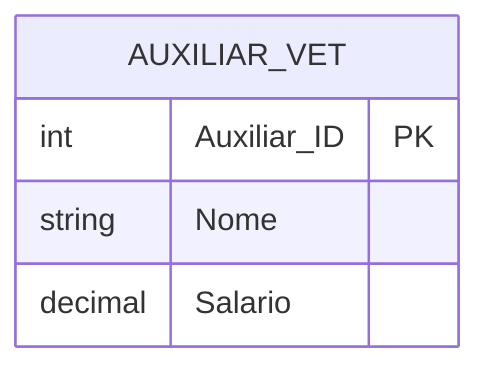

# Exercício 16 - Hospital Veterinário

## Descrição do Cenário

Este exercício apresenta um sistema de banco de dados para um hospital veterinário. O objetivo é demonstrar como
utilizar subconsultas com funções de agregação (AVG) para comparar valores individuais com médias calculadas,
identificando auxiliares veterinários que recebem salários acima da média salarial da categoria.

### Contexto do Negócio

O hospital veterinário possui diversos auxiliares veterinários com diferentes níveis de experiência e responsabilidades,
resultando em variações salariais. Para fins de análise de recursos humanos, revisão salarial ou identificação de
profissionais com remuneração diferenciada, é importante identificar quais auxiliares recebem salários superiores à
média da categoria, permitindo análises de equidade salarial e planejamento de benefícios.

### Estrutura dos Dados

O sistema é composto por uma entidade principal que armazena informações dos auxiliares veterinários:



## Implementação em PostgreSQL

### Definição da Estrutura (DDL)

O código abaixo cria o esquema e a tabela necessária para o sistema:

```sql
-- Criação do esquema para organizar as tabelas
CREATE SCHEMA Hospital_Vet;
SET search_path TO Hospital_Vet;

-- Tabela para armazenar dados dos auxiliares veterinários
CREATE TABLE Auxiliar_Vet
(
    Auxiliar_ID SERIAL PRIMARY KEY,
    Nome        VARCHAR(100)   NOT NULL,
    Salario     NUMERIC(10, 2) NOT NULL
);
```

### Inserção de Dados de Exemplo

Para demonstrar o funcionamento do sistema, inserimos alguns registros de exemplo:

```sql
-- Inserção de auxiliares veterinários com diferentes salários
INSERT INTO Auxiliar_Vet (Nome, Salario)
VALUES ('Carlos Silva', 3000.00),
       ('Fernanda Costa', 3200.00),
       ('João Oliveira', 2800.00),
       ('Marina Souza', 3500.00);
```

### Consulta Principal: Auxiliares Acima da Média Salarial

O objetivo principal deste exercício é identificar auxiliares veterinários que recebem salários superiores à média
salarial:

```sql
SELECT Nome, Salario
FROM Auxiliar_Vet
WHERE Salario > (SELECT AVG(Salario) FROM Auxiliar_Vet);
```

**Cálculo da média com os dados de exemplo:**

- Média = (3000.00 + 3200.00 + 2800.00 + 3500.00) ÷ 4 = 3125.00

**Resultado esperado:**

```
Nome           | Salario
---------------|--------
Fernanda Costa | 3200.00
Marina Souza   | 3500.00
```

## Explicação Técnica

### Operações Utilizadas

1. **Subconsulta com AVG()**:
    - `(SELECT AVG(Salario) FROM Auxiliar_Vet)` calcula a média salarial
    - Executa primeiro e retorna um valor único (escalar)
    - Resultado é usado na comparação da consulta principal

2. **Comparação com Subconsulta**:
    - `WHERE Salario > (subconsulta)` compara cada salário individual com a média
    - Operador `>` filtra apenas valores superiores à média
    - Permite filtros dinâmicos baseados em cálculos agregados

3. **Função de Agregação AVG()**:
    - Calcula a média aritmética de todos os salários
    - Ignora valores NULL automaticamente
    - Retorna um valor NUMERIC com precisão adequada

4. **Filtro Dinâmico**:
    - A média é recalculada automaticamente se dados mudarem
    - Não requer valores fixos (hardcoded) na consulta
    - Mantém a consulta sempre atualizada

### Processo de Execução

1. **Primeira fase**: Subconsulta calcula AVG(Salario) = 3125.00
2. **Segunda fase**: Consulta principal compara cada Salario > 3125.00
3. **Resultado**: Retorna apenas registros que atendem ao critério
4. **Exibição**: Mostra Nome e Salario dos auxiliares selecionados

### Consultas Adicionais Úteis

#### Auxiliares com salário e diferença da média:

```sql
SELECT Nome,
       Salario,
       (SELECT AVG(Salario) FROM Auxiliar_Vet)                   AS Media_Salarial,
       Salario - (SELECT AVG(Salario) FROM Auxiliar_Vet)         AS Diferenca_Media,
       ROUND(((Salario - (SELECT AVG(Salario) FROM Auxiliar_Vet)) /
              (SELECT AVG(Salario) FROM Auxiliar_Vet)) * 100, 2) AS Percentual_Acima_Media
FROM Auxiliar_Vet
WHERE Salario > (SELECT AVG(Salario) FROM Auxiliar_Vet)
ORDER BY Salario DESC;
```

#### Estatísticas salariais completas:

```sql
SELECT 'Acima da Média' AS Categoria,
       COUNT(*)         AS Quantidade_Auxiliares,
       AVG(Salario)     AS Media_Categoria,
       MIN(Salario)     AS Menor_Salario,
       MAX(Salario)     AS Maior_Salario
FROM Auxiliar_Vet
WHERE Salario > (SELECT AVG(Salario) FROM Auxiliar_Vet)

UNION ALL

SELECT 'Abaixo da Média' AS Categoria,
       COUNT(*)          AS Quantidade_Auxiliares,
       AVG(Salario)      AS Media_Categoria,
       MIN(Salario)      AS Menor_Salario,
       MAX(Salario)      AS Maior_Salario
FROM Auxiliar_Vet
WHERE Salario <= (SELECT AVG(Salario) FROM Auxiliar_Vet);
```

#### Ranking salarial com posição relativa à média:

```sql
SELECT Nome,
       Salario,
       RANK() OVER (ORDER BY Salario DESC)     AS Ranking_Salarial,
       CASE
           WHEN Salario > (SELECT AVG(Salario) FROM Auxiliar_Vet) THEN 'Acima da Média'
           WHEN Salario = (SELECT AVG(Salario) FROM Auxiliar_Vet) THEN 'Na Média'
           ELSE 'Abaixo da Média'
           END                                 AS Posicao_Relativa_Media,
       (SELECT AVG(Salario) FROM Auxiliar_Vet) AS Media_Geral
FROM Auxiliar_Vet
ORDER BY Salario DESC;
```

#### Cálculo de mediana (alternativa ao MEDIAN que não existe no PostgreSQL):

```sql
-- Mediana usando PERCENTILE_CONT (recomendado)
SELECT COUNT(*)                                                                       AS Total_Auxiliares,
       AVG(Salario)                                                                   AS Media_Salarial,
       PERCENTILE_CONT(0.5) WITHIN GROUP (ORDER BY Salario)                           AS Mediana_Salarial,
       MIN(Salario)                                                                   AS Menor_Salario,
       MAX(Salario)                                                                   AS Maior_Salario,
       MAX(Salario) - MIN(Salario)                                                    AS Amplitude_Salarial,
       STDDEV(Salario)                                                                AS Desvio_Padrao,
       VARIANCE(Salario)                                                              AS Variancia,
       COUNT(CASE WHEN Salario > (SELECT AVG(Salario) FROM Auxiliar_Vet) THEN 1 END)  AS Acima_Media,
       COUNT(CASE WHEN Salario <= (SELECT AVG(Salario) FROM Auxiliar_Vet) THEN 1 END) AS Abaixo_Igual_Media
FROM Auxiliar_Vet;
```

#### Auxiliares em diferentes faixas salariais:

```sql
WITH estatisticas AS (SELECT AVG(Salario)    AS media,
                             STDDEV(Salario) AS desvio_padrao
                      FROM Auxiliar_Vet)
SELECT Nome,
       Salario,
       CASE
           WHEN Salario > (SELECT media + desvio_padrao FROM estatisticas) THEN 'Muito Acima da Média'
           WHEN Salario > (SELECT media FROM estatisticas) THEN 'Acima da Média'
           WHEN Salario > (SELECT media - desvio_padrao FROM estatisticas) THEN 'Próximo da Média'
           ELSE 'Abaixo da Média'
           END AS Classificacao_Salarial
FROM Auxiliar_Vet
ORDER BY Salario DESC;
```

#### Comparação com percentis:

```sql
SELECT Nome,
       Salario,
       PERCENT_RANK() OVER (ORDER BY Salario) AS Percentil,
       CASE
           WHEN Salario > (SELECT AVG(Salario) FROM Auxiliar_Vet) THEN 'Acima da Média'
           ELSE 'Abaixo da Média'
           END                                AS Posicao_Media,
       CASE
           WHEN PERCENT_RANK() OVER (ORDER BY Salario) >= 0.75 THEN 'Top 25%'
           WHEN PERCENT_RANK() OVER (ORDER BY Salario) >= 0.50 THEN 'Top 50%'
           WHEN PERCENT_RANK() OVER (ORDER BY Salario) >= 0.25 THEN 'Top 75%'
           ELSE 'Bottom 25%'
           END                                AS Quartil
FROM Auxiliar_Vet
ORDER BY Salario DESC;
```

#### Análise de dispersão salarial (corrigida):

```sql
SELECT COUNT(*)                                                                       AS Total_Auxiliares,
       AVG(Salario)                                                                   AS Media_Salarial,
       PERCENTILE_CONT(0.5) WITHIN GROUP (ORDER BY Salario)                           AS Mediana_Salarial,
       MIN(Salario)                                                                   AS Menor_Salario,
       MAX(Salario)                                                                   AS Maior_Salario,
       MAX(Salario) - MIN(Salario)                                                    AS Amplitude_Salarial,
       STDDEV(Salario)                                                                AS Desvio_Padrao,
       VARIANCE(Salario)                                                              AS Variancia,
       COUNT(CASE WHEN Salario > (SELECT AVG(Salario) FROM Auxiliar_Vet) THEN 1 END)  AS Acima_Media,
       COUNT(CASE WHEN Salario <= (SELECT AVG(Salario) FROM Auxiliar_Vet) THEN 1 END) AS Abaixo_Igual_Media
FROM Auxiliar_Vet;
```

#### Auxiliares próximos da média (dentro de uma margem):

```sql
SELECT Nome,
       Salario,
       ABS(Salario - (SELECT AVG(Salario) FROM Auxiliar_Vet)) AS Distancia_Media
FROM Auxiliar_Vet
WHERE ABS(Salario - (SELECT AVG(Salario) FROM Auxiliar_Vet)) <= 200.00 -- Margem de R$ 200
ORDER BY Distancia_Media;
```
