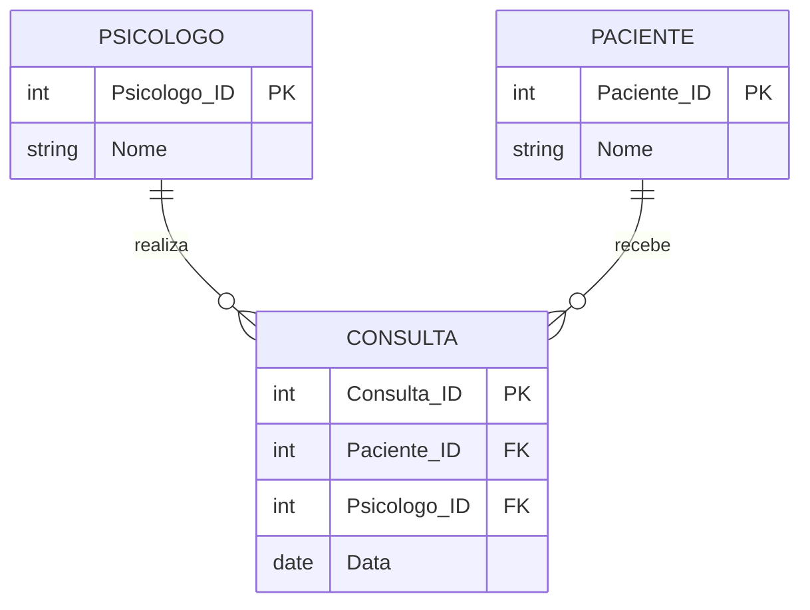

# Exercício 17 - Clínica de Psicologia

## Descrição do Cenário

Este exercício apresenta um sistema de banco de dados para uma clínica de psicologia. O objetivo é demonstrar como
utilizar subconsultas com operadores de negação (NOT IN) para identificar registros que não possuem relacionamentos
específicos, encontrando psicólogos que não têm consultas agendadas para um período específico (mês de janeiro).

### Contexto do Negócio

A clínica de psicologia possui diversos psicólogos que atendem pacientes em diferentes datas ao longo do ano. Para fins
de planejamento de recursos, gestão de agenda ou identificação de disponibilidade, é importante identificar quais
psicólogos não possuem consultas agendadas em períodos específicos, como o mês de janeiro, permitindo melhor
distribuição de carga de trabalho e otimização da agenda.

### Estrutura dos Dados

O sistema é composto por três entidades principais com os seguintes relacionamentos:



## Implementação em PostgreSQL

### Definição da Estrutura (DDL)

O código abaixo cria o esquema e as tabelas necessárias para o sistema:

```sql
-- Criação do esquema para organizar as tabelas
CREATE SCHEMA Clinica_Psicologia;
SET search_path TO Clinica_Psicologia;

-- Tabela para armazenar dados dos psicólogos
CREATE TABLE Psicologo
(
    Psicologo_ID SERIAL PRIMARY KEY,
    Nome         VARCHAR(100) NOT NULL
);

-- Tabela para armazenar dados dos pacientes
CREATE TABLE Paciente
(
    Paciente_ID SERIAL PRIMARY KEY,
    Nome        VARCHAR(100) NOT NULL
);

-- Tabela para armazenar dados das consultas
CREATE TABLE Consulta
(
    Consulta_ID  SERIAL PRIMARY KEY,
    Paciente_ID  INT REFERENCES Paciente (Paciente_ID),
    Psicologo_ID INT REFERENCES Psicologo (Psicologo_ID),
    Data         DATE NOT NULL
);
```

### Inserção de Dados de Exemplo

Para demonstrar o funcionamento do sistema, inserimos alguns registros de exemplo:

```sql
-- Inserção de psicólogos
INSERT INTO Psicologo (Nome)
VALUES ('Ana Souza'),
       ('Carlos Pereira');

-- Inserção de pacientes
INSERT INTO Paciente (Nome)
VALUES ('Fernanda Costa'),
       ('João Oliveira');

-- Inserção de consultas
INSERT INTO Consulta (Paciente_ID, Psicologo_ID, Data)
VALUES (1, 1, '2024-02-15'), -- Ana Souza em fevereiro
       (2, 2, '2024-01-10'); -- Carlos Pereira em janeiro
```

### Consulta Principal: Psicólogos Sem Consultas em Janeiro

O objetivo principal deste exercício é identificar psicólogos que não possuem consultas agendadas no mês de janeiro:

```sql
SELECT DISTINCT P.Nome AS Psicologo
FROM Psicologo P
WHERE P.Psicologo_ID NOT IN (SELECT DISTINCT C.Psicologo_ID
                             FROM Consulta C
                             WHERE EXTRACT(MONTH FROM C.Data) = 1);
```

**Resultado esperado:**

```
Psicologo
---------
Ana Souza
```

## Explicação Técnica

### Operações Utilizadas

1. **Subconsulta com EXTRACT()**:
    - `EXTRACT(MONTH FROM C.Data) = 1` filtra consultas do mês de janeiro
    - `SELECT DISTINCT C.Psicologo_ID` retorna IDs únicos dos psicólogos com consultas em janeiro
    - Subconsulta executa primeiro e retorna uma lista de valores

2. **Operador NOT IN**:
    - `WHERE P.Psicologo_ID NOT IN (subconsulta)` exclui psicólogos que estão na lista
    - Compara cada ID de psicólogo com a lista retornada pela subconsulta
    - Retorna apenas psicólogos que NÃO estão na lista de janeiro

3. **DISTINCT na consulta principal**:
    - Evita duplicação de nomes de psicólogos no resultado
    - Garante que cada psicólogo apareça apenas uma vez

4. **Função EXTRACT()**:
    - Extrai partes específicas de datas (ano, mês, dia, etc.)
    - `EXTRACT(MONTH FROM data)` retorna o número do mês (1-12)
    - Permite filtros baseados em períodos específicos

### Processo de Execução

1. **Primeira fase**: Subconsulta identifica psicólogos com consultas em janeiro
2. **Segunda fase**: Consulta principal exclui esses psicólogos da lista completa
3. **Resultado**: Retorna psicólogos que não aparecem na lista de janeiro
4. **DISTINCT**: Remove possíveis duplicatas do resultado final

### Consultas Adicionais Úteis

#### Psicólogos com e sem consultas em janeiro:

```sql
SELECT P.Nome  AS Psicologo,
       CASE
           WHEN P.Psicologo_ID IN (SELECT DISTINCT C.Psicologo_ID
                                   FROM Consulta C
                                   WHERE EXTRACT(MONTH FROM C.Data) = 1) THEN 'Com consultas em Janeiro'
           ELSE 'Sem consultas em Janeiro'
           END AS Status_Janeiro
FROM Psicologo P
ORDER BY P.Nome;
```

#### Contagem de consultas por psicólogo em janeiro:

```sql
SELECT P.Nome               AS Psicologo,
       COUNT(C.Consulta_ID) AS Consultas_Janeiro
FROM Psicologo P
         LEFT JOIN Consulta C ON P.Psicologo_ID = C.Psicologo_ID
    AND EXTRACT(MONTH FROM C.Data) = 1
GROUP BY P.Psicologo_ID, P.Nome
ORDER BY Consultas_Janeiro DESC, P.Nome;
```

#### Psicólogos disponíveis por mês:

```sql
WITH meses AS (SELECT generate_series(1, 12) AS mes),
     psicologos_por_mes AS (SELECT m.mes,
                                   P.Psicologo_ID,
                                   P.Nome,
                                   COUNT(C.Consulta_ID) AS consultas_mes
                            FROM meses m
                                     CROSS JOIN Psicologo P
                                     LEFT JOIN Consulta C ON P.Psicologo_ID = C.Psicologo_ID
                                AND EXTRACT(MONTH FROM C.Data) = m.mes
                            GROUP BY m.mes, P.Psicologo_ID, P.Nome)
SELECT mes,
       Nome                                                             AS Psicologo,
       consultas_mes,
       CASE WHEN consultas_mes = 0 THEN 'Disponível' ELSE 'Ocupado' END AS Status
FROM psicologos_por_mes
ORDER BY mes, Nome;
```

#### Análise de disponibilidade por período:

```sql
SELECT P.Nome                                                     AS Psicologo,
       COUNT(CASE WHEN EXTRACT(MONTH FROM C.Data) = 1 THEN 1 END) AS Janeiro,
       COUNT(CASE WHEN EXTRACT(MONTH FROM C.Data) = 2 THEN 1 END) AS Fevereiro,
       COUNT(CASE WHEN EXTRACT(MONTH FROM C.Data) = 3 THEN 1 END) AS Marco,
       COUNT(C.Consulta_ID)                                       AS Total_Consultas
FROM Psicologo P
         LEFT JOIN Consulta C ON P.Psicologo_ID = C.Psicologo_ID
GROUP BY P.Psicologo_ID, P.Nome
ORDER BY Total_Consultas DESC;
```

#### Psicólogos sem consultas em múltiplos meses:

```sql
SELECT P.Nome AS Psicologo,
       STRING_AGG(
               CASE
                   WHEN meses_sem_consulta.mes = 1 THEN 'Janeiro'
                   WHEN meses_sem_consulta.mes = 2 THEN 'Fevereiro'
                   WHEN meses_sem_consulta.mes = 3 THEN 'Março'
                   WHEN meses_sem_consulta.mes = 4 THEN 'Abril'
                   WHEN meses_sem_consulta.mes = 5 THEN 'Maio'
                   WHEN meses_sem_consulta.mes = 6 THEN 'Junho'
                   WHEN meses_sem_consulta.mes = 7 THEN 'Julho'
                   WHEN meses_sem_consulta.mes = 8 THEN 'Agosto'
                   WHEN meses_sem_consulta.mes = 9 THEN 'Setembro'
                   WHEN meses_sem_consulta.mes = 10 THEN 'Outubro'
                   WHEN meses_sem_consulta.mes = 11 THEN 'Novembro'
                   WHEN meses_sem_consulta.mes = 12 THEN 'Dezembro'
                   END,
               ', '
       )      AS Meses_Sem_Consultas
FROM Psicologo P
         CROSS JOIN (SELECT generate_series(1, 12) AS mes) meses_sem_consulta
WHERE P.Psicologo_ID NOT IN (SELECT DISTINCT C.Psicologo_ID
                             FROM Consulta C
                             WHERE EXTRACT(MONTH FROM C.Data) = meses_sem_consulta.mes)
GROUP BY P.Psicologo_ID, P.Nome
HAVING COUNT(*) > 0
ORDER BY P.Nome;
```

#### Relatório de ocupação mensal:

```sql
WITH ocupacao_mensal AS (SELECT EXTRACT(MONTH FROM C.Data)       AS mes,
                                COUNT(DISTINCT C.Psicologo_ID)   AS psicologos_ocupados,
                                (SELECT COUNT(*) FROM Psicologo) AS total_psicologos
                         FROM Consulta C
                         GROUP BY EXTRACT(MONTH FROM C.Data))
SELECT mes,
       psicologos_ocupados,
       total_psicologos - psicologos_ocupados                            AS psicologos_disponiveis,
       ROUND((psicologos_ocupados::DECIMAL / total_psicologos) * 100, 2) AS percentual_ocupacao
FROM ocupacao_mensal
ORDER BY mes;
```

#### Psicólogos com maior disponibilidade:

```sql
SELECT P.Nome                                          AS Psicologo,
       12 - COUNT(DISTINCT EXTRACT(MONTH FROM C.Data)) AS Meses_Disponiveis,
       COUNT(DISTINCT EXTRACT(MONTH FROM C.Data))      AS Meses_Ocupados,
       COUNT(C.Consulta_ID)                            AS Total_Consultas
FROM Psicologo P
         LEFT JOIN Consulta C ON P.Psicologo_ID = C.Psicologo_ID
GROUP BY P.Psicologo_ID, P.Nome
ORDER BY Meses_Disponiveis DESC, Total_Consultas ASC;
```

### Variações da Consulta Principal

#### Usando LEFT JOIN (alternativa ao NOT IN):

```sql
SELECT DISTINCT P.Nome AS Psicologo
FROM Psicologo P
         LEFT JOIN Consulta C ON P.Psicologo_ID = C.Psicologo_ID
    AND EXTRACT(MONTH FROM C.Data) = 1
WHERE C.Psicologo_ID IS NULL;
```

#### Para um ano específico:

```sql
SELECT DISTINCT P.Nome AS Psicologo
FROM Psicologo P
WHERE P.Psicologo_ID NOT IN (SELECT DISTINCT C.Psicologo_ID
                             FROM Consulta C
                             WHERE EXTRACT(MONTH FROM C.Data) = 1
                               AND EXTRACT(YEAR FROM C.Data) = 2024);
```

#### Com informações adicionais:

```sql
SELECT P.Psicologo_ID,
       P.Nome                                                                    AS Psicologo,
       (SELECT COUNT(*) FROM Consulta C2 WHERE C2.Psicologo_ID = P.Psicologo_ID) AS Total_Consultas_Geral
FROM Psicologo P
WHERE P.Psicologo_ID NOT IN (SELECT DISTINCT C.Psicologo_ID
                             FROM Consulta C
                             WHERE EXTRACT(MONTH FROM C.Data) = 1)
ORDER BY Total_Consultas_Geral DESC;
```

#### Usando NOT EXISTS (alternativa mais eficiente):

```sql
SELECT P.Nome AS Psicologo
FROM Psicologo P
WHERE NOT EXISTS (SELECT 1
                  FROM Consulta C
                  WHERE C.Psicologo_ID = P.Psicologo_ID
                    AND EXTRACT(MONTH FROM C.Data) = 1);
```

#### Para múltiplos meses:

```sql
SELECT DISTINCT P.Nome AS Psicologo
FROM Psicologo P
WHERE P.Psicologo_ID NOT IN (SELECT DISTINCT C.Psicologo_ID
                             FROM Consulta C
                             WHERE EXTRACT(MONTH FROM C.Data) IN (1, 2, 3) -- Janeiro, Fevereiro, Março
);
```

## Considerações de Performance

### Otimizações Recomendadas

1. **Índice na coluna Data**:

```sql
CREATE INDEX idx_consulta_data ON Consulta (Data);
```

2. **Índice composto para filtros frequentes**:

```sql
CREATE INDEX idx_consulta_psicologo_data ON Consulta (Psicologo_ID, Data);
```

3. **Índice funcional para extrações de mês**:

```sql
CREATE INDEX idx_consulta_mes ON Consulta (EXTRACT(MONTH FROM Data));
```

### Alternativas de Performance

Para tabelas grandes, considere usar `NOT EXISTS` ao invés de `NOT IN`:

```sql
-- Mais eficiente para grandes volumes
SELECT P.Nome AS Psicologo
FROM Psicologo P
WHERE NOT EXISTS (SELECT 1
                  FROM Consulta C
                  WHERE C.Psicologo_ID = P.Psicologo_ID
                    AND EXTRACT(MONTH FROM C.Data) = 1);
```

