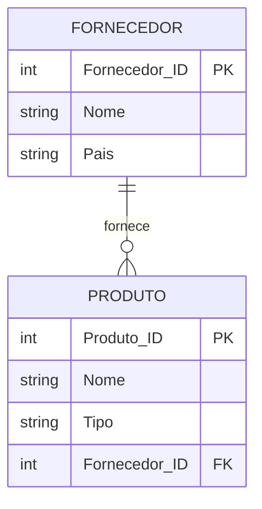

# Exercício 18 - Distribuidora de Alimentos

## Descrição do Cenário

Este exercício apresenta um sistema de banco de dados para uma distribuidora de alimentos. O objetivo é demonstrar como
utilizar JOINs com agregação de strings (STRING_AGG) para obter listas de fornecedores baseados em localização
específica e os tipos de produtos que eles fornecem, criando relatórios consolidados com informações agrupadas.

### Contexto do Negócio

A distribuidora trabalha com diversos fornecedores de alimentos de diferentes países. Cada fornecedor possui uma
especialização em tipos específicos de produtos alimentícios. Para fins de planejamento logístico, análise de
fornecedores por região ou estratégias de importação, é importante identificar fornecedores de países específicos e
conhecer a variedade de tipos de produtos que cada um oferece.

### Estrutura dos Dados

O sistema é composto por duas entidades principais com o seguinte relacionamento:



## Implementação em PostgreSQL

### Definição da Estrutura (DDL)

O código abaixo cria o esquema e as tabelas necessárias para o sistema:

```sql
-- Criação do esquema para organizar as tabelas
CREATE SCHEMA Distribuidora_Alimentos;
SET search_path TO Distribuidora_Alimentos;

-- Tabela para armazenar dados dos fornecedores
CREATE TABLE Fornecedor
(
    Fornecedor_ID SERIAL PRIMARY KEY,
    Nome          VARCHAR(100) NOT NULL,
    Pais          VARCHAR(50)  NOT NULL
);

-- Tabela para armazenar dados dos produtos
CREATE TABLE Produto
(
    Produto_ID    SERIAL PRIMARY KEY,
    Nome          VARCHAR(100) NOT NULL,
    Tipo          VARCHAR(50)  NOT NULL,
    Fornecedor_ID INT REFERENCES Fornecedor (Fornecedor_ID)
);
```

### Inserção de Dados de Exemplo

Para demonstrar o funcionamento do sistema, inserimos alguns registros de exemplo:

```sql
-- Inserção de fornecedores
INSERT INTO Fornecedor (Nome, Pais)
VALUES ('Alimentos del Sur', 'México'),
       ('Sabores Latinos', 'México'),
       ('ExportFoods', 'Brasil');

-- Inserção de produtos
INSERT INTO Produto (Nome, Tipo, Fornecedor_ID)
VALUES ('Milho', 'Grão', 1),
       ('Feijão', 'Leguminosa', 1),
       ('Abacate', 'Fruta', 2),
       ('Arroz', 'Grão', 3);
```

### Consulta Principal: Fornecedores Mexicanos e Tipos de Produtos

O objetivo principal deste exercício é listar fornecedores baseados no México e os tipos de produtos que eles fornecem:

```sql
SELECT F.Nome                            AS Fornecedor,
       STRING_AGG(DISTINCT P.Tipo, ', ') AS Tipos_de_Produtos
FROM Fornecedor F
         JOIN Produto P ON P.Fornecedor_ID = F.Fornecedor_ID
WHERE F.Pais = 'México'
GROUP BY F.Nome;
```

**Resultado esperado:**

```
Fornecedor        | Tipos_de_Produtos
------------------|------------------
Alimentos del Sur | Grão, Leguminosa
Sabores Latinos   | Fruta
```

## Explicação Técnica

### Operações Utilizadas

1. **JOIN entre tabelas**:
    - `JOIN Produto P ON P.Fornecedor_ID = F.Fornecedor_ID` conecta fornecedores aos seus produtos
    - Permite acesso aos dados de ambas as tabelas simultaneamente
    - Estabelece a relação um-para-muitos entre fornecedor e produtos

2. **Filtro por localização**:
    - `WHERE F.Pais = 'México'` filtra apenas fornecedores do país especificado
    - Aplicado antes da agregação para otimizar performance
    - Permite análises regionais específicas

3. **Agregação com STRING_AGG**:
    - `STRING_AGG(DISTINCT P.Tipo, ', ')` concatena tipos únicos de produtos
    - `DISTINCT` evita repetição de tipos iguais do mesmo fornecedor
    - Separador `', '` cria uma lista legível e organizada

4. **Agrupamento por fornecedor**:
    - `GROUP BY F.Nome` agrupa resultados por fornecedor
    - Permite que STRING_AGG funcione corretamente
    - Cada linha representa um fornecedor único

### Processo de Execução

1. **JOIN**: Conecta fornecedores aos seus produtos
2. **WHERE**: Filtra apenas fornecedores do México
3. **GROUP BY**: Agrupa por fornecedor
4. **STRING_AGG**: Concatena tipos de produtos únicos
5. **Resultado**: Lista consolidada por fornecedor

### Consultas Adicionais Úteis

#### Fornecedores com contagem de tipos de produtos:

```sql
SELECT F.Nome                            AS Fornecedor,
       F.Pais,
       COUNT(DISTINCT P.Tipo)            AS Quantidade_Tipos,
       STRING_AGG(DISTINCT P.Tipo, ', ') AS Tipos_de_Produtos,
       COUNT(P.Produto_ID)               AS Total_Produtos
FROM Fornecedor F
         JOIN Produto P ON P.Fornecedor_ID = F.Fornecedor_ID
WHERE F.Pais = 'México'
GROUP BY F.Fornecedor_ID, F.Nome, F.Pais
ORDER BY Quantidade_Tipos DESC;
```

#### Análise por país com estatísticas:

```sql
SELECT F.Pais,
       COUNT(DISTINCT F.Fornecedor_ID)   AS Quantidade_Fornecedores,
       COUNT(DISTINCT P.Tipo)            AS Tipos_Diferentes,
       STRING_AGG(DISTINCT P.Tipo, ', ') AS Todos_Tipos,
       COUNT(P.Produto_ID)               AS Total_Produtos
FROM Fornecedor F
         JOIN Produto P ON P.Fornecedor_ID = F.Fornecedor_ID
GROUP BY F.Pais
ORDER BY Quantidade_Fornecedores DESC;
```

#### Fornecedores especializados (apenas um tipo):

```sql
SELECT F.Nome                            AS Fornecedor,
       F.Pais,
       STRING_AGG(DISTINCT P.Tipo, ', ') AS Tipo_Especializado
FROM Fornecedor F
         JOIN Produto P ON P.Fornecedor_ID = F.Fornecedor_ID
WHERE F.Pais = 'México'
GROUP BY F.Fornecedor_ID, F.Nome, F.Pais
HAVING COUNT(DISTINCT P.Tipo) = 1;
```

#### Fornecedores diversificados (múltiplos tipos):

```sql
SELECT F.Nome                            AS Fornecedor,
       F.Pais,
       COUNT(DISTINCT P.Tipo)            AS Quantidade_Tipos,
       STRING_AGG(DISTINCT P.Tipo, ', ') AS Tipos_de_Produtos
FROM Fornecedor F
         JOIN Produto P ON P.Fornecedor_ID = F.Fornecedor_ID
WHERE F.Pais = 'México'
GROUP BY F.Fornecedor_ID, F.Nome, F.Pais
HAVING COUNT(DISTINCT P.Tipo) > 1
ORDER BY Quantidade_Tipos DESC;
```

#### Relatório detalhado com produtos específicos:

```sql
SELECT F.Nome                   AS Fornecedor,
       P.Tipo,
       STRING_AGG(P.Nome, ', ') AS Produtos_do_Tipo,
       COUNT(P.Produto_ID)      AS Quantidade_Produtos
FROM Fornecedor F
         JOIN Produto P ON P.Fornecedor_ID = F.Fornecedor_ID
WHERE F.Pais = 'México'
GROUP BY F.Fornecedor_ID, F.Nome, P.Tipo
ORDER BY F.Nome, P.Tipo;
```

#### Comparação entre países:

```sql
WITH fornecedores_por_pais AS (SELECT F.Pais,
                                      F.Nome                            AS Fornecedor,
                                      STRING_AGG(DISTINCT P.Tipo, ', ') AS Tipos_de_Produtos,
                                      COUNT(DISTINCT P.Tipo)            AS Quantidade_Tipos
                               FROM Fornecedor F
                                        JOIN Produto P ON P.Fornecedor_ID = F.Fornecedor_ID
                               GROUP BY F.Pais, F.Fornecedor_ID, F.Nome)
SELECT Pais,
       Fornecedor,
       Tipos_de_Produtos,
       Quantidade_Tipos,
       RANK() OVER (PARTITION BY Pais ORDER BY Quantidade_Tipos DESC) AS Ranking_Diversificacao
FROM fornecedores_por_pais
ORDER BY Pais, Ranking_Diversificacao;
```

#### Tipos de produtos mais comuns por região:

```sql
SELECT F.Pais,
       P.Tipo,
       COUNT(DISTINCT F.Fornecedor_ID)   AS Fornecedores_que_Oferecem,
       COUNT(P.Produto_ID)               AS Total_Produtos_Tipo,
       STRING_AGG(DISTINCT F.Nome, ', ') AS Lista_Fornecedores
FROM Fornecedor F
         JOIN Produto P ON P.Fornecedor_ID = F.Fornecedor_ID
GROUP BY F.Pais, P.Tipo
ORDER BY F.Pais, Fornecedores_que_Oferecem DESC;
```

### Variações da Consulta Principal

#### Incluindo fornecedores sem produtos (LEFT JOIN):

```sql
SELECT F.Nome                                                                   AS Fornecedor,
       COALESCE(STRING_AGG(DISTINCT P.Tipo, ', '), 'Nenhum produto cadastrado') AS Tipos_de_Produtos
FROM Fornecedor F
         LEFT JOIN Produto P ON P.Fornecedor_ID = F.Fornecedor_ID
WHERE F.Pais = 'México'
GROUP BY F.Nome;
```

#### Com ordenação alfabética dos tipos:

```sql
SELECT F.Nome                                            AS Fornecedor,
       STRING_AGG(DISTINCT P.Tipo, ', ' ORDER BY P.Tipo) AS Tipos_de_Produtos
FROM Fornecedor F
         JOIN Produto P ON P.Fornecedor_ID = F.Fornecedor_ID
WHERE F.Pais = 'México'
GROUP BY F.Nome
ORDER BY F.Nome;
```

#### Para múltiplos países:

```sql
SELECT F.Nome                            AS Fornecedor,
       F.Pais,
       STRING_AGG(DISTINCT P.Tipo, ', ') AS Tipos_de_Produtos
FROM Fornecedor F
         JOIN Produto P ON P.Fornecedor_ID = F.Fornecedor_ID
WHERE F.Pais IN ('México', 'Brasil', 'Argentina')
GROUP BY F.Fornecedor_ID, F.Nome, F.Pais
ORDER BY F.Pais, F.Nome;
```

#### Com formatação personalizada:

```sql
SELECT F.Nome                                                           AS Fornecedor,
       CONCAT('Tipos oferecidos: ', STRING_AGG(DISTINCT P.Tipo, ' | ')) AS Descricao_Produtos,
       COUNT(DISTINCT P.Tipo) || ' tipos diferentes'                    AS Resumo_Diversificacao
FROM Fornecedor F
         JOIN Produto P ON P.Fornecedor_ID = F.Fornecedor_ID
WHERE F.Pais = 'México'
GROUP BY F.Nome;
```

#### Usando ARRAY_AGG como alternativa:

```sql
SELECT F.Nome                                                            AS Fornecedor,
       ARRAY_AGG(DISTINCT P.Tipo ORDER BY P.Tipo)                        AS Array_Tipos,
       ARRAY_TO_STRING(ARRAY_AGG(DISTINCT P.Tipo ORDER BY P.Tipo), ', ') AS Tipos_de_Produtos
FROM Fornecedor F
         JOIN Produto P ON P.Fornecedor_ID = F.Fornecedor_ID
WHERE F.Pais = 'México'
GROUP BY F.Nome;
```

### Estatísticas e Análise

```sql
-- Verificar distribuição de dados
ANALYZE Fornecedor;
ANALYZE Produto;

-- Verificar plano de execução
EXPLAIN ANALYZE
SELECT F.Nome                            AS Fornecedor,
       STRING_AGG(DISTINCT P.Tipo, ', ') AS Tipos_de_Produtos
FROM Fornecedor F
         JOIN Produto P ON P.Fornecedor_ID = F.Fornecedor_ID
WHERE F.Pais = 'México'
GROUP BY F.Nome;
```
