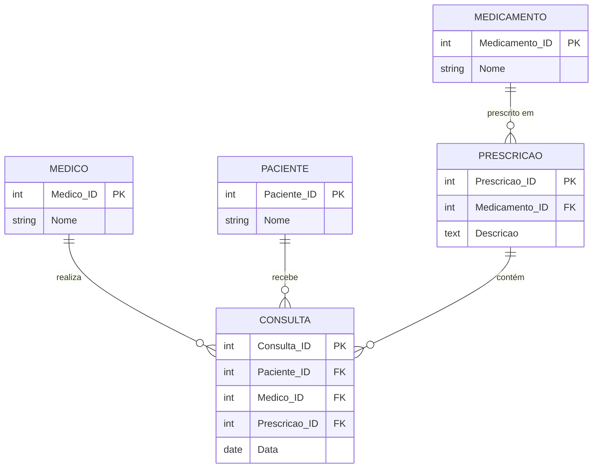

# Exercício 19 - Clínica de Endocrinologia

## Descrição do Cenário

Este exercício apresenta um sistema de banco de dados para uma clínica de endocrinologia. O objetivo é demonstrar como utilizar múltiplos JOINs para obter informações detalhadas de prescrições médicas, conectando dados de médicos, pacientes, prescrições e medicamentos em uma única consulta consolidada.

### Contexto do Negócio

A clínica de endocrinologia possui diversos endocrinologistas que realizam prescrições para seus pacientes. Cada prescrição está relacionada a um medicamento específico e contém instruções detalhadas de uso. Para fins de acompanhamento médico, auditoria de prescrições ou relatórios clínicos, é importante obter uma visão completa que inclua informações do médico, paciente, descrição da prescrição e medicamento prescrito.

### Estrutura dos Dados

O sistema é composto por cinco entidades principais com os seguintes relacionamentos:



## Implementação em PostgreSQL

### Definição da Estrutura (DDL)

O código abaixo cria o esquema e as tabelas necessárias para o sistema:

```sql
-- Criação do esquema para organizar as tabelas
CREATE SCHEMA Clinica_Endocrino;
SET search_path TO Clinica_Endocrino;

-- Tabela para armazenar dados dos médicos
CREATE TABLE Medico (
    Medico_ID SERIAL PRIMARY KEY,
    Nome VARCHAR(100) NOT NULL
);

-- Tabela para armazenar dados dos pacientes
CREATE TABLE Paciente (
    Paciente_ID SERIAL PRIMARY KEY,
    Nome VARCHAR(100) NOT NULL
);

-- Tabela para armazenar dados dos medicamentos
CREATE TABLE Medicamento (
    Medicamento_ID SERIAL PRIMARY KEY,
    Nome VARCHAR(100) NOT NULL
);

-- Tabela para armazenar dados das prescrições
CREATE TABLE Prescricao (
    Prescricao_ID SERIAL PRIMARY KEY,
    Medicamento_ID INT REFERENCES Medicamento(Medicamento_ID),
    Descricao TEXT NOT NULL
);

-- Tabela para armazenar dados das consultas
CREATE TABLE Consulta (
    Consulta_ID SERIAL PRIMARY KEY,
    Paciente_ID INT REFERENCES Paciente(Paciente_ID),
    Medico_ID INT REFERENCES Medico(Medico_ID),
    Prescricao_ID INT REFERENCES Prescricao(Prescricao_ID),
    Data DATE NOT NULL
);
```

### Inserção de Dados de Exemplo

Para demonstrar o funcionamento do sistema, inserimos alguns registros de exemplo:

```sql
-- Inserção de médicos
INSERT INTO Medico (Nome) VALUES
('Dr. Ana Lima'),
('Dr. Paulo Souza');

-- Inserção de pacientes
INSERT INTO Paciente (Nome) VALUES
('Carlos Silva'),
('Fernanda Costa');

-- Inserção de medicamentos
INSERT INTO Medicamento (Nome) VALUES
('Insulina'),
('Levotiroxina');

-- Inserção de prescrições
INSERT INTO Prescricao (Medicamento_ID, Descricao) VALUES
(1, 'Aplicar 10 unidades ao acordar'),
(2, 'Tomar 1 comprimido antes do café');

-- Inserção de consultas
INSERT INTO Consulta (Paciente_ID, Medico_ID, Prescricao_ID, Data) VALUES
(1, 1, 1, '2024-06-10'),
(2, 2, 2, '2024-06-12');
```

### Consulta Principal: Médico, Paciente, Descrição e Medicamento

O objetivo principal deste exercício é obter uma lista completa com informações de prescrições médicas:

```sql
SELECT M.Nome AS Medico,
       P.Nome AS Paciente,
       PR.Descricao AS Descricao_Prescricao,
       MED.Nome AS Medicamento
FROM Consulta C
JOIN Medico M ON C.Medico_ID = M.Medico_ID
JOIN Paciente P ON C.Paciente_ID = P.Paciente_ID
JOIN Prescricao PR ON C.Prescricao_ID = PR.Prescricao_ID
JOIN Medicamento MED ON PR.Medicamento_ID = MED.Medicamento_ID;
```

**Resultado esperado:**
```
Medico        | Paciente      | Descricao_Prescricao           | Medicamento
--------------|---------------|--------------------------------|-------------
Dr. Ana Lima  | Carlos Silva  | Aplicar 10 unidades ao acordar | Insulina
Dr. Paulo Souza| Fernanda Costa| Tomar 1 comprimido antes do café| Levotiroxina
```

## Explicação Técnica

### Operações Utilizadas

1. **Múltiplos JOINs**:
   - `JOIN Medico M ON C.Medico_ID = M.Medico_ID` conecta consulta ao médico
   - `JOIN Paciente P ON C.Paciente_ID = P.Paciente_ID` conecta consulta ao paciente
   - `JOIN Prescricao PR ON C.Prescricao_ID = PR.Prescricao_ID` conecta consulta à prescrição
   - `JOIN Medicamento MED ON PR.Medicamento_ID = MED.Medicamento_ID` conecta prescrição ao medicamento

2. **Cadeia de relacionamentos**:
   - Consulta → Médico (relacionamento direto)
   - Consulta → Paciente (relacionamento direto)
   - Consulta → Prescrição → Medicamento (relacionamento indireto)

3. **Aliases para clareza**:
   - Cada tabela recebe um alias (C, M, P, PR, MED) para facilitar leitura
   - Colunas de resultado recebem nomes descritivos
   - Evita ambiguidade em colunas com nomes similares

4. **Resultado desnormalizado**:
   - Cada linha representa uma prescrição completa
   - Dados aparecem sem agrupamento
   - Informações de todas as entidades em uma única linha

### Processo de Execução

1. **Tabela base**: Consulta serve como ponto central
2. **JOINs sequenciais**: Conecta todas as entidades relacionadas
3. **Projeção**: Seleciona apenas as colunas necessárias
4. **Resultado**: Lista completa de prescrições com detalhes

### Consultas Adicionais Úteis

#### Incluindo data da consulta e informações adicionais:

```sql
SELECT M.Nome AS Medico,
       P.Nome AS Paciente,
       C.Data AS Data_Consulta,
       PR.Descricao AS Descricao_Prescricao,
       MED.Nome AS Medicamento,
       C.Consulta_ID AS Numero_Consulta
FROM Consulta C
JOIN Medico M ON C.Medico_ID = M.Medico_ID
JOIN Paciente P ON C.Paciente_ID = P.Paciente_ID
JOIN Prescricao PR ON C.Prescricao_ID = PR.Prescricao_ID
JOIN Medicamento MED ON PR.Medicamento_ID = MED.Medicamento_ID
ORDER BY C.Data DESC;
```

#### Prescrições por médico específico:

```sql
SELECT M.Nome AS Medico,
       P.Nome AS Paciente,
       C.Data AS Data_Consulta,
       PR.Descricao AS Descricao_Prescricao,
       MED.Nome AS Medicamento
FROM Consulta C
JOIN Medico M ON C.Medico_ID = M.Medico_ID
JOIN Paciente P ON C.Paciente_ID = P.Paciente_ID
JOIN Prescricao PR ON C.Prescricao_ID = PR.Prescricao_ID
JOIN Medicamento MED ON PR.Medicamento_ID = MED.Medicamento_ID
WHERE M.Nome ILIKE '%Ana%'
ORDER BY C.Data DESC;
```

#### Prescrições por medicamento específico:

```sql
SELECT M.Nome AS Medico,
       P.Nome AS Paciente,
       C.Data AS Data_Consulta,
       PR.Descricao AS Descricao_Prescricao,
       MED.Nome AS Medicamento
FROM Consulta C
JOIN Medico M ON C.Medico_ID = M.Medico_ID
JOIN Paciente P ON C.Paciente_ID = P.Paciente_ID
JOIN Prescricao PR ON C.Prescricao_ID = PR.Prescricao_ID
JOIN Medicamento MED ON PR.Medicamento_ID = MED.Medicamento_ID
WHERE MED.Nome = 'Insulina'
ORDER BY C.Data DESC;
```

#### Relatório de prescrições por período:

```sql
SELECT M.Nome AS Medico,
       P.Nome AS Paciente,
       C.Data AS Data_Consulta,
       PR.Descricao AS Descricao_Prescricao,
       MED.Nome AS Medicamento,
       EXTRACT(MONTH FROM C.Data) AS Mes,
       EXTRACT(YEAR FROM C.Data) AS Ano
FROM Consulta C
JOIN Medico M ON C.Medico_ID = M.Medico_ID
JOIN Paciente P ON C.Paciente_ID = P.Paciente_ID
JOIN Prescricao PR ON C.Prescricao_ID = PR.Prescricao_ID
JOIN Medicamento MED ON PR.Medicamento_ID = MED.Medicamento_ID
WHERE C.Data BETWEEN '2024-06-01' AND '2024-06-30'
ORDER BY C.Data, M.Nome;
```

#### Estatísticas de prescrições por médico:

```sql
SELECT M.Nome AS Medico,
       COUNT(*) AS Total_Prescricoes,
       COUNT(DISTINCT P.Paciente_ID) AS Pacientes_Atendidos,
       COUNT(DISTINCT MED.Medicamento_ID) AS Medicamentos_Diferentes,
       STRING_AGG(DISTINCT MED.Nome, ', ') AS Lista_Medicamentos
FROM Consulta C
JOIN Medico M ON C.Medico_ID = M.Medico_ID
JOIN Paciente P ON C.Paciente_ID = P.Paciente_ID
JOIN Prescricao PR ON C.Prescricao_ID = PR.Prescricao_ID
JOIN Medicamento MED ON PR.Medicamento_ID = MED.Medicamento_ID
GROUP BY M.Medico_ID, M.Nome
ORDER BY Total_Prescricoes DESC;
```

#### Histórico completo de um paciente:

```sql
SELECT P.Nome AS Paciente,
       M.Nome AS Medico,
       C.Data AS Data_Consulta,
       MED.Nome AS Medicamento,
       PR.Descricao AS Instrucoes,
       ROW_NUMBER() OVER (PARTITION BY P.Paciente_ID ORDER BY C.Data) AS Numero_Prescricao
FROM Consulta C
JOIN Medico M ON C.Medico_ID = M.Medico_ID
JOIN Paciente P ON C.Paciente_ID = P.Paciente_ID
JOIN Prescricao PR ON C.Prescricao_ID = PR.Prescricao_ID
JOIN Medicamento MED ON PR.Medicamento_ID = MED.Medicamento_ID
WHERE P.Nome = 'Carlos Silva'
ORDER BY C.Data;
```

#### Medicamentos mais prescritos:

```sql
SELECT MED.Nome AS Medicamento,
       COUNT(*) AS Vezes_Prescrito,
       COUNT(DISTINCT M.Medico_ID) AS Medicos_que_Prescrevem,
       COUNT(DISTINCT P.Paciente_ID) AS Pacientes_que_Usam,
       STRING_AGG(DISTINCT M.Nome, ', ') AS Lista_Medicos
FROM Consulta C
JOIN Medico M ON C.Medico_ID = M.Medico_ID
JOIN Paciente P ON C.Paciente_ID = P.Paciente_ID
JOIN Prescricao PR ON C.Prescricao_ID = PR.Prescricao_ID
JOIN Medicamento MED ON PR.Medicamento_ID = MED.Medicamento_ID
GROUP BY MED.Medicamento_ID, MED.Nome
ORDER BY Vezes_Prescrito DESC;
```

### Variações da Consulta Principal

#### Com formatação de data brasileira:

```sql
SELECT M.Nome AS Medico,
       P.Nome AS Paciente,
       TO_CHAR(C.Data, 'DD/MM/YYYY') AS Data_Consulta,
       PR.Descricao AS Descricao_Prescricao,
       MED.Nome AS Medicamento
FROM Consulta C
JOIN Medico M ON C.Medico_ID = M.Medico_ID
JOIN Paciente P ON C.Paciente_ID = P.Paciente_ID
JOIN Prescricao PR ON C.Prescricao_ID = PR.Prescricao_ID
JOIN Medicamento MED ON PR.Medicamento_ID = MED.Medicamento_ID
ORDER BY C.Data DESC;
```

#### Com informações concatenadas:

```sql
SELECT CONCAT('Dr(a). ', M.Nome) AS Medico_Completo,
       UPPER(P.Nome) AS Paciente_Maiusculo,
       CONCAT(MED.Nome, ' - ', PR.Descricao) AS Medicamento_e_Instrucoes,
       C.Data AS Data_Prescricao
FROM Consulta C
JOIN Medico M ON C.Medico_ID = M.Medico_ID
JOIN Paciente P ON C.Paciente_ID = P.Paciente_ID
JOIN Prescricao PR ON C.Prescricao_ID = PR.Prescricao_ID
JOIN Medicamento MED ON PR.Medicamento_ID = MED.Medicamento_ID;
```

#### Usando LEFT JOINs para incluir consultas sem prescrição:

```sql
SELECT M.Nome AS Medico,
       P.Nome AS Paciente,
       C.Data AS Data_Consulta,
       COALESCE(PR.Descricao, 'Sem prescrição') AS Descricao_Prescricao,
       COALESCE(MED.Nome, 'Nenhum medicamento') AS Medicamento
FROM Consulta C
JOIN Medico M ON C.Medico_ID = M.Medico_ID
JOIN Paciente P ON C.Paciente_ID = P.Paciente_ID
LEFT JOIN Prescricao PR ON C.Prescricao_ID = PR.Prescricao_ID
LEFT JOIN Medicamento MED ON PR.Medicamento_ID = MED.Medicamento_ID
ORDER BY C.Data DESC;
```

#### Com filtros múltiplos:

```sql
SELECT M.Nome AS Medico,
       P.Nome AS Paciente,
       PR.Descricao AS Descricao_Prescricao,
       MED.Nome AS Medicamento,
       C.Data AS Data_Consulta
FROM Consulta C
JOIN Medico M ON C.Medico_ID = M.Medico_ID
JOIN Paciente P ON C.Paciente_ID = P.Paciente_ID
JOIN Prescricao PR ON C.Prescricao_ID = PR.Prescricao_ID
JOIN Medicamento MED ON PR.Medicamento_ID = MED.Medicamento_ID
WHERE C.Data >= CURRENT_DATE - INTERVAL '30 days'
  AND MED.Nome NOT LIKE '%Controlado%'
ORDER BY C.Data DESC, M.Nome;
```

#### Com numeração sequencial:

```sql
SELECT ROW_NUMBER() OVER (ORDER BY C.Data DESC) AS Numero_Linha,
       M.Nome AS Medico,
       P.Nome AS Paciente,
       PR.Descricao AS Descricao_Prescricao,
       MED.Nome AS Medicamento,
       C.Data AS Data_Consulta
FROM Consulta C
JOIN Medico M ON C.Medico_ID = M.Medico_ID
JOIN Paciente P ON C.Paciente_ID = P.Paciente_ID
JOIN Prescricao PR ON C.Prescricao_ID = PR.Prescricao_ID
JOIN Medicamento MED ON PR.Medicamento_ID = MED.Medicamento_ID;
```


### Análise de Performance

```sql
-- Verificar plano de execução
EXPLAIN ANALYZE
SELECT M.Nome AS Medico,
       P.Nome AS Paciente,
       PR.Descricao AS Descricao_Prescricao,
       MED.Nome AS Medicamento
FROM Consulta C
JOIN Medico M ON C.Medico_ID = M.Medico_ID
JOIN Paciente P ON C.Paciente_ID = P.Paciente_ID
JOIN Prescricao PR ON C.Prescricao_ID = PR.Prescricao_ID
JOIN Medicamento MED ON PR.Medicamento_ID = MED.Medicamento_ID;
```

### Otimização para Grandes Volumes

Quando a gente tem tabelas com muitos registros:

```sql
-- Consulta otimizada com LIMIT para paginação
SELECT M.Nome AS Medico,
       P.Nome AS Paciente,
       PR.Descricao AS Descricao_Prescricao,
       MED.Nome AS Medicamento,
       C.Data AS Data_Consulta
FROM Consulta C
JOIN Medico M ON C.Medico_ID = M.Medico_ID
JOIN Paciente P ON C.Paciente_ID = P.Paciente_ID
JOIN Prescricao PR ON C.Prescricao_ID = PR.Prescricao_ID
JOIN Medicamento MED ON PR.Medicamento_ID = MED.Medicamento_ID
ORDER BY C.Data DESC
LIMIT 50 OFFSET 0;
```

