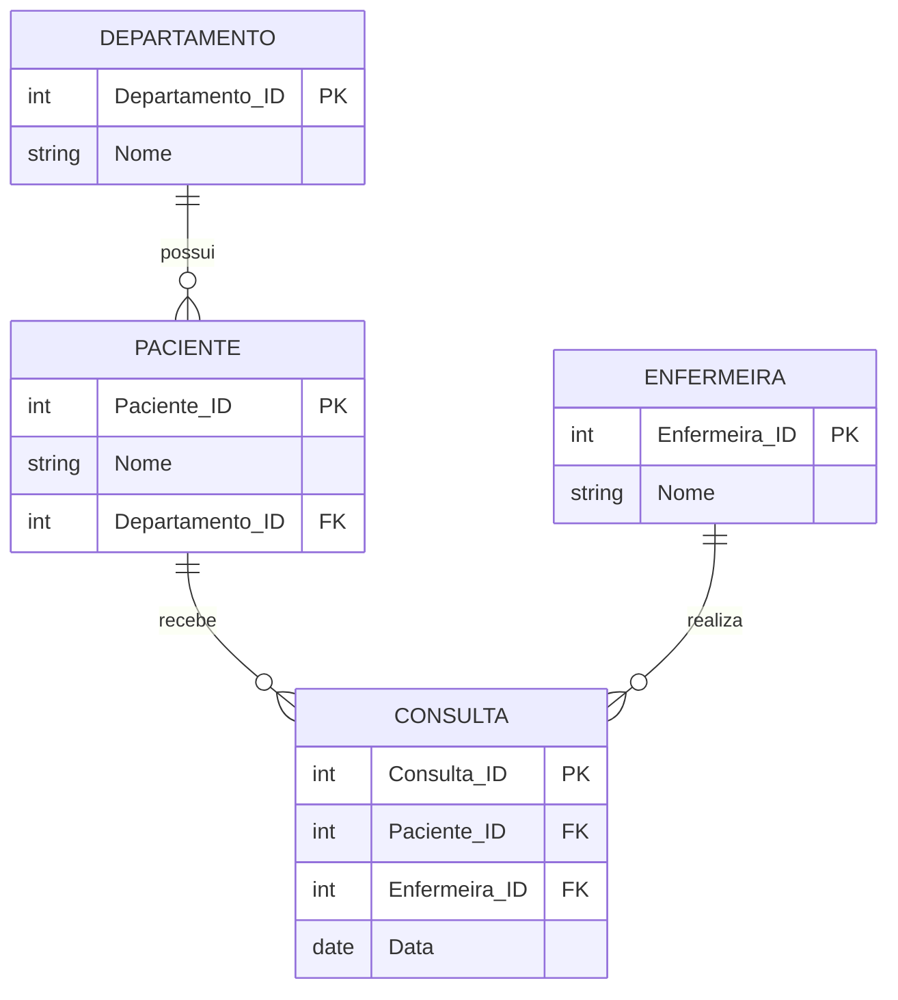

# Exercício 20 - Hospital Psiquiátrico

## Descrição do Cenário

Este exercício apresenta um sistema de banco de dados para um hospital psiquiátrico. O objetivo é demonstrar como utilizar múltiplos JOINs para obter informações completas de consultas, conectando dados de pacientes, departamentos, enfermeiras e datas de consulta em uma única consulta consolidada sem agrupamento.

### Contexto do Negócio

O hospital psiquiátrico possui diversos departamentos especializados, cada um atendendo pacientes com diferentes necessidades. Cada paciente pertence a um departamento específico e recebe atendimento de enfermeiras especializadas durante suas consultas. Para fins de acompanhamento médico, relatórios administrativos ou auditoria de atendimentos, é importante obter uma visão completa que inclua informações do paciente, seu departamento, a enfermeira responsável e a data da consulta.

### Estrutura dos Dados

O sistema é composto por quatro entidades principais com os seguintes relacionamentos:



## Implementação em PostgreSQL

### Definição da Estrutura (DDL)

O código abaixo cria o esquema e as tabelas necessárias para o sistema:

```sql
-- Criação do esquema para organizar as tabelas
CREATE SCHEMA Hospital_Psiquiatrico;
SET search_path TO Hospital_Psiquiatrico;

-- Tabela para armazenar dados dos departamentos
CREATE TABLE Departamento (
    Departamento_ID SERIAL PRIMARY KEY,
    Nome VARCHAR(100) NOT NULL
);

-- Tabela para armazenar dados dos pacientes
CREATE TABLE Paciente (
    Paciente_ID SERIAL PRIMARY KEY,
    Nome VARCHAR(100) NOT NULL,
    Departamento_ID INT REFERENCES Departamento(Departamento_ID)
);

-- Tabela para armazenar dados das enfermeiras
CREATE TABLE Enfermeira (
    Enfermeira_ID SERIAL PRIMARY KEY,
    Nome VARCHAR(100) NOT NULL
);

-- Tabela para armazenar dados das consultas
CREATE TABLE Consulta (
    Consulta_ID SERIAL PRIMARY KEY,
    Paciente_ID INT REFERENCES Paciente(Paciente_ID),
    Enfermeira_ID INT REFERENCES Enfermeira(Enfermeira_ID),
    Data DATE NOT NULL
);
```

### Inserção de Dados de Exemplo

Para demonstrar o funcionamento do sistema, inserimos alguns registros de exemplo:

```sql
-- Inserção de departamentos
INSERT INTO Departamento (Nome) VALUES
('Internação'),
('Ambulatório');

-- Inserção de pacientes
INSERT INTO Paciente (Nome, Departamento_ID) VALUES
('Carlos Silva', 1),
('Fernanda Costa', 2);

-- Inserção de enfermeiras
INSERT INTO Enfermeira (Nome) VALUES
('Ana Souza'),
('João Pereira');

-- Inserção de consultas
INSERT INTO Consulta (Paciente_ID, Enfermeira_ID, Data) VALUES
(1, 1, '2024-06-15'),
(2, 2, '2024-06-20');
```

### Consulta Principal: Paciente, Departamento, Enfermeira e Data

O objetivo principal deste exercício é obter uma lista completa com informações de consultas sem agrupamento:

```sql
SELECT P.Nome AS Paciente,
       D.Nome AS Departamento,
       E.Nome AS Enfermeira,
       C.Data AS Data_Consulta
FROM Consulta C
JOIN Paciente P ON C.Paciente_ID = P.Paciente_ID
JOIN Departamento D ON P.Departamento_ID = D.Departamento_ID
JOIN Enfermeira E ON C.Enfermeira_ID = E.Enfermeira_ID
ORDER BY C.Data DESC;
```

**Resultado esperado:**
```
Paciente       | Departamento | Enfermeira   | Data_Consulta
---------------|--------------|--------------|---------------
Fernanda Costa | Ambulatório  | João Pereira | 2024-06-20
Carlos Silva   | Internação   | Ana Souza    | 2024-06-15
```

## Explicação Técnica

### Operações Utilizadas

1. **Múltiplos JOINs**:
   - `JOIN Paciente P ON C.Paciente_ID = P.Paciente_ID` conecta consulta ao paciente
   - `JOIN Departamento D ON P.Departamento_ID = D.Departamento_ID` conecta paciente ao departamento
   - `JOIN Enfermeira E ON C.Enfermeira_ID = E.Enfermeira_ID` conecta consulta à enfermeira

2. **Cadeia de relacionamentos**:
   - Consulta → Paciente → Departamento (relacionamento indireto)
   - Consulta → Enfermeira (relacionamento direto)

3. **Ordenação por data**:
   - `ORDER BY C.Data DESC` organiza resultados do mais recente ao mais antigo
   - Facilita visualização cronológica dos atendimentos

4. **Resultado desnormalizado**:
   - Cada linha representa uma consulta individual
   - Dados aparecem em linhas individuais sem agrupamento
   - Informações de todas as entidades em uma única linha

### Processo de Execução

1. **Tabela base**: Consulta serve como ponto central
2. **JOINs sequenciais**: Conecta todas as entidades relacionadas
3. **Projeção**: Seleciona apenas as colunas necessárias
4. **Ordenação**: Organiza por data decrescente
5. **Resultado**: Lista completa de consultas com detalhes

### Consultas Adicionais Úteis

#### Incluindo horário da consulta e informações adicionais:

```sql
SELECT P.Nome AS Paciente,
       D.Nome AS Departamento,
       E.Nome AS Enfermeira,
       TO_CHAR(C.Data, 'DD/MM/YYYY') AS Data_Formatada,
       C.Consulta_ID AS Numero_Consulta,
       EXTRACT(DOW FROM C.Data) AS Dia_Semana
FROM Consulta C
JOIN Paciente P ON C.Paciente_ID = P.Paciente_ID
JOIN Departamento D ON P.Departamento_ID = D.Departamento_ID
JOIN Enfermeira E ON C.Enfermeira_ID = E.Enfermeira_ID
ORDER BY C.Data DESC;
```

#### Consultas por departamento específico:

```sql
SELECT P.Nome AS Paciente,
       D.Nome AS Departamento,
       E.Nome AS Enfermeira,
       C.Data AS Data_Consulta
FROM Consulta C
JOIN Paciente P ON C.Paciente_ID = P.Paciente_ID
JOIN Departamento D ON P.Departamento_ID = D.Departamento_ID
JOIN Enfermeira E ON C.Enfermeira_ID = E.Enfermeira_ID
WHERE D.Nome = 'Internação'
ORDER BY C.Data DESC;
```

#### Consultas por enfermeira específica:

```sql
SELECT P.Nome AS Paciente,
       D.Nome AS Departamento,
       E.Nome AS Enfermeira,
       C.Data AS Data_Consulta
FROM Consulta C
JOIN Paciente P ON C.Paciente_ID = P.Paciente_ID
JOIN Departamento D ON P.Departamento_ID = D.Departamento_ID
JOIN Enfermeira E ON C.Enfermeira_ID = E.Enfermeira_ID
WHERE E.Nome ILIKE '%Ana%'
ORDER BY C.Data DESC;
```

#### Consultas por período específico:

```sql
SELECT P.Nome AS Paciente,
       D.Nome AS Departamento,
       E.Nome AS Enfermeira,
       C.Data AS Data_Consulta,
       CASE 
           WHEN C.Data >= CURRENT_DATE - INTERVAL '7 days' THEN 'Recente'
           WHEN C.Data >= CURRENT_DATE - INTERVAL '30 days' THEN 'Último mês'
           ELSE 'Anterior'
       END AS Periodo
FROM Consulta C
JOIN Paciente P ON C.Paciente_ID = P.Paciente_ID
JOIN Departamento D ON P.Departamento_ID = D.Departamento_ID
JOIN Enfermeira E ON C.Enfermeira_ID = E.Enfermeira_ID
WHERE C.Data BETWEEN '2024-06-01' AND '2024-06-30'
ORDER BY C.Data DESC;
```

#### Relatório com numeração sequencial:

```sql
SELECT ROW_NUMBER() OVER (ORDER BY C.Data DESC) AS Numero_Linha,
       P.Nome AS Paciente,
       D.Nome AS Departamento,
       E.Nome AS Enfermeira,
       C.Data AS Data_Consulta,
       EXTRACT(MONTH FROM C.Data) AS Mes,
       EXTRACT(YEAR FROM C.Data) AS Ano
FROM Consulta C
JOIN Paciente P ON C.Paciente_ID = P.Paciente_ID
JOIN Departamento D ON P.Departamento_ID = D.Departamento_ID
JOIN Enfermeira E ON C.Enfermeira_ID = E.Enfermeira_ID
ORDER BY C.Data DESC;
```

#### Consultas com informações de contato (modelo expandido):

```sql
-- Assumindo que as tabelas foram expandidas com informações de contato
SELECT P.Nome AS Paciente,
       P.Telefone AS Telefone_Paciente,
       D.Nome AS Departamento,
       E.Nome AS Enfermeira,
       E.Telefone AS Telefone_Enfermeira,
       C.Data AS Data_Consulta,
       CURRENT_DATE - C.Data AS Dias_Desde_Consulta
FROM Consulta C
JOIN Paciente P ON C.Paciente_ID = P.Paciente_ID
JOIN Departamento D ON P.Departamento_ID = D.Departamento_ID
JOIN Enfermeira E ON C.Enfermeira_ID = E.Enfermeira_ID
ORDER BY C.Data DESC;
```

### Variações da Consulta Principal

#### Com formatação personalizada:

```sql
SELECT UPPER(P.Nome) AS Paciente_Maiusculo,
       CONCAT('Depto: ', D.Nome) AS Departamento_Formatado,
       CONCAT('Enf. ', E.Nome) AS Enfermeira_Formatada,
       TO_CHAR(C.Data, 'DD "de" Month "de" YYYY') AS Data_Extenso
FROM Consulta C
JOIN Paciente P ON C.Paciente_ID = P.Paciente_ID
JOIN Departamento D ON P.Departamento_ID = D.Departamento_ID
JOIN Enfermeira E ON C.Enfermeira_ID = E.Enfermeira_ID
ORDER BY C.Data DESC;
```

#### Incluindo consultas sem enfermeira (LEFT JOIN):

```sql
SELECT P.Nome AS Paciente,
       D.Nome AS Departamento,
       COALESCE(E.Nome, 'Sem enfermeira designada') AS Enfermeira,
       C.Data AS Data_Consulta
FROM Consulta C
JOIN Paciente P ON C.Paciente_ID = P.Paciente_ID
JOIN Departamento D ON P.Departamento_ID = D.Departamento_ID
LEFT JOIN Enfermeira E ON C.Enfermeira_ID = E.Enfermeira_ID
ORDER BY C.Data DESC;
```

#### Com filtros múltiplos:

```sql
SELECT P.Nome AS Paciente,
       D.Nome AS Departamento,
       E.Nome AS Enfermeira,
       C.Data AS Data_Consulta
FROM Consulta C
JOIN Paciente P ON C.Paciente_ID = P.Paciente_ID
JOIN Departamento D ON P.Departamento_ID = D.Departamento_ID
JOIN Enfermeira E ON C.Enfermeira_ID = E.Enfermeira_ID
WHERE C.Data >= CURRENT_DATE - INTERVAL '90 days'
  AND D.Nome IN ('Internação', 'Ambulatório')
  AND P.Nome NOT LIKE '%Test%'
ORDER BY D.Nome, C.Data DESC;
```

#### Com informações estatísticas por linha:

```sql
SELECT P.Nome AS Paciente,
       D.Nome AS Departamento,
       E.Nome AS Enfermeira,
       C.Data AS Data_Consulta,
       COUNT(*) OVER (PARTITION BY P.Paciente_ID) AS Total_Consultas_Paciente,
       COUNT(*) OVER (PARTITION BY E.Enfermeira_ID) AS Total_Consultas_Enfermeira,
       COUNT(*) OVER (PARTITION BY D.Departamento_ID) AS Total_Consultas_Departamento
FROM Consulta C
JOIN Paciente P ON C.Paciente_ID = P.Paciente_ID
JOIN Departamento D ON P.Departamento_ID = D.Departamento_ID
JOIN Enfermeira E ON C.Enfermeira_ID = E.Enfermeira_ID
ORDER BY C.Data DESC;
```

#### Com ranking por departamento:

```sql
SELECT P.Nome AS Paciente,
       D.Nome AS Departamento,
       E.Nome AS Enfermeira,
       C.Data AS Data_Consulta,
       ROW_NUMBER() OVER (PARTITION BY D.Departamento_ID ORDER BY C.Data DESC) AS Ranking_Depto
FROM Consulta C
JOIN Paciente P ON C.Paciente_ID = P.Paciente_ID
JOIN Departamento D ON P.Departamento_ID = D.Departamento_ID
JOIN Enfermeira E ON C.Enfermeira_ID = E.Enfermeira_ID
ORDER BY D.Nome, C.Data DESC;
```