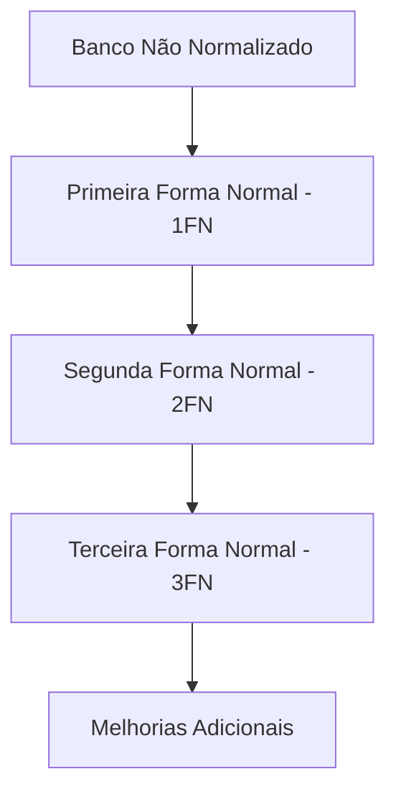
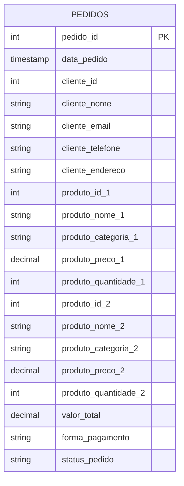
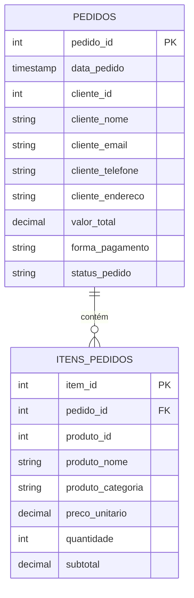
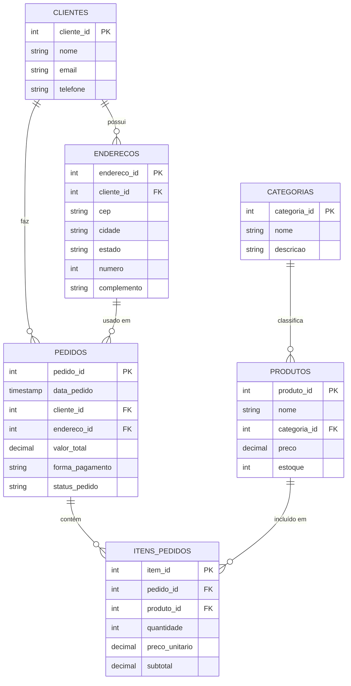
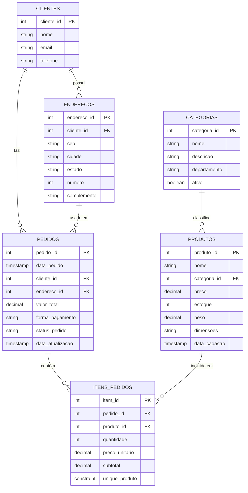
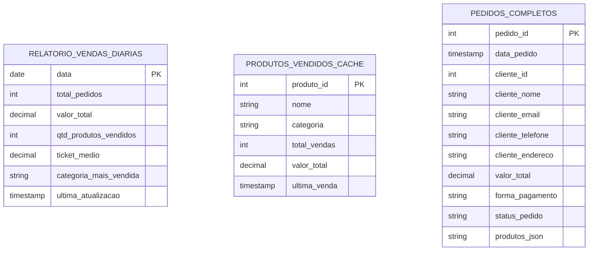
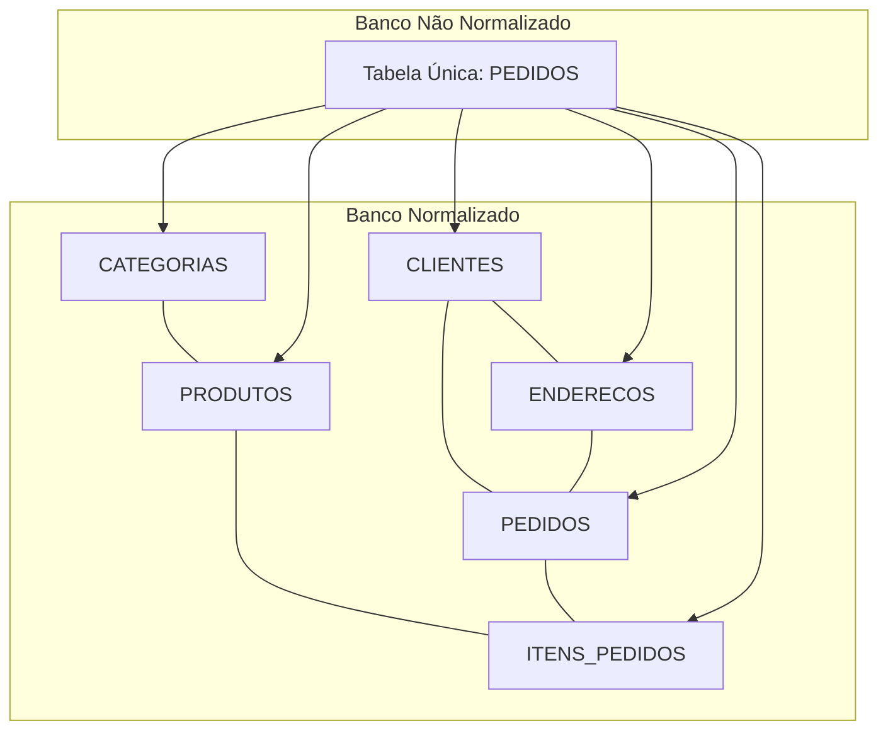

# Normalização

Este artigo explica o processo de normalização aplicado ao nosso banco de dados, transformando uma estrutura não normalizada em um modelo relacional eficiente e bem estruturado.

## O que é Normalização?

A normalização é um processo sistemático de design de banco de dados que:
1. Reduz a redundância de dados
2. Elimina anomalias de inserção, atualização e exclusão
3. Melhora a integridade dos dados
4. Simplifica consultas e manutenção
5. Otimiza o desempenho do banco de dados

O processo segue um conjunto de regras formais chamadas "Formas Normais" (1FN, 2FN, 3FN, BCNF, 4FN, 5FN), cada uma construída sobre a anterior para resolver problemas específicos de design.

## Por que Normalizar?

Muitos sistemas começam com estruturas de dados simples e não normalizadas, geralmente por razões como:
- Facilidade inicial de implementação
- Falta de conhecimento em design de banco de dados
- Priorização de velocidade de desenvolvimento sobre qualidade
- Requisitos iniciais limitados que não expõem problemas de escalabilidade

No entanto, à medida que o sistema cresce, surgem diversos problemas que afetam a manutenção, o desempenho e a integridade dos dados.

## Problemas Práticos com o Banco não Normalizado

### 1. Atualização de Informações de Clientes
**Cenário**: O cliente João Silva muda seu telefone

**Problema**:
```sql
-- Necessário atualizar MULTIPLOS registros
UPDATE pedidos SET cliente_telefone = '(11) 98888-7777' 
WHERE cliente_id = 101;

-- Risco de inconsitência se alguma linha não for atualizada
```

**Consequência**: Dados desatualizados em pedidos antigos, dificuldade para manter integridade

### 2. Mudança de Preço de Produtos
**Cenário**: O preço do "Smartphone XYZ" aumenta para R$ 2.799,90

**Problema**:
```sql
-- Preço antigo permanece nos pedidos existentes
-- Não temos histórico de alterações
-- Consultas para cálculo de faturamento ficam imprecisas
```

**Consequência**: Dificuldade para análises financeiras precisas, impossibilidade de calcular inflação/reajustes

### 3. Pedidos com Muitos Itens
**Cenário**: Um cliente compra 5 produtos diferentes

**Problema**:
```sql
-- Necessário criar múltiplos registros "fake"
INSERT INTO pedidos (
    pedido_id, data_pedido, cliente_id, /*...*/, 
    produto_id_1, produto_nome_1, /*...*/, 
    produto_id_2, produto_nome_2, /*... NULL ...*/
) VALUES (...);

-- Ou deixar itens de fora do pedido
```

**Consequência**: Sistema não reflete a realidade dos negócios, relatórios imprecisos

### 4. Relatórios e Business Intelligence
**Cenário**: Gerar relatório de produtos mais vendidos

**Problema**:
```sql
-- Consulta extremamente complexa
SELECT 
    COALESCE(produto_id_1, produto_id_2) as produto_id,
    COALESCE(produto_nome_1, produto_nome_2) as nome,
    SUM(COALESCE(produto_quantidade_1, 0) + COALESCE(produto_quantidade_2, 0)) as total
FROM pedidos
GROUP BY 1, 2
ORDER BY 3 DESC;

-- Impossível filtrar por categoria de forma eficiente
```

**Consequência**: Queries lentas, complexas e propensas a erros

### 5. Gestão de Estoque
**Cenário**: Atualizar estoque após uma venda

**Problema**:
```sql
-- Não há ligação direta com tabela de produtos
-- Dificuldade para automatizar baixa no estoque
-- Risco de overselling (vender produto sem estoque)
```

**Consequência**: Erros operacionais, clientes recebendo produtos esgotados

### 6. Análise de Desempenho
**Cenário**: Sistema começa a ficar lento com crescimento

**Problema**:
```sql
-- Tabela pedidos terá muitas colunas NULL
-- Índices menos eficientes em estrutura não normalizada
-- Espaço em disco desperdiçado
```

**Consequência**: Degradação de desempenho conforme volume aumenta

---

## Processo de Normalização

A seguir, detalhamos o processo de normalização aplicado ao nosso banco de dados, explicando cada forma normal e as alterações realizadas.

### Diagrama de Evolução da Normalização



### Banco de Dados Original (Não Normalizado)

O banco de dados original consistia em uma única tabela `pedidos` com a seguinte estrutura:



```sql
CREATE TABLE pedidos (
    pedido_id SERIAL PRIMARY KEY,
    data_pedido TIMESTAMP NOT NULL,
    cliente_id INTEGER NOT NULL,
    cliente_nome VARCHAR(100) NOT NULL,
    cliente_email VARCHAR(100) NOT NULL,
    cliente_telefone VARCHAR(20) NOT NULL,
    cliente_endereco TEXT NOT NULL,
    produto_id_1 INTEGER,
    produto_nome_1 VARCHAR(100),
    produto_categoria_1 VARCHAR(50),
    produto_preco_1 DECIMAL(10,2),
    produto_quantidade_1 INTEGER,
    produto_id_2 INTEGER,
    produto_nome_2 VARCHAR(100),
    produto_categoria_2 VARCHAR(50),
    produto_preco_2 DECIMAL(10,2),
    produto_quantidade_2 INTEGER,
    valor_total DECIMAL(10,2) NOT NULL,
    forma_pagamento VARCHAR(50) NOT NULL,
    status_pedido VARCHAR(20) NOT NULL
);
```

Esta estrutura apresenta diversos problemas:
- Redundância de dados de clientes
- Limitação de produtos por pedido (apenas 2)
- Repetição de informações de produtos
- Dificuldade para consultas e relatórios

### Primeira Forma Normal (1FN)

**Princípio**: Eliminar grupos repetitivos, garantir que cada coluna contenha apenas valores atômicos (indivisíveis) e que cada tabela tenha uma chave primária.

**Problema identificado**:
A tabela `pedidos` viola a 1FN porque:
- Contém grupos repetitivos (produto_id_1, produto_id_2, etc.)
- Limita artificialmente o número de produtos por pedido a apenas 2
- Tem colunas que podem ficar vazias (NULL) quando um pedido tem menos de 2 produtos

**Alterações realizadas**:
1. Criação de uma tabela separada `itens_pedidos` para armazenar os produtos de cada pedido
2. Remoção das colunas repetitivas (produto_id_1, produto_nome_1, produto_id_2, etc.) da tabela `pedidos`
3. Estabelecimento de uma relação um-para-muitos entre `pedidos` e `itens_pedidos`
4. Definição de chaves primárias adequadas para cada tabela

```sql
-- Tabela principal de pedidos (sem os grupos repetitivos)
CREATE TABLE pedidos (
    pedido_id SERIAL PRIMARY KEY,
    data_pedido TIMESTAMP NOT NULL,
    cliente_id INTEGER NOT NULL,
    cliente_nome VARCHAR(100) NOT NULL,
    cliente_email VARCHAR(100) NOT NULL,
    cliente_telefone VARCHAR(20) NOT NULL,
    cliente_endereco TEXT NOT NULL,
    valor_total DECIMAL(10,2) NOT NULL,
    forma_pagamento VARCHAR(50) NOT NULL,
    status_pedido VARCHAR(20) NOT NULL
);

-- Nova tabela para itens de pedido (resolve o problema dos grupos repetitivos)
CREATE TABLE itens_pedidos (
    item_id SERIAL PRIMARY KEY,
    pedido_id INTEGER NOT NULL REFERENCES pedidos(pedido_id),
    produto_id INTEGER NOT NULL,
    produto_nome VARCHAR(100) NOT NULL,
    produto_categoria VARCHAR(50) NOT NULL,
    preco_unitario DECIMAL(10, 2) NOT NULL,
    quantidade INTEGER NOT NULL,
    subtotal DECIMAL(10, 2) NOT NULL
);
```

**Benefícios**:
- Permite número ilimitado de produtos por pedido
- Elimina valores nulos para pedidos com menos produtos
- Facilita consultas sobre produtos vendidos
- Cada tabela agora tem uma estrutura clara com chave primária
- Todas as colunas contêm valores atômicos (indivisíveis)
- Elimina a redundância estrutural (colunas repetitivas)



### Segunda Forma Normal (2FN)

**Princípio**: Uma tabela está na 2FN quando já está na 1FN e todos os atributos não-chave dependem totalmente da chave primária, não apenas de parte dela. Isso elimina as dependências parciais.

**Problema identificado**:
Após aplicar a 1FN, ainda temos problemas na tabela `itens_pedidos`:
- Informações do produto (nome, categoria) dependem apenas do `produto_id`, não da chave completa (`item_id` ou combinação `pedido_id` + `produto_id`)
- Dados repetidos de produtos em múltiplos pedidos
- Inconsistências potenciais quando informações de produtos são atualizadas

Além disso, na tabela `pedidos`:
- Informações do cliente (nome, email, telefone, endereço) dependem apenas do `cliente_id`, não do `pedido_id`
- Dados de clientes repetidos em múltiplos pedidos

**Alterações realizadas**:
1. Criação de tabela `CLIENTES` para armazenar dados dos clientes
2. Criação de tabela `ENDERECOS` para armazenar endereços dos clientes
3. Criação de tabela `PRODUTOS` para armazenar informações de produtos
4. Criação de tabela `CATEGORIAS` para armazenar categorias de produtos
5. Remoção de atributos dependentes de apenas parte da chave das tabelas originais
6. Estabelecimento de relacionamentos via chaves estrangeiras

```sql
-- Tabela de clientes (remove dependências parciais da tabela pedidos)
CREATE TABLE CLIENTES (
    cliente_id SERIAL PRIMARY KEY,
    nome VARCHAR(100) NOT NULL,
    email VARCHAR(100) NOT NULL,
    telefone VARCHAR(20) NOT NULL
);

-- Tabela de endereços (normaliza ainda mais os dados do cliente)
CREATE TABLE ENDERECOS (
    endereco_id SERIAL PRIMARY KEY,
    cliente_id INTEGER REFERENCES CLIENTES (cliente_id),
    cep CHAR(9),
    cidade VARCHAR(150),
    estado CHAR(2),
    numero INTEGER,
    complemento VARCHAR(100)
);

-- Tabela de categorias (remove dependências transitivas da tabela produtos)
CREATE TABLE CATEGORIAS (
    categoria_id SERIAL PRIMARY KEY,
    nome VARCHAR(120) NOT NULL,
    descricao VARCHAR(150)
);

-- Tabela de produtos (remove dependências parciais da tabela itens_pedidos)
CREATE TABLE PRODUTOS (
    produto_id INTEGER PRIMARY KEY,
    nome VARCHAR(100) NOT NULL,
    categoria_id INTEGER REFERENCES CATEGORIAS (categoria_id),
    preco DECIMAL(10, 2) NOT NULL,
    estoque INTEGER DEFAULT 0
);

-- Tabela de pedidos atualizada (sem dados de clientes)
CREATE TABLE pedidos (
    pedido_id SERIAL PRIMARY KEY,
    data_pedido TIMESTAMP NOT NULL,
    cliente_id INTEGER NOT NULL REFERENCES CLIENTES (cliente_id),
    endereco_id INTEGER NOT NULL REFERENCES ENDERECOS (endereco_id),
    valor_total DECIMAL(10, 2) NOT NULL,
    forma_pagamento VARCHAR(50) NOT NULL,
    status_pedido VARCHAR(20) NOT NULL
);

-- Tabela de itens de pedido atualizada (sem dados de produtos)
CREATE TABLE itens_pedidos (
    item_id SERIAL PRIMARY KEY,
    pedido_id INTEGER NOT NULL REFERENCES pedidos (pedido_id),
    produto_id INTEGER NOT NULL REFERENCES PRODUTOS (produto_id),
    quantidade INTEGER NOT NULL,
    preco_unitario DECIMAL(10, 2) NOT NULL,
    subtotal DECIMAL(10, 2) NOT NULL
);
```

**Benefícios**:
- Elimina redundância de dados de clientes e produtos
- Facilita atualizações de informações (alterações em um único lugar)
- Melhora a integridade dos dados
- Reduz o espaço de armazenamento necessário
- Simplifica consultas que envolvem produtos ou clientes
- Permite adicionar mais informações sobre produtos ou clientes sem alterar a estrutura das tabelas de pedidos

**Exemplo prático**:
Antes da 2FN, atualizar o nome de um produto exigiria:
```sql
-- Atualização complexa e propensa a erros
UPDATE itens_pedidos 
SET produto_nome = 'Novo Nome do Produto' 
WHERE produto_id = 5001;
```

Depois da 2FN, a mesma atualização é simples e segura:
```sql
-- Atualização em um único lugar
UPDATE PRODUTOS 
SET nome = 'Novo Nome do Produto' 
WHERE produto_id = 5001;
```



### Terceira Forma Normal (3FN)

**Princípio**: Uma tabela está na 3FN quando já está na 2FN e todos os atributos não-chave dependem diretamente da chave primária e não de outros atributos não-chave. Isso elimina as dependências transitivas.

**Problema identificado**:
Após aplicar a 2FN, ainda temos algumas dependências transitivas:
- Na tabela `PRODUTOS`, o nome da categoria depende da `categoria_id`, que por sua vez depende da chave primária `produto_id`
- Na tabela `ENDERECOS`, informações como cidade e estado poderiam depender do CEP, que por sua vez depende da chave primária `endereco_id`

**Alterações realizadas**:
1. Refinamento da tabela `CATEGORIAS` para armazenar todas as informações relacionadas a categorias
2. Garantia de que todos os atributos não-chave dependam diretamente da chave primária
3. Implementação de colunas calculadas para valores derivados (como `subtotal` em `itens_pedidos`)
4. Fortalecimento das relações entre tabelas com chaves estrangeiras e restrições de integridade

```sql
-- Tabela de categorias (remove dependências transitivas da tabela produtos)
CREATE TABLE CATEGORIAS (
    categoria_id SERIAL PRIMARY KEY,
    nome VARCHAR(120) NOT NULL,
    descricao VARCHAR(150),
    departamento VARCHAR(100),
    ativo BOOLEAN DEFAULT TRUE
);

-- Tabela de produtos refinada
CREATE TABLE PRODUTOS (
    produto_id INTEGER PRIMARY KEY,
    nome VARCHAR(100) NOT NULL,
    categoria_id INTEGER REFERENCES CATEGORIAS (categoria_id),
    preco DECIMAL(10, 2) NOT NULL,
    estoque INTEGER DEFAULT 0,
    peso DECIMAL(8, 3),
    dimensoes VARCHAR(50),
    data_cadastro TIMESTAMP DEFAULT CURRENT_TIMESTAMP
);

-- Tabela de pedidos com relações bem definidas
CREATE TABLE pedidos (
    pedido_id SERIAL PRIMARY KEY,
    data_pedido TIMESTAMP NOT NULL DEFAULT CURRENT_TIMESTAMP,
    cliente_id INTEGER NOT NULL REFERENCES CLIENTES (cliente_id),
    endereco_id INTEGER NOT NULL REFERENCES ENDERECOS (endereco_id),
    valor_total DECIMAL(10, 2) NOT NULL,
    forma_pagamento VARCHAR(50) NOT NULL,
    status_pedido VARCHAR(20) NOT NULL,
    data_atualizacao TIMESTAMP
);

-- Tabela de itens com coluna calculada
CREATE TABLE itens_pedidos (
    item_id SERIAL PRIMARY KEY,
    pedido_id INTEGER NOT NULL REFERENCES pedidos (pedido_id),
    produto_id INTEGER NOT NULL REFERENCES PRODUTOS (produto_id),
    quantidade INTEGER NOT NULL CHECK (quantidade > 0),
    preco_unitario DECIMAL(10, 2) NOT NULL,
    subtotal DECIMAL(10, 2) GENERATED ALWAYS AS (quantidade * preco_unitario) STORED,
    UNIQUE (pedido_id, produto_id)  -- Evita duplicação de produtos no mesmo pedido
);
```

**Benefícios**:
- Elimina completamente dependências transitivas
- Melhora a organização lógica dos dados
- Facilita a manutenção e evolução do esquema
- Reduz ainda mais a redundância de dados
- Melhora a integridade referencial com restrições
- Automatiza cálculos com colunas geradas
- Previne erros com validações (CHECK constraints)




### Melhorias Adicionais

Além da normalização básica até a 3FN, implementamos outras melhorias que aumentam a robustez e a usabilidade do banco de dados:

1. **Restrições de Integridade**:
   - Adição de restrições CHECK para validar dados
   ```sql
   quantidade INTEGER NOT NULL CHECK (quantidade > 0)
   ```
   - Uso de UNIQUE para prevenir duplicações
   ```sql
   UNIQUE (pedido_id, produto_id)  -- Evita duplicação de produtos no mesmo pedido
   ```
   - Restrições NOT NULL para campos obrigatórios
   ```sql
   nome VARCHAR(100) NOT NULL
   ```

2. **Colunas Calculadas**:
   - Adição de `subtotal` como coluna calculada em `itens_pedidos`
   ```sql
   subtotal DECIMAL(10, 2) GENERATED ALWAYS AS (quantidade * preco_unitario) STORED
   ```
   - Benefícios: consistência garantida, simplificação de consultas, melhor desempenho

3. **Valores Default e Timestamps Automáticos**:
   - Valores padrão para campos comuns
   ```sql
   estoque INTEGER DEFAULT 0
   ativo BOOLEAN DEFAULT TRUE
   ```
   - Timestamps automáticos para auditoria
   ```sql
   data_cadastro TIMESTAMP DEFAULT CURRENT_TIMESTAMP
   ```

4. **Estrutura de Endereço Normalizada**:
   - Separação do endereço em componentes atômicos
   ```sql
   cep CHAR(9),
   cidade VARCHAR(150),
   estado CHAR(2),
   numero INTEGER,
   complemento VARCHAR(100)
   ```
   - Benefícios: facilita buscas por região, validações específicas por campo


---


## Quando Desnormalizar?

Embora a normalização seja geralmente benéfica existem situações específicas onde a desnormalização controlada pode ser vantajosa:

### Cenários para Desnormalização

1. **Otimização de Desempenho de Leitura**:
   - Tabelas de relatórios pré-calculados
   - Consultas frequentes que envolvem muitos JOINs

2. **Requisitos de Alta Performance**:
   - Sistemas com milhões de transações por segundo
   - Aplicações onde o tempo de resposta é crítico
   - Casos onde os JOINs se tornam gargalos de desempenho

3. **Armazenamento de Dados Históricos**:
   - Preservação do estado exato no momento da transação
   - Exemplo: manter o preço do produto no momento da venda

### Técnicas de Desnormalização Controlada



```sql
-- Exemplo: Tabela de pedidos com dados desnormalizados para relatórios
CREATE TABLE relatorio_vendas_diarias (
    data DATE PRIMARY KEY,
    total_pedidos INTEGER NOT NULL,
    valor_total DECIMAL(12, 2) NOT NULL,
    qtd_produtos_vendidos INTEGER NOT NULL,
    ticket_medio DECIMAL(10, 2) GENERATED ALWAYS AS (CASE WHEN total_pedidos > 0 THEN valor_total / total_pedidos ELSE 0 END) STORED,
    categoria_mais_vendida VARCHAR(100),
    ultima_atualizacao TIMESTAMP DEFAULT CURRENT_TIMESTAMP
);
```

## Conclusão

A normalização é um processo fundamental no design de bancos de dados relacionais que transforma estruturas caóticas e redundantes em modelos organizados, eficientes e escaláveis. Através da aplicação sistemática das formas normais (1FN, 2FN, 3FN e além), conseguimos:

1. **Eliminar redundâncias** que causam inconsistências e desperdício de espaço
2. **Prevenir anomalias** de inserção, atualização e exclusão
3. **Melhorar a integridade dos dados** através de relacionamentos bem definidos
4. **Facilitar a manutenção e evolução** do esquema ao longo do tempo
5. **Otimizar consultas** através de estruturas lógicas e bem organizadas

Nosso exemplo demonstrou como um banco de dados problemático e limitado foi transformado em uma estrutura robusta, flexível e eficiente. As tabelas agora seguem os princípios das formas normais, facilitando a manutenção dos dados e permitindo que o sistema cresça sem acumular problemas técnicos.


